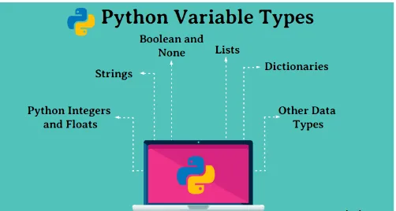

Hello folks,

Data types, huuuh! Python as any other programming language has its own data types, that may agree with other programming languages and may differ.



Variables are used to hold values of different data types. Python is called a dynamically typed language hence we need not define the type of the variable while declaring it. The interpreter implicitly binds the value with its type.

#### Data types in Python.
1. Numbers (Int, Long, Complex and Float)
2. String
3. Boolean
4. List
5. Tuple
6. Dictionary

At the end of this blog, attached is a Colab Notebook which includes examples of all the data types discussed in this blog.

##### Numbers (Intergers and Floats):

A number is used to store numeric values. The number can be an integer “with no decimals” or it can be a float number “A fractional number which is a number with decimals”. Python as we said before is able to detect the type of the number you are passing to it and define it.

```python
a = 3
b = 5 # here a and b are number objects in which we pass 3,5
```

There are four number types in Python:

**Int**

(signed integers like 13, 2, 29, etc.)

**Long**

(long integers used for a higher range of values like 90809080L, -0x192929L, etc.)

**Float**

(float is used for floating-point numbers like 1.9, 9.902, 15.2, etc.)

**Complex**

(complex numbers like 2.14j, 2.0 + 2.3j, etc.)

```python
integer = 10
print("The type of {} is {}".format(integer,type(integer)))
my_float = 16.791
print("The type of {} is {}".format(my_float,type(my_float)))
# Initializing real numbers
x = 5
y = 3
# converting x and y into complex number
my_complex = complex(x,y)
print("The type of {} is {}".format(my_complex,type(my_complex)))
# printing real and imaginary part of complex number
print ("The real part of complex number is : ",end="")
print (my_complex.real)
print ("The imaginary part of complex number is : ",end="")
print (my_complex.imag)
```

##### String

The string can be defined as the sequence of characters represented in the quotation(“ ”) marks. We will use single, double, or triple quotes to define a string in Python.

Example:

```python
B="Kartik’s friend"
```

Second Example:

```python
str1 ="DataScience"str2 = "Python"print (str1[0:2]) #printing first two characters using the slice operator
print (str1[4]) #printing 4th character of the string
print (str1*2) #printing the string twice
print (str1 + str2) #printing the concatenation of str1 and str2
```

##### List

[Lists](https://www.fireblazeaischool.in/blogs/list-in-python/) are similar to [arrays](https://www.fireblazeaischool.in/blogs/array-in-python/) in [C](https://www.tutorialspoint.com/cprogramming/index.htm). However; the list can contain data of various types. The items stored in the list are separated with a comma (,) and enclosed within square brackets [].

```python
my_list = [1, 2] #Here we create a list of two numbers 1,2
print(my_list) #here we print the variable myList of type list
print(my_list + my_list) #here we append the same variable to itself.
```

##### Tuple

A tuple is similar to the list in many ways. Like lists, tuples also contain the gathering of the things of various data types. The items of the tuple are separated with a comma (,) and enclosed in parentheses ().

A tuple may be a read-only arrangement as we will not modify the dimensions and value of the things of a tuple.

```python
Tuple1 = ('SQL', 'Python', 100, 200)
Tuple2 = (1, 2, 3, 4)
print ("tuple1[0]: ", Tuple1[0])
print ("tuple2[1:4]: ", Tuple2[1:4])
```

##### Dictionary

Dictionary is an ordered set of a key-value pair of things. It is like an associative array or a hash table where each key stores a selected value. Key can hold any primitive data type and value is an arbitrary Python object.

The items within the dictionary are separated with the comma and enclosed within the curly braces {}.

```python
dict1 = {1: 'a', 2: 'b'}
dict2 = {'c': 3, 'd': 4}
dict3 = {'N': 'Nagpur', 'M': 'Mumbai'}
print(dict1)
print(dict2)
print(dict3)
print("dict1[2] is ",dict1[2])
print("dict2['c'] is ",dict2['c'])
print("dict3['M'] is ",dict3['M'])
```

### Colab Notebook

### Good luck all
