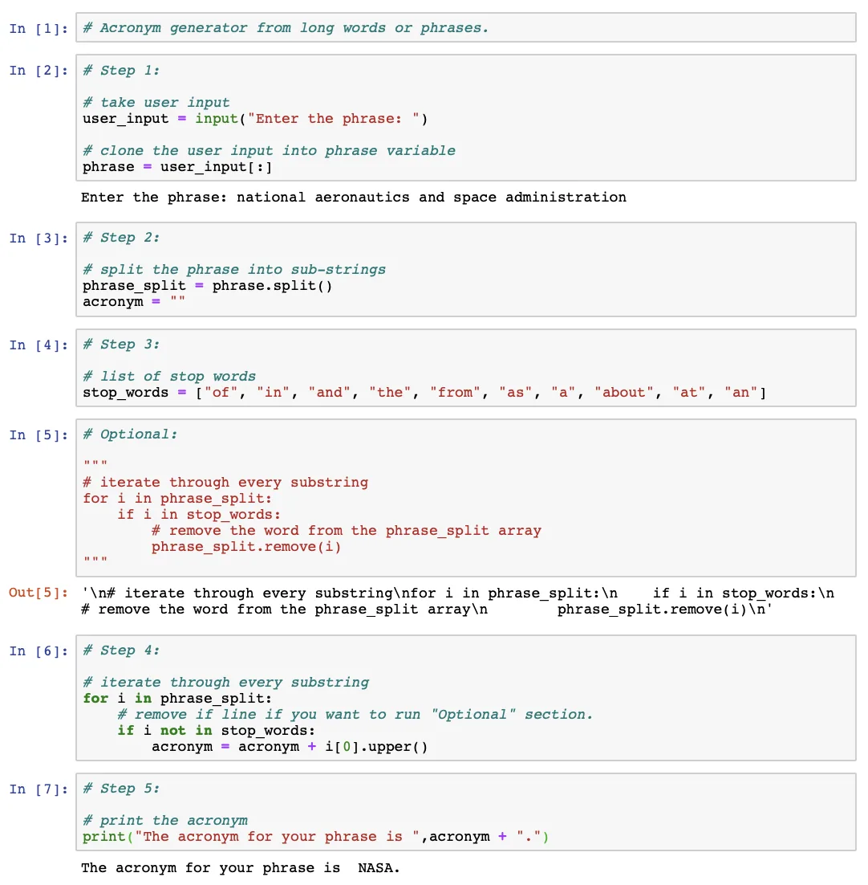

Acronyms are abbrevations of long and complex words. They are used to shorten long words and generate easy, concise and pronouncable short-version word. Such acronyms are usually used for company or project's name. It consists of the initial letters of each words and each of these letters represent a certain word. For example: USA is an acronym for United States of America, LOL is an acronym for Laugh Out Loud and so forth.

You can easily generate simple acronyms with Python. You can either use the initial letter of each words or use first two initial letters of each words and mix-max with each other. For now, we will have a look at how acronym can be generated by using only the initial letter of each words through Python coding.

**Let's start coding!!!!**

**Generate acronym using only initial letter of each words:**

**Step 1:**

The first step is to take the desired input (words or phrases) from the user. This can be done by utilizing the input() method which takes user input in the string format. Here, the user input is stored in **user_input** variable. The user_input is cloned to a new variable called **phrase**. Since, the string is immutable it cannot be copied, so here we are using slicing method to clone the **user_input** variable into **phrase** variable.

```python
# take user input
user_input = input("Enter the phrase: ")

# clone the user input into phrase variable
phrase = user_input[:]
```

**Step 2:**

The second step is to split the phrase into words so that we can process it. The phrases in the **phrase** variable is splitted into words and stored in **phrase_split** as an array. An empty string variable called **acronym** is also initialized. We will be storing the acronym generated in this variable.

```python
# split the phrase into sub-strings
phrase_split = phrase.split()
acronym = ""
```

**Step 3:**

The third step is to declare the list (or an array) of stop words in the **stop_words** variable. The user input might contain stopwords like a, an, the etc. which will need to be removed. Usually, these words are ignored in an acronym. You can add words as you see fit.

```python
# list of stop words
stop_words = ["of", "in", "and", "the", "from", "as", "a", "about", "at", "an"]
```

**Step 4:**

The fourth step is iterate through every substring stored in phrase_split by using for loop. With each iteration you will need to check whether the substring is included in the **stop_words** array or not. If the substring does contain one of the words from the stop_words list then just ignore it and go to next iteration. However, if the substring doesn't contain any stop words then the first letter of the word is added to the string existing in the **acronym** variable. Here, **i[0]** represents the first letter of the word received from the loop and represented by **i**. The letter is then changed into uppercase through **upper()** method. By the end of the loop **acronym** variable will contain the desired acronym of the words or phrases inputted by the user.

```python
# iterate through every substring
for i in phrase_split:
        if i not in stop_words:
                acronym = acronym + i[0].upper()
```

Instead of checking for stop_words in iteration for generating acronym, you can add another step before the fourth step to remove the substrings that contain stop words. You will need to iterate over **phrase_split** array and check whether every substring contains words included in **stop_words** array. If it does, then remove the word from the phrase_split by using the **remove()** method. The remove() method takes the word to be removed from the given array as input. However, this step is optional and you can skip and continue with **Step 4** to avoid long vode.

```python
# iterate through every substring
for i in phrase_split:
	if i in stop_words:
		# remove the word from the phrase_split array
		phrase_split.remove(i)
```

**Step 5:**

The fifth or the last step is to print the acronym as an output, so that the user can observe the generated acronym.

```python
# print the acronym
print("The acronym for your phrase is ",acronym + ".")
```

A screenshot of the code, input and output has been attached below with the necessary steps indication.


