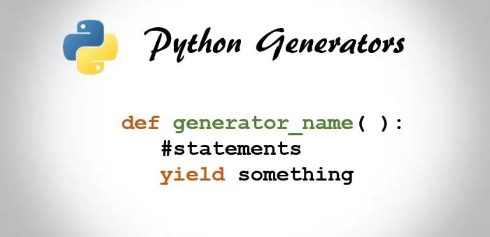
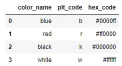

Source : [Try To Program](http://www.trytoprogram.com/)

A generator is a special type of python function that returns an iterator (generator) object. Contrary to the normal function, a generator uses the **yield** statement instead of **return**. However, functions and generators are completely different by syntax and semantic.

In this article, I will first depict the concept of **generator** with examples of how to apply it in data science, then I will give some advantages and finally some limitations of python generators.

## 1. Generator syntax and examples

#### a. Syntax

As can be shown on cover image, the syntax of a python generator is as follows:

- Generator function

```python
def gen_name(arguments):
        List of instructions
       yield result
```

- Generator expression

```python
(exp for exp in collection if condition)
```

#### b. Examples

Throughout this article, we will be working with a dummy dataframe named **color** that contains 8 color names associated with their matplotlib and hexadecimal or html codes.

```python
import pandas as pd

data = {'color_name': ['blue', 'red', 'black', 'white', 'magenta', 'green', 'cyan', 'yellow'],
       'plt_code' : ['b', 'r', 'k', 'w', 'm', 'g', 'c', 'y'],
        'hex_code' : ['#0000ff', '#ff0000', '#000000', '#ffffff', '#ff00ff', '#008000', '#00ffff', '#ffff00']}

color = pd.DataFrame(data)
```

To make sure our dataframe has the expected shape and organization, let's print its first few rows.

```python
color.head(4)

# Output
```



To illustrate the concept of generator function, let's create a generator **read_df** that takes two positional arguments namely:

**df**, a [Pandas Dataframe](https://pandas.pydata.org/docs/reference/api/pandas.DataFrame.html) and **column**, the name of one of its columns and yields a generator object of all the elements of that column in the dataframe.

```python
def read_df(df, column):
    """Returns a generator of column elements"""
    for elt in df[column]:
        yield elt
```

It is very important to notice how the yield statement is under a for loop. This is a special characteristic of python generator functions. Unlike conventional functions, the yield statement can be used more than once. Another special, the most relevant characteristic of generators is that they don't store a list of objects into the memory. When instantiated, the elements of a generator are accessible one at a time using the function **next**. The current element is stored and calling **next** again retrieves the following one up to the last, after what a [StopIteration error](https://docs.python.org/3/library/exceptions.html#StopIteration) is raised.

In the example below, we create a generator object **name_gen** that holds all the values of the name column of color dataframe.

```python
name_gen = read_df(df, 'color_name')
```

Now let's check the type of **name_gen** and print out its 3 first values. To do so, we need to call **next** three times.

```python
print(type(name_gen))
print(next(name_gen))  # First value
print(next(name_gen))   # Second value
print(next(name_gen))    # Third value
```

```python
# Output
<class 'generator'>
blue
red
black
```

The same iterator can be created using a generator expression which is a simpler way than generator function.

```python
name_gen1 = (item for item in color['color_name'])
```

```python
print(type(name_gen1))
print(next(name_gen1))  # First value
print(next(name_gen1))   # Second value
print(next(name_gen1))    # Third value
```

```python
# Output
<class 'generator'>
blue
red
black
```

## 2. Advantages of python generators
The python generators provide programmers with the followings advantages, over other concepts used for the same task.

#### a. Easy Implementation

An iterator class can be used to create iterators, just like generators do. However, compared to the iterator class, the implementation of a generator is simple, easy and require less lines of code. Let's illustrate this by creating an iterator class **Timestwo** and a generator function **timestwo** that perform the same operation: multiply a given stream by two in the item level.

```python
# iterator class
class Timestwo:
    def __init__(self, n_iter=0):
        self.n = 0
        self.n_iter = n_iter

    def __iter__(self):
        return self

    def __next__(self):
        if self.n > self.n_iter:
            raise StopIteration

        result = self.n * 2
        self.n += 1
        return result

# Generator function
def timestwo(n_iter=0):
    n = 0
    while n < n_iter:
        yield n * 2
        n += 1
```

The difference in complexity between the two code snippets is quite clear. Defining the iterator class requires much more code than defining the generator function. Besides, the generator code is highly legible and understandable than its Iterator class counterpart.

#### b. Memory efficiency

If we want a function to draw all the values from a certain of a given dataframe, the only way to achieve this is by storing these values as list or another dataframe. For the **color** dataframe above, this won't be a problem since every column consists of only 8 values. For larger dataframes with hundreds of thousands, or even millions of values, this can become very memory consuming. In this case a generator would be the most relevant solution.

#### c. Infinite stream representation
Related to memory efficiency, a generator is the most suited way to represent infinite stream of data. In fact, infinite stream of data cannot hold into memory, thus need to be treated one after another or by chunks.

For example, the **mult_three** generator function can theoretically generate all the integers that are divisible by three.

```python
def mult_three():
    n = 0
    while True:
        yield n
        n += 3
by_three = mult_three()
next(by_three)
next(by_three)
```

```python
# Output
3
```

Contrary to the conventional function, a call to **mult_three** won't freeze the program.

## 3. When to avoid using python generators

Like any other python concept, generators are very useful but not perfect in that they aren't always the best fit in all the situations involving stream of data. Below are few cases where generators should be avoided.

- You need to access data multiple times, a generator allows to access data only once;
- You need to randomly draw an element from a stream of data;
- You need to join strings. A list is the best fit because this process requires two passes over data.

## Conclusion
Generators are one of the most powerful python concepts when it comes to deal with large stream of data that need to be accessed one item at a time. This make generators very useful when the stream is particularly long or can't fit into memory. However if we need to access each data point more than once, conventional lists become more suited.

Find the notebook related to this post [here](https://github.com/tem-ctrl/generators_in_python)
