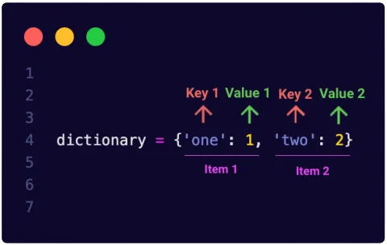

Dictionary is an important data type built into Python. It contains key-value pair elements. You should know that keys are unique and that they can be only an immutable data type, a key can be for example a string, a number or a tuple, but, it can't be a list. Whereas, the values in a dictionary can be of any type.

In this article, we will see together how to create a dictionary, access values, update and delete items and some useful methods and techniques for a dictionary in Python.

## 1) Creating a dictionary

The dictionary can be empty. We initialize an empty dictionary using {} or dict():

There are several methods to create non-empty dictionaries in Python. We can create a dictionary using a comma-separated list of key:value pairs inside the braces. We can also create it from sequences of key-value pairs using dict() constructor. The third method consists on specifying pairs using keyword arguments in case the keys are simple strings. And finally, we can create a dictionary using key-value pairs expressions.

## 2) Accessing items
We can access values in a dictionary using indexing or the get() method as shown in the code below:

## 3) Updating items
We can update the value of a dictionary using **dictionary[key]=value.** If the key already exists in the dictionary the value will be updated and if the key doesn’t exist then that key-value pair will be added to the dictionary. Another method allows us to update our dictionary which is update().

## 4) Deleting
Several methods are used for deletion. The first one is popitem() which removes and returns the last item inserted in the dictionary. pop() method removes and return a value from a dictionary for a given key. And clear() method is used to delete all the items.

## 5) Some useful methods and techniques

The code below shows how to use [dict.keys()](https://docs.python.org/3/library/stdtypes.html#dict.keys), [dict.values()](https://docs.python.org/3/library/stdtypes.html#dict.values) and [dict.items()](https://docs.python.org/3/library/stdtypes.html#dict.items):

The objects returned by [dict.keys()](https://docs.python.org/3/library/stdtypes.html#dict.keys), [dict.values()](https://docs.python.org/3/library/stdtypes.html#dict.values) and [dict.items()](https://docs.python.org/3/library/stdtypes.html#dict.items) are *view objects*. They provide a dynamic view on the dictionary’s entries, which means that when the dictionary changes, the view reflects these changes.[[Python docs](https://docs.python.org/3/library/stdtypes.html#dictionary-view-objects)]

Now, you learnt the basics of dictionaries in Python. Enjoy using this important data type.

You can find the notebook containing the source code used in this post [here](https://github.com/arijbt/Data-Insight2021/blob/main/Assignments/2).

References:

Python docs: <https://docs.python.org/3/library/stdtypes.html#mapping-types-dict>

<https://medium.com/analytics-vidhya/an-introduction-to-python-dictionary-520302924ef8>

https://www.tutorialspoint.com/python/python_dictionary.html
