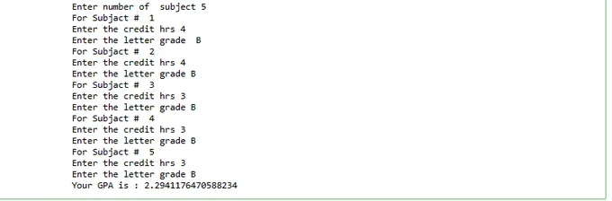

## Introduction
we will discuss GPA calculation using python programming. We all have either the GPA system or the percentage system in our education grading system to measure a student’s performance in his/her academic session. So, to calculate the overall student performance GPA calculator is used.

## What is GPA sytem?
GPA stands for [Grade Point Average](https://www.edglossary.org/grade-point-average/#:~:text=A%20grade%20point%20average%20is,the%20number%20of%20grades%20awarded). It refers to a grading system used to measure students’ performance in an academic session. It is a numerical index that summarizes the academic performance of the students in an academic year.

Different schools and other educational institutes measure GPA on different scales. For example, some measure it on a scale of 1 to 5, and some measure it on a scale of 1 to 10. This number represents the average value of all final grades earned in a course over a specific period of time.

Some organizations also use it to measure a candidate’s employability; apart from performance in the interview, these organizations also consider the GPA in academics.

## GPA Calculator Code in Python

## declear the varable
count = 0

hrs = 0

numberofsubject =0

totalhours = 0

totalPoints = 0.0

gpa = 0.0

**Prompt the user for the number of subject taking**

numberofsubject = int(input("Enter number of subjact "))

**use for to loop:**

for count in range(count, numberofsubject):

'''This is to keep track of the number of subject (Optional)'''

print("For subject # ", count+1)

**Prompt the user for the number of subject taking**

numberofsubject = int(input("Enter number of subject "))

for count in range(count, numberofsubject):

'''This is to keep track of the number of classes (Optional)'''

print("For Subjact # ", count+1)

'''Prompt user for number of number of credit hours per class'''

hrs = int(input("Enter the credit hrs "))

'''Prompt user to enter the letter grade'''

grade = input("Enter the letter grade ")

**Use if statement to check the grade and increment points and total hours**

if grade == 'A' or grade == 'a':

totalPoints = totalPoints + (hrs \* 4)

totalhours = totalhours + hrs

elif grade == 'B' or grade == 'b':

totalPoints += (hrs \* 3.0)

totalhours += hrs

elif grade == 'C' or grade == 'c':

totalPoints += (hrs \* 2.0)

totalhours += hrs

elif grade == 'D' or grade == 'd':

totalPoints += (hrs \* 1.0)

totalhours += hrs

'''If not A,B, C, D then it must be F. You can write validation to check in other lettes'''

else:

totalPoints += (hrs \* 0.0)

totalhours += hrs

**Calculate GPA based on the total points and total hours'**

gpa = totalPoints / totalhours

print("Your GPA is :", gpa)

def main():

gpa = GpaCalculator()

if __name__ == '__main__':main()

