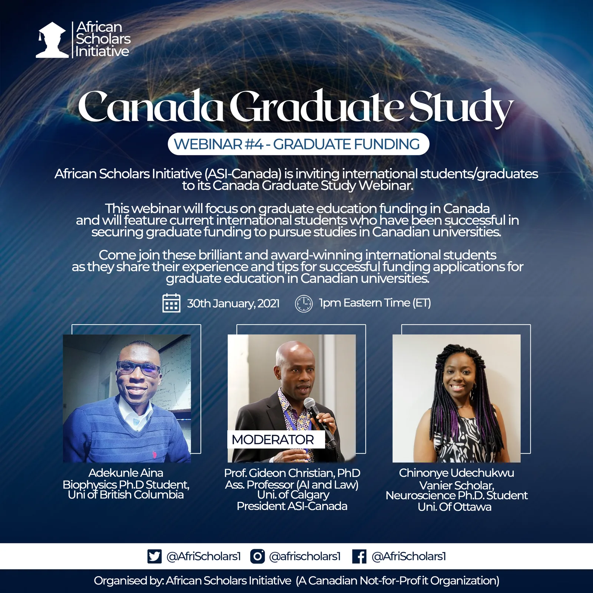

> One of the best decisions you could make in life

Dear Prospective Graduate Student,

I hope this piece meets you well.

Over the years I have made a wide range of research and found (in my opinion) that Canada is one of the best places to study in the world. Studying especially at the postgraduate level is beyond the walls of classrooms and libraries and Canada offers just that. Imagine being able to work and earn decent pay while studying. Studying and doing research under the supervision of some of the world's best faculty members in their respective fields, plus the opportunity to live and work after your studies can be a life-transforming decision.

The best way I know to fund your studies abroad is to apply for a research program. This is true for Canadian universities in particular. Almost all students admitted to research programs are funded. However, funding varies with programs of study. You can check what is obtainable from the program website.

*Webinar: Graduate Funding In Canada.*

Everything starts by identifying one or more universities that meet your interest. I will recommend to you the following universities;

1. University of Alberta ([www.ualberta.ca/admissions](https://www.ualberta.ca/admissions))
2. McGill University ([www.mcgill.ca/admissions/home-page](https://www.mcgill.ca/admissions/home-page))
3. University of Calgary ([www.grad.ucalgary.ca/future/admissions](http://www.grad.ucalgary.ca/future/admissions))
4. Queen's University ([www.queensu.ca/sgs/prospective-students/application-process](http://www.queensu.ca/sgs/prospective-students/application-process))
5. University of Saskatchewan ([www.usask.ca/admission/](https://www.usask.ca/admission/))
6. University of Manitoba (<http://umanitoba.ca/faculties/graduate_studies/admissions/>)
7. Memorial University of Newfoundland ([www.mun.ca/become/graduate/](https://www.mun.ca/become/graduate/)) (This is where I am currently studying for my master's)

Apply to as many universities as possible to better your chances.

For each university you are interested in, identify programs and research areas that interest you, then contact (by e-mail), all the faculty members (professors) who align with your interest. Expect mixed (positive, negative, and NO) reactions from them though. When I was going through this process, a typical e-mail I sent goes:

> Good day Prof XXX,

> It is a pleasure to send you this mail. I must say it is delightful to read through your profile.
>
> I would start by introducing myself. I am Aina Adekunle from the Department of Physics, University of Lagos, Lagos-Nigeria. I bagged a First Class Bachelor of Science degree in Applied Physics. I always have a keen interest in Condensed Matter Physics. Right now, I belong to the Theoretical Physics Research Group at the Department of Physics, University of Lagos as a Graduate Assistant. I want to develop my career in academia in this direction.
>
> The reason for this mail is that I have started planning for MSc/PhD in Condensed Matter Physics and need your candid advice about the MSc/PhD program at the University of XXX and also an opinion about these questions:
> Can I still apply for the fall 2016 admissions?
> Can I do PhD with Bachelors without Masters?
> Do I need to do the GRE- general and subject tests?
> Is TOEFL compulsory?
> Are you willing to supervise me if I put in an application?
>
> I have attached my degree certificate, transcript, curriculum vitae and statement of purpose for your perusal.

> I anticipate your response.

> Best regards.

For my PhD applications, a typical email is as follows:

> Title: Interest in Computational Biophysics

> Hello Dr. XXX,
>
> It is a pleasure to send you this email and more importantly I found it fascinating going through your profile.
>
> I am Aina Adekunle, a graduate student from the Department of Physics and Physical Oceanography, Memorial University of Newfoundland. I am writing you about my intention to come to XXX University in the fall of 2018 for my PhD under your supervision.
>
>  I am generally interested in Computational Biophysics and in particular the study of biomolecules especially proteins and associated phenomena like protein folding, misfolding with their physical and biological implications.
>
> My undergraduate was in Physics and Electronics at the University of Lagos, Nigeria where I bagged a First Class degree. I moved to Canada in the fall of 2016 when I began studies at the Memorial University of Newfoundland for a Masters in Condensed Matter Physics (Computational Biophysics research option). Here, I use Monte Carlo based methods such as simulated tempering and multisequence algorithms alongside a coarse-grained protein model to study model protein sequences.
>
> Attached are my transcripts and curriculum vitae for your perusal.
>
> Hope to hear from you soon. Thanks for your time.

> Regards.

> ...

> Professor's response:

> Aina, thanks for your interest in our research group. Perhaps you can tell me a little more about what interests you in our work, and how you see that relating to your current experience? And who are you working with at XXX University?

> Thanks,

> XXX

> ...

> My response:

> Hi Dr. XXX,

> Thanks for your timely response.
>
> I can see that your research group uses theory (e.g. Non equilibrium statistical mechanics) and computational tools to design and study the effective operation of bimolecular machines i.e. proteins and the physical limitations of their operation. You therefore seek to see if the theoretical predictions from these studies agree with experimental observations from real life bimolecular machines. This incredible ability of theory and computation to make such predictions is what fascinates me.
>
> Dr. XXX is my supervisor at XXX University. Like I said before, I currently use Monte Carlo-based methods (simulated tempering and multisequence algorithms) to study model protein sequences using a coarse-grained protein model. They are capable of giving insight into phenomena such as protein-evolution, protein-folding, mis-folding and how it relates to diseases.
>
> I think there is a fundamental overlap between my current study and what you are doing in your group; to use theory and computation to study and predict these bimolecular machines known as proteins.
>
> I would be grateful for a consideration to join your group after completing my studies at XXX University.
>
> Once again thanks for your time.

> Regards.

> ...

> Professor's response:

> OK, thanks for your further thoughts. You seem like a promising candidate, a potentially a good match for our group, so I definitely recommend that you apply to our graduate program in December 2017. Once I have had a chance to see your full application, I will be able to give you a better sense of the prospects. Will be in touch then.

> Best,

> XXX

> ...

> Professor's response after some time:

> I've had a chance to review your application, and you are an impressive candidate. I think we should explore further to learn whether we are a good match: I would like to learn more about you, and I would like to answer any questions you might have. Perhaps we can talk over Google Hangouts or Skype sometime soon? If that is agreeable to you, please let me know convenient times for you in the next 2 weeks (and please make clear whether you are specifying Newfoundland time or Vancouver time!). Also, it would be helpful for me to speak directly with your references to hear more details from them. Do I have your permission to contact them to arrange a time to chat?

> Thanks!

The point is this: engage and communicate with them to show your interest. Also, make sure you have gone through the webpage(s) of any professor you are sending an email.

Send emails showing your interest to as many professors as possible. I sent to about 70! Yes, it's not a typo.

Whatever response you get, the next line of action is to gather the necessary documents. These would typically include:
1. Official Transcript
2. Degree Certificate
3 Statement of Purpose (See my SOP below)
4. Curriculum Vitae
5. English as a Medium of Study
6. 2 or 3 Recommendation letters
7. Application Fee (usually $100 CAD or more)
8. Sometimes language test scores (e.g TOEFL) and/or GRE.

Many universities in Canada do not require language test scores from Nigerians and English-speaking countries. You may, however, need "English as a Medium" in lieu, which can be obtained from your university.

GRE is usually requested but not required. Make sure you check the requirements from the university and specific program website.

Below is my statement of purpose to the University of Newfoundland for an MSc.

> **STATEMENT OF PURPOSE FOR GRADUATE STUDIES IN CONDENSED MATTER PHYSICS AT MEMORIAL UNIVERSITY OF NEWFOUNDLAND**
>
> The year 2004 was a remarkable year of my life. The year that sparked the light of Physics in me; a eureka moment that ushered my inquiry into the nature of matter. I was in final year of my secondary education when Mr. Afolabi who was my Physics teacher started with topics in modern Physics. He began saying, “Hitherto Sir Isaac Newton has been famous in our classes but will no longer be. Henceforth, a man with the name Albert Einstein will be at the focal point of our classes.”

> My curiosity instantly arose. Within me, I asked, who is this man? What did he do? How did he do what he did? Then I raised my hand and asked, “Could you tell us more about Einstein?” He replied, “He is the most brilliant person that has ever lived. He won the Nobel Prize and disputed Newton’s laws.” I got even more interested. I wondered and screamed “Newton’s laws!” This was my feeling at the time and my disposition expressly showed it because I felt what I had learned about Newton and classical laws was the ultimate. I was wrong, but the experience put me on a path of research about physics.

> Since then my knowledge of Physics has continued to grow every step of my life. I went on to make a distinction in ordinary level physics and major in Physics at the University of Lagos. I had a brilliant start at the University of Lagos having a grade point of 4.80 out of the possible 5.00 (a rare achievement in the Physics program) and was consequently awarded the University’s scholarship for outstanding performance. This scholarship I retained every year throughout my undergraduate studies for a consistent academic feat which culminated to a First Class Bachelor of Science degree in Applied Physics and Electronics.

> During my undergraduate years, I offered and had ‘A’ grade in each of the following specialized courses; Classical Mechanics, Quantum Mechanics, Statistical Mechanics, Electrodynamics, Solid State Physics, Theoretical Physics, and Mathematical Methods.

> I also won the best student prize in Physics at graduation and was as a result employed as a Graduate Assistant in the Department of Physics. Here, I belong to the Theoretical Physics Research Group. I want to develop my career in academia towards this direction. My interest lies in Theoretical Physics and I want to specialize in Condensed Matter Physics, which is one of the core areas of research at Memorial University. I am particularly interested in the work of Dr. XXX; computer simulation to study thermodynamics and dynamics of supercooled liquids, focusing on aspects of crystal nucleation and the glass transition.

> I want to continue my education at Memorial University. With my background and passion for Physics, I think I am prepared for your Master of Science in Physics program, and I am sure it will lead me through the path of understanding the true nature of matter.

[**Here is the link to my statement of purpose to the University of British Columbia for PhD.**](http://bit.ly/physicsandi)

Make sure you write an original statement of purpose. DO NOT PLAGIARIZE!

After gathering these documents, the next thing is to read and understand the admission requirements perhaps there are additional documents that you would need for your application.

I would end by encouraging you to APPLY.

Do not hesitate to ask me for assistance (**schedule a meeting with me** [**here**](https://linktrest.io/aina)) if you need one.

Best wishes,
[Aina Adekunle](http://linktrest.io/aina)
