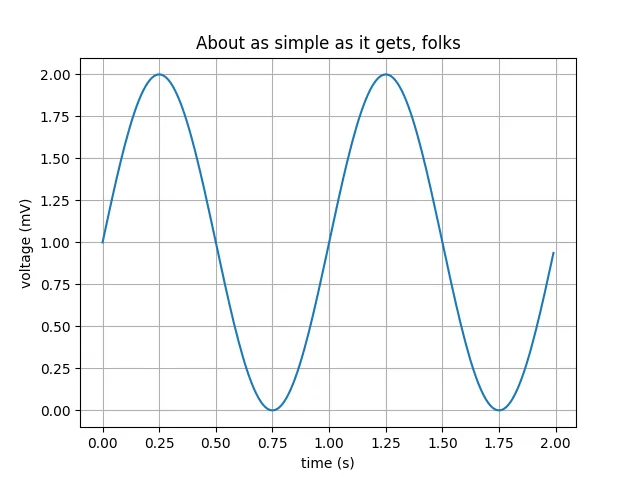

Simplest and quickest method to analyse data is through graphs and plots.

In Python,Plots can be drawn very quickly using Matplotlib.

Matplotlib is a tool to draw different complex plot with many options of adjustments.

Even Sine plots can be drawn easily.

```python
import matplotlib.pyplot as pltimport numpy as np# Data for plottingt = np.arange(0.0, 2.0, 0.01)s = 1 + np.sin(2 * np.pi * t)fig, ax = plt.subplots()ax.plot(t, s)ax.set(xlabel='time (s)', ylabel='voltage (mV)',title='About as simple as it gets, folks')ax.grid()fig.savefig("test.png")plt.show()
```



This plot is showing relation between voltage and current with easy readability.
