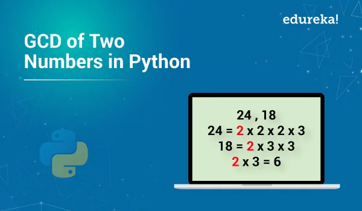

In mathematics, the **greatest common divisor** (**GCD**) of two or more integers, which are not all zero, is the largest positive integer that divides each of the integers. For two integers *x*, *y*, the greatest common divisor of *x* and *y* is denoted gcd(x,y). For example, the GCD of 8 and 12 is 4, that is, gcd(8,12)=4

gcd(12,9) = 3

gcd(10,6) = 2 and so on..In the name "greatest common divisor", the adjective "greatest" may be replaced by "highest", and the word "divisor" may be replaced by "factor", so that other names include **greatest common factor** (**gcf**).

### GCD



Code:

```python
def gcd(a,b):
   if b==0:
      return a
   else:
      return(gcd(b,a%b))
```

```python
if __name__ == "__main__":
   two_inputs = input()
   a, b = map(int, two_inputs.split())
   print(gcd(a, b))
```

## [Python Notebook Github - GCD](https://github.com/omarmohamed2011/Greatest-Common-Divisor/blob/main/greatest_common_divisor.ipynb)

In this code we used the Euclidian algorithm which is as follows:

The Algorithm

The Euclidean Algorithm for finding GCD(A,B) is as follows:

- If A = 0 then GCD(A,B)=B, since the GCD(0,B)=B, and we can stop.
- If B = 0 then GCD(A,B)=A, since the GCD(A,0)=A, and we can stop.
- Write A in quotient remainder form (A = B⋅Q + R)
- Find GCD(B,R) using the Euclidean Algorithm since GCD(A,B) = GCD(B,R)

Example:

Find the GCD of 270 and 192

- A=270, B=192
- A ≠0
- B ≠0
- Use long division to find that 270/192 = 1 with a remainder of 78. We can write this as: 270 = 192 \* 1 +78
- Find GCD(192,78), since GCD(270,192)=GCD(192,78)

A=192, B=78

- A ≠0
- B ≠0
- Use long division to find that 192/78 = 2 with a remainder of 36. We can write this as:
- 192 = 78 \* 2 + 36
- Find GCD(78,36), since GCD(192,78)=GCD(78,36)

A=78, B=36

- A ≠0
- B ≠0
- Use long division to find that 78/36 = 2 with a remainder of 6. We can write this as:
- 78 = 36 \* 2 + 6
- Find GCD(36,6), since GCD(78,36)=GCD(36,6)

A=36, B=6

- A ≠0
- B ≠0
- Use long division to find that 36/6 = 6 with a remainder of 0. We can write this as:
- 36 = 6 \* 6 + 0
- Find GCD(6,0), since GCD(36,6)=GCD(6,0)

A=6, B=0

- A ≠0
- B =0, GCD(6,0)=6

**So we have shown:**

GCD(270,192) = GCD(192,78) = GCD(78,36) = GCD(36,6) = GCD(6,0) = 6

**GCD(270,192) = 6**

Though in the code we have used the same manner, a function called gcd() does the whole job, it takes the two inputs and repeatedly do the calculations, it finds b%a and recall the same function giving inputs as (b, b%a), it repeatedly does this until a is found to be 0, it then can return b; otherwise it will keep working recursively until the Greatest Common Divisor is found and returns it.

Resources for explanation:

Example and explanation provided from Khan Academy explanation it was very helpful made me understand that's why I shared it to help people understand the idea

[Wikipedia](https://en.wikipedia.org/wiki/Greatest_common_divisor)

[Khan Academy](https://www.khanacademy.org/computing/computer-science/cryptography/modarithmetic/a/the-euclidean-algorithm)
