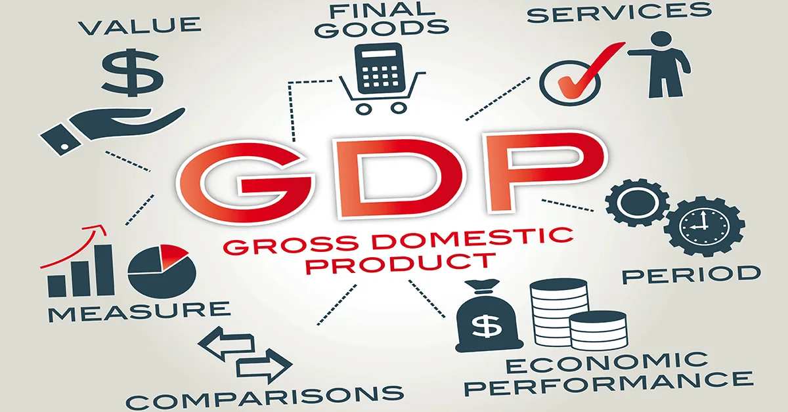

**Gross Domestic Product (GDP)** measures the market value for all products and services within a country's borders. **GDP Growth Rate** is the percentage increase in GDP from quarter to quarter.

To avoid double-counting, GDP includes the product's final value, but not the parts that go into it. For example, a U.S. footwear manufacturer uses shoelaces and other materials made in the U.S., but only the value of the shoe gets counted; the shoelaces don't.
GDP is calculated using the formula:

**GDP = Consumptions + Investments + Government Spending + (Exports – Imports)**

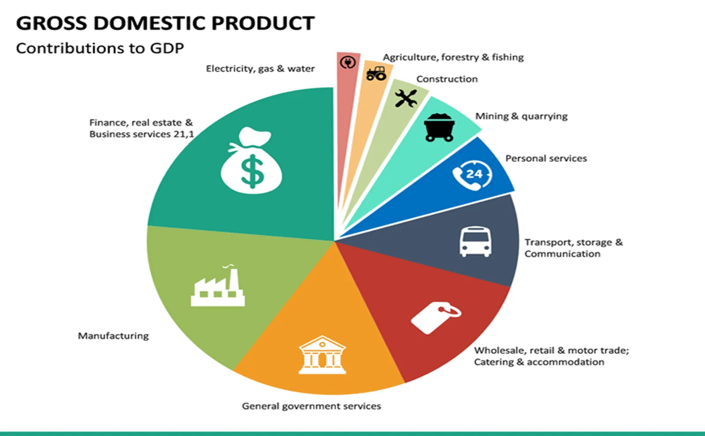

**Objective**

1.Compare GDP growth between Developed(USA, China, Kuwait etc.) and Developing nations(Nepal, Pakistan, Bangladesh etc.) and factors affecting the growth.

2. Find how the economic indicator/factors affect the GDP and how strongly correlated are the indicators and GDP.

**Algorithm Used Linear Regression**

•Linear Regression is a supervised machine learning algorithm that performs a regression task.

•Basically, it is the mathematical model of the linear relationship between a dependent variable with a given set of independent variables.

•In this project, linear regression will be used to predict the individual attributes of the datasets also which indicators prominently affect GDP growth.

**Reason for Selecting this Algorithm**

•Linear Regression helps analyze the linear regression between a dependent variable with a given set of independent variables.

•In this dataset,

i.GDP is a dependent variable.

ii. Attributes such as Import of goods and services, Revenue, Taxes, Net Export, etc. are Independent variables.

• Hence, since GDP has many indicators and these indicators highly affect GDP growth, linear regression will help to find the dependency of GDP with respect to these indicators.

**Methodology**

1. Data collection

2. Data cleaning

3. Preprocessing

4. Data visualization

5. Model Training and Testing using **Linear Regression**

**1. Data Source and Dataset(Data Collection)**

•This dataset consists of the yearly gross domestic product (GDP) in the current USD of countries and regions worldwide for the recent 25 years i.e. from 1997 - 2021.

•The data is sourced from the World Bank which in turn lists as sources: ***World Bank national accounts data, and OECD National Accounts data files*****.**

•Since GDP is affected by lots of factors such as education, health, environment, etc. We will be considering the **Financial Sector** (which includes Assets, Capital Market), **Economic Policy and Debt** (which includes External Debt Net Flow), **Public Sector**(which provides for Government Sector expenses and Revenue), and **Private Sector**(Export, Import and Private Infrasture Investment).

•Regional means collections of countries e.g. Europe & Central Asia. For this project, South Asia(Nepal, India, Bangladesh), North America (Canada, US), and the Middle East and North Africa(UAE, Israel, etc) regions are taken. A total of 32 countries are taken.

2. **Data Cleaning**

GDP is calculated and stored in 3 different data types ie, Currency, Percentage, and Number. So the dataset has different data types in a single column. So for the accuracy of the analysis, the dataset has been divided into files named Currency Indicator, Percentage Indicator, and Number Indicator

1. **In Currency Indicators**: GDP (current US$), GNI (current US$), GDP per capita, Market capitalization of listed domestic companies (current US$)
2. **In Percentage Indicators:** Current account balance (% of GDP), Total reserves (% of total external debt), Total debt service (% of GNI), GDP growth (annual %)
3. **In Number Indicators:** Population, total, Listed domestic companies, total

- The NA(Not Available) data has been replaced by the value “0” because indicators such as the Market capitalization of listed domestic companies (current US$) have stopped being considered as a factor affecting GDP after 2015 due to changes in the law in the US. Many agriculture indicators also have NA because mostly in developing nations the crops grown are consumed within the household and not exchanged in Monterey value.
- The details as to why the values are not available are described in the source from which the data has been sourced. These details can be found in the file **Metadata.**
- Since the official data have given clear reasons as to why some cell is blank has been stated to the value imputed is zero.
- Another reason why I choose to keep the value Zero is if we use mean imputation the mean of the observed values for each variable is computed and the missing values for that variable are imputed by this mean. The observed value is different for each country.
- For example suppose we take China, India United States is taken and the value is imputed in Nepal’s GDP but since the country mentioned is developed, it results in an inaccurate analysis.
- Also, the GDP indicator value of each country is different, they do not affect each other. GDP is calculated for goods produced within the country border using various factors. Hence the NA value has been replaced by “0”.

## 3. Data Preprocessing
There is no null value in the data. There is 6600 row in each data file. The number of columns is different for each file.

**1. In Currency Indicators**: 6600 rows and 13 columns

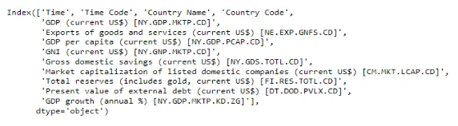

Fig 1: Currency Indicator Column Name

**2. In Percentage Indicators:**6600 rows and 20 columns

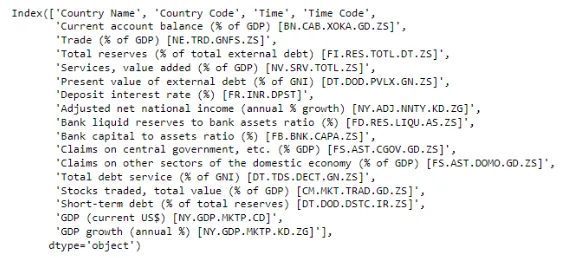

Fig 2: Percentage Indicator Column Name

**3. In Number Indicators:** 6600 rows and 12 columns

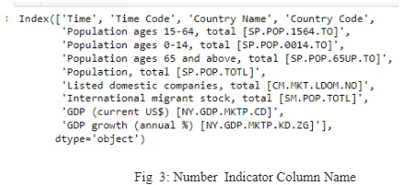

Fig 3: Number Indicator Column Name

Hence, we have 6600 rows and 55 columns altogether.

4. **Data Visualization and Analysis**

The visualization is also done in the form of a **Case Study of the April 2015 Earthquake in Nepal** and **a Case Study of the COVID Pandemic Year 2021**. The pandemic started at the end of December 2019 and continued to cause major effects for the year until 2021.

**i. Total GDP of Nepal(Developing nation) and China(Developed Nation)**

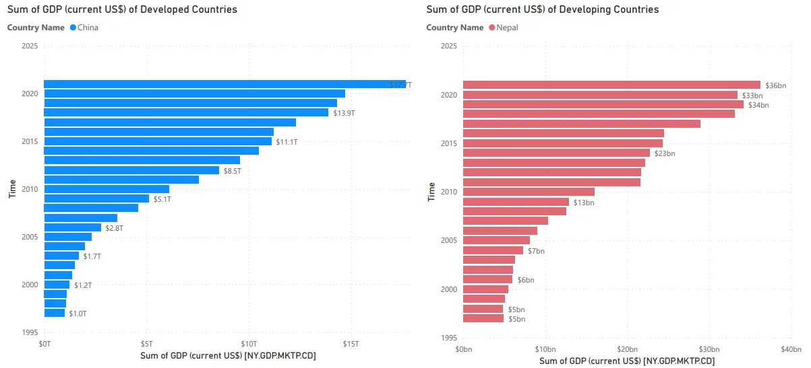

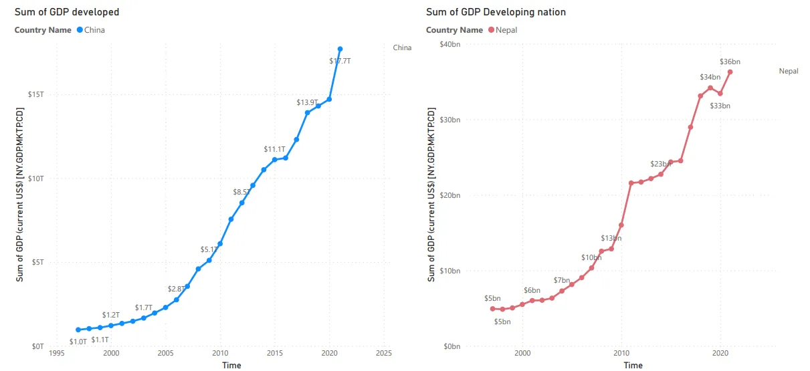

Fig 4: Comparing the Total GDP growth of Nepal and China Over the Years

- Here we can see the GDP of Nepal has been growing continually from the year 2000 to 2015 until the earthquake of 2015. In the year 2016, the was almost the same as that of 2015 as the country was still coping with the destruction caused by the massive earthquake. All the aid was used in the reconstruction and helping the family that faced major losses.
- After 2016 i.e. 2017 onward there was a GDP growth until 2020, this year the pandemic hit the world and the GDP of Nepal decreased by a billion value.
- While Nepal saw a decline in GDP there China saw growth in GDP as a large number of hospitals were constructed, and vaccines, marks, and oxygen were continuously being produced within the nation which helped in the growth of GDP
- Nepal had to import vital medical kits, and PCR test kits which caused a decline in the total GDP.

**ii. Export of Goods and Services affecting the GDP Growth**

Exports of goods and services represent the value of all goods and other market services provided to the rest of the world.

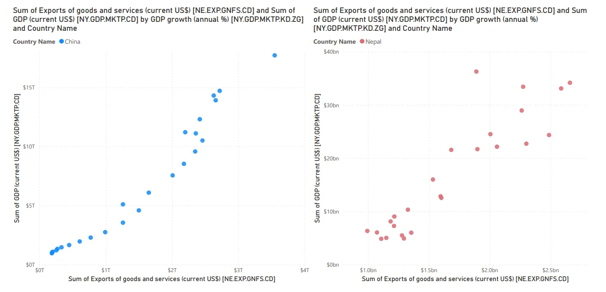

Fig 5: Correlation of GDP Growth and Export of Goods

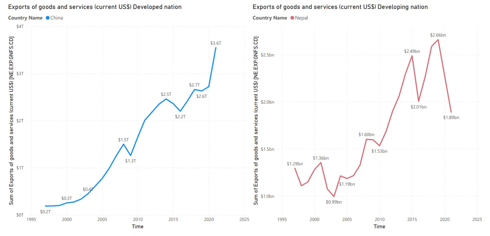

Fig 6: Comparing Export of Goods and Services

- Exports of goods and services in China have been continuously increasing over the year due to which there is an increase in GDP also over the year
- While in the case of Nepal Exports of goods and services is varying over the year, and in the recent year we can see there is a Decrease
- In 2015 we could see there was a growth in export but in 2016 there was a decrease because of the earthquake, which destroyed the majority of old architecture and buildings.
- We can see that the export of Goods and Services is strongly correlated.

**iii. GDP Per Capita Over Time**

Gross Domestic Product (GDP) per capita shows a country's GDP divided by its total population. It is the income per head.

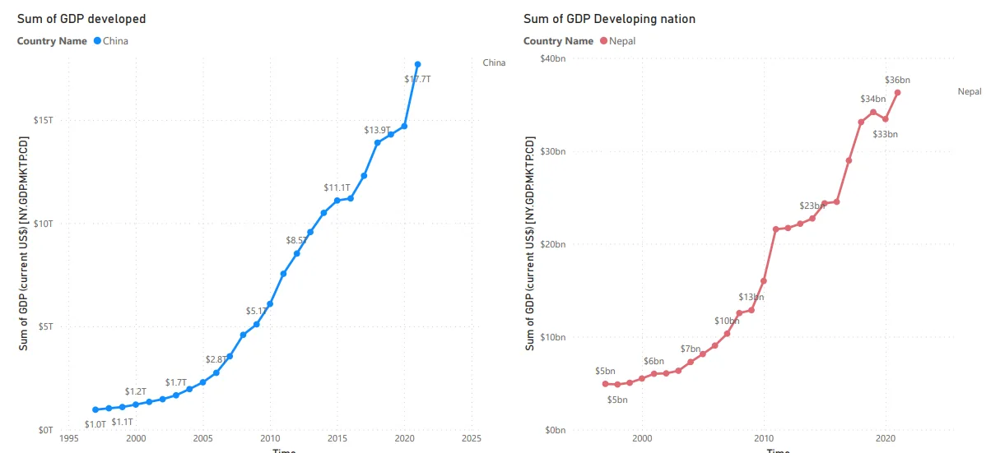

Fig 7: Comparing GDP Per Capita

- Nepal's GDP per capita for 2021 was $1,223, a 6.57% increase from 2020. Nepal's GDP per capita for 2020 was $1,147, a 3.97% decline from 2019. Nepal's GDP per capita for 2019 was $1,195, a 1.39% increase from 2018.

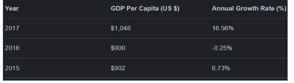

Hence we can conclude that the GDP Per Capita of Nepal depends on the internal factors of the country and yearly occurrences.

**iv. Total Reserve (including gold)**

Total reserves comprise holdings of monetary gold, special drawing rights, reserves of IMF members held by the IMF, and holdings of foreign exchange under the control of monetary authorities.

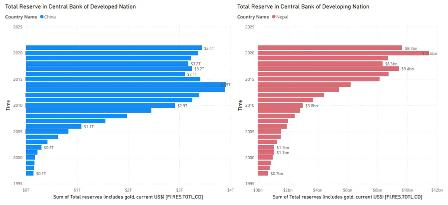

- In the year 2021, the reserve amount decreased due to the import of medical equipment.
- In the years 2015 and 2016, the amount was almost similar.
- Hence we can conclude that the GDP Per Capita of Nepal depends on the internal factors of the country and yearly occurrences

**v. Gross National Income(GNI)**
GNI (Gross National Income) is the sum of value added by all resident producers plus any product taxes not included in the valuation of output plus net receipts of primary income (compensation of employees and property income) from abroad.

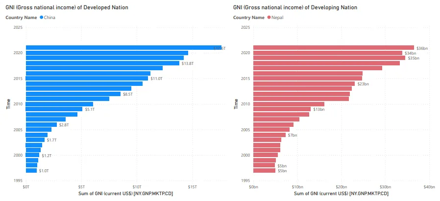

In the year 2020, the GNI of Nepal saw a decrease because the values added by the residents were stalled due to the lockdown which was a reduction to control the pandemic

## Predictive Modeling
The modeling is done using Linear Regression Algorithm. Reason for selecting this algorithm:

- Linear Regression helps analyze the linear regression between a dependent variable with a given set of independent variables.
- In this dataset,

1. GDP is a dependent variable.
2. Attributes such as Import of goods and services, Revenue, Taxes, Net Export, etc. are Independent variables

**In Currency Indicators:**

The dataset has been split into a 70/30 ratio i.e 70% data for training and 30% for testing.

The R-square value for the Currency Indicator obtained is 99% ~ 1 which is the best fit. Hence we can conclude that the variable is strongly correlated.

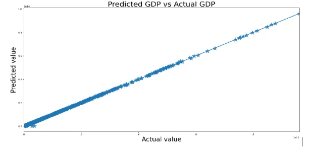

**Conclusion**

Hence we can conclude that the indicators strongly affect the GDP growth.

These indicators are also affected by the internal situation of the Country.

We can see in the year 2015/2016 when the massive earthquake affected the nation there was another decrease or constant value.

Similar to the year 2020 when the pandemic affected the whole world, the total reserve in the central bank, and the export of goods and services were affected. Those countries that imported saw a loss while those imported this year saw growth.

## Reference
1. <https://data.worldbank.org/indicator/SM.POP.TOTL?locations=NP>
2. <https://www.migrationdataportal.org/themes/international-migrant-stocks>
3. [2005 Nepal coup d'état - Wikipedia](https://en.wikipedia.org/wiki/2005_Nepal_coup_d%27%C3%A9tat#:~:text=A%20coup%20d%27%C3%A9tat%20in,power%20following%20the%20Loktantra%20Andolan.)
4. [Total reserves (includes gold, current US$) - Nepal | Data (worldbank.org)](https://data.worldbank.org/indicator/FI.RES.TOTL.CD?locations=NP)
