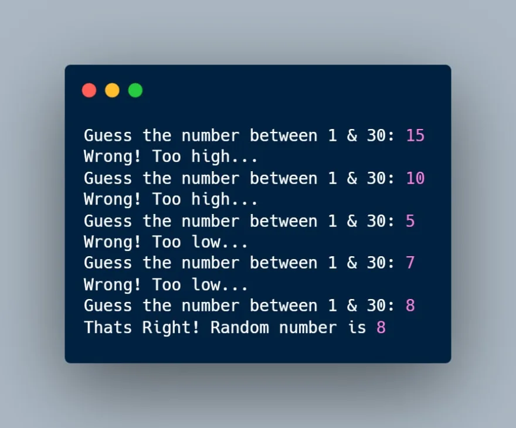

In this article, we are going to make a “Guess the Number” game.

**How it works**

Our games will randomly generate a number between **0 and 30** and the player has to guess the number. If the number entered by the player is less than generated number then the player will be prompted with **too low** message! And if the number entered by the player is more than generated number then the player will be prompted with **too high** message! This process will be repeated until the player finds the right number.

## Let's Code
Now since we are going to generate a random number and if you've been following past tutorials in the series than you might know what we are talking about here. We are going to import a module that comes pre-installed with our Python, it's called **random.**

## **Step 1 :** Let's import it into our project.

```python
import random
```

## **Step 2 :** Now we have to initialize a **max_num** variable. So that we can customize the difficulty as per our choice. The higher the value of **max_num**, the higher the difficulty. For now, let's keep it 30

```python
max_num = 30
```

## **Step 3 :** Now it's time we generate our random number which the player has to find. For that we will be using **randint()** function from the **random** module. We will store this random value in **random_number** variable.

```python
random_number = random.randint(1, max_num)
```

## It will generate a random number between **1** & **max_num.**

**Step 4 :** Then we will also initialize a **guess** variable to store the player's answer for comparison.

```python
guess = 0
```

**Step 5 :** Now let's create a while loop to keep asking the player until the right number is found. We will keep this loop running until our **random_number** & guess matches.

```python
while guess != random_number:
    pass
```

**Step 6 :** so it's time we ask our player to make a guess enter a number to start the game.

```python
while guess != random_number:
    guess = int(input(f"Guess the number between 1 &{max_num}: "))
```

We will also use **int()** function to covert the number from a string into an integer so that we can compare it to check the answer.

**Step 6 :** Now we will make use of **if** conditionals to compare the answer and provide suitable feedback to the player.

```python
while guess != random_number:
    guess = int(input(f"Guess the number between 1 &{max_num}: "))
    if guess < random_number:
        print("Wrong! Too low...")
    elif guess > random_number:gfd
        print("Wrong! Too high...")
    else:
        print(f"Thats Right! Random number is {random_number}")
```

**Happy coding !!!**
