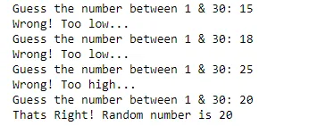

Our games will randomly generate a number between **0 and 30** and the player has to guess the number.

If the number entered by the player is less than generated number then a **too low** message will be displayed

And if the number entered by the player is more than generated number then a **too high** message will be displayed

This process will be repeated until the player finds the right number.

First, we start by generating the random number thatthe user will have to guess. To do so we're gonna have to import module that comes pre-installed with our Python, it's called **random.**

```python
#we need to generte randome numbers wo first we need to import random
import random
```

**max** variable will decide the difficulty of our game. Higher the value, the higher the difficulty.

```python
#Now we have to initialize a max variable.
max = 30
```

Now it's time we generate our random number which the player has to find.

We will use **random.randint(1, max)** function to generate a random number.

```python
#Now it's time we generate our random number which the player has to find.
random_number = random.randint(1, max)
```

It will generate a random number between **1** & **max.**

**number** variable will contain the answer entered by the player.

```python
number = 0
```

Now loop will begin and if the number entered by the player matches the generated answer then the loop will no longer execute and the final **print()** statement will be printed, telling the player that the game is over.

```python
while number != random_number:
number = int(input(f"Guess the number between 1 & {max}: "))
if number < random_number:
   print("Wrong! Too low...")
elif number > random_number:
   print("Wrong! Too high...")
print(f"Thats Right! Random number is {random_number}")
```

Otherwise, the loop will keep running until the right number is entered by the player.

we'll get this output:



the link to github repository is:

[Here](https://github.com/asmakrl/datacampstd/blob/bccf22856f0908ae97a1cdc15c4f594c3fd7d897/guess%20the%20number%20game.ipynb)
