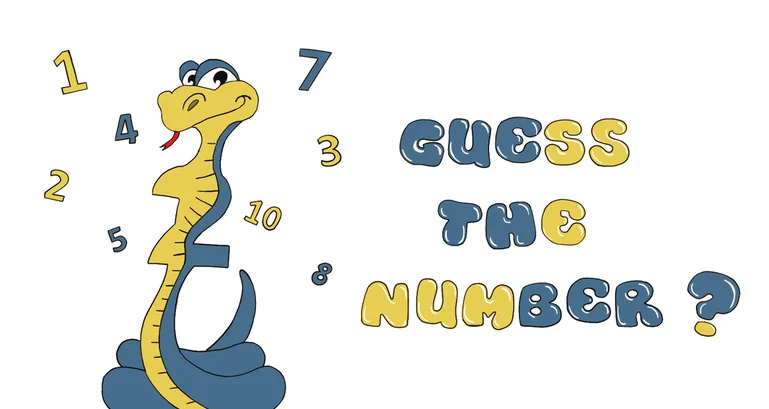
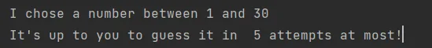
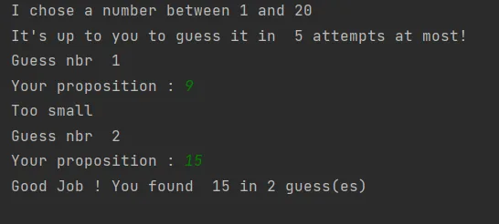
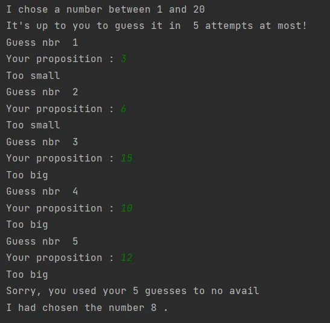

In this tutorial, you'll learn to create a simple **number guessing game using python****.**

**Rules of the game**

This game is very simple. The computer draws a random number between 1 and 20 and you have five tries to find it.

After each attempt, the computer will tell you if the number you offered is too big, too small, or you've found the right number.



### Let's Start Conding!

**First Step: Importing the random module**

```python
from random import randint
```

Here is the *random* module from which we import the function *randint (a,b),* which returns an integer between the bounds a and b, the bounds being included. We’ll use it to stimulate the computer’s choice.

**Step 2: Initializing the variables**

```python
nbr_guesses_max = 5
nbr_guesses = 1
max_random = 20
my_nbr = randint(1,max_random) # number chosen by the PC
your_nbr = 0 # Number proposed by the player
```

Here we have five variables that must be initialized. This means that you have to give them a value starting point.

An integer random value will be stored in the variable *my_nbr*, which will change each time program execution.

**Step 3 : While loop / Conditionns**

```python
print("I chose a number between 1 and",max_random)
print("It's up to you to guess it in ",nbr_guesses_max,"attempts at most!")
```

These two lines write on the screen the text between quotation marks, as well as the values contained in the variables *max_random* and nbr_guesses_max. In this case, we will see writing on the screen:



If the user enters anything other than a whole number, the program will generate an error and stop.

The solution is to implement an infinite loop (*while* True) whose only way to break is to enter a whole number. As long as the *ValueError* exception is raised, a user-created error message is displayed on the screen and the program asks the question again.

```python
 while True:
  try:
   your_nbr = int(input("Your proposition : "))
   break
  except ValueError:
   print("Invalid response. Try again !")
```

As long as the value stored in my_nbr is different from the

value stored in your_nbr and that the number of tests carried out will be less than or equal to maximum number of tries, then all the part of the code that is indented will be executed on a loop.

When the player proposes a number, there are three possibilities: either his number is too small, or he is too big, or it is the correct number. These three possibilities will correspond to three answers
different from the computer.

```python
while your_nbr != my_nbr and nbr_guesses <= nbr_guesses_max:
 print("Guess nbr ",nbr_guesses)
 #Getting the user's input
 while True:
  try:
   your_nbr = int(input("Your proposition : "))
   break
  except ValueError:
   print("Invalid response. Try again !")

 if your_nbr < my_nbr:
  print("Too small")
 elif your_nbr > my_nbr:
  print("Too big")
 else:
  print("Good Job ! You found ", my_nbr, "in", nbr_guesses, "guess(es)")

 nbr_essays += 1
```

**Final step: Running the code**

let's try running our Code!





### Source Code:
Thank you so much for reading! I hope you found this project useful.

You can find the complete source code of this project here ==> [**SourceCode**](https://github.com/LinaMeddeb/GuessTheNumber)
