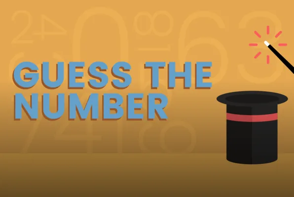

## General Introduction

"**Guess the Number**" is a simple game, which consists of simply finding the number generated by the program.

This game can be easy or difficult to play according to the defined rules. In this article we are going our version of this game, following the rules that we have to establish in advance.

If we guess the number we have a **"Youpi 🎉🎉🎉🎉"** message and if not then that's a message "***Greater than the number to guess***" or "***Lower than the number to guess***".

When the user cannot find the number at the end of the game, we display the number for example "**The guess number is 67**".

**Rules**

- The generated number is between 1 and 300
- The number of luck to find the number is 9

## Application in code
Now that each of the rules is established, we have implemented the first rule.

**Generate number between 1 and 300**

In order to generate, a guess number we will use the following library from python core librairies.

```python
import random
```

inside this library we have a function which allows us to generate a number in one between 2 values, we will use it to generate our number at each execution of the program. Then we will record the value of the generated value inside a variable **guess.**

```python
guess = random.randint(1, 300)
```

**Core program**

In this part we will write the code to play the game.

For the needs of our program we will create 4 variables

- **max** in order to save the maximum value that we can entered, by default it's 300
- **min** in order to save the minimum value that we can entered, by default it's 1
- **luck** the number of remaining attempts, by default it's 9
- **attempt** the value entered by user, by default it's 0

```python
min = 1
max = 300
luck = 9
attempt = 0
```

We have the option of declaring these variables before or after generating a number, it's up to us to do as we want.

First we will make sure that everything the user enters is in our range.

At each failed attempt we will ask him the same question until this one has something valid.

```python
while luck > 0:
    while min > attempt or max < attempt:
        attempt = int(input('Entrer a number between %s and  %s' % (min, max)))
```

Then we will display if the number to find is smaller, greater or equal to the number entered.

Each time we will take the opportunity to change the limits (**max** and **min**) of our interval.

If we find the number we stop the program.

```python
if attempt == guess:
    print("Youpi 🎉🎉🎉🎉")
    break
else:
    luck -= 1
    if guess < attempt:
        max = attempt
        print('%d is greater than the number to guess'%(attempt))
    else:
        min = attempt
        print('%d is lower than the number to guess'%(attempt))
```

finally, if the number of luck is exhausted we will display the number to guess

```python
if luck == 0:
    print('The guess number is %d'%(guess))
```

## Full Code

```python
import random

guess = random.randint(1, 300)

min = 1
max = 300
luck = 9

while luck > 0:
    attempt = 0
    while min > attempt or max < attempt:
        attempt = int(input('Entrer a number between %s and  %s' % (min, max)))

    if attempt == guess:
        print("Youpi 🎉🎉🎉🎉")
        break
    else:
        luck -= 1
        if guess < attempt:
            max = attempt
            print('%d is greater than the number to guess'%(attempt))
        else:
            min = attempt
            print('%d is lower than the number to guess'%(attempt))

if luck == 0:
    print('The guess number is %d'%(guess))
```
