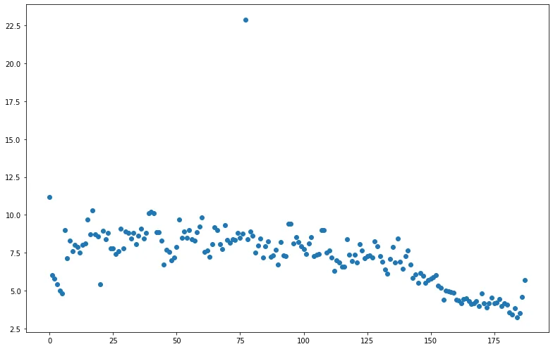
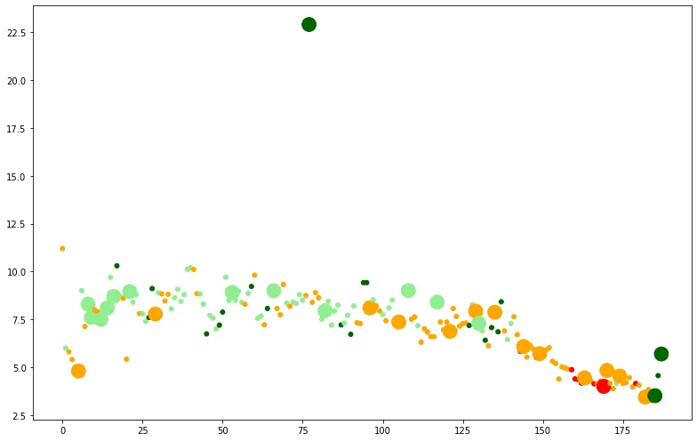
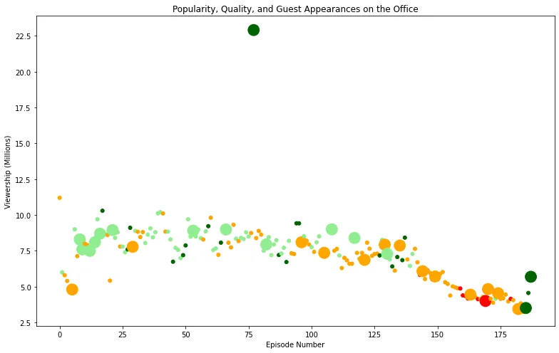
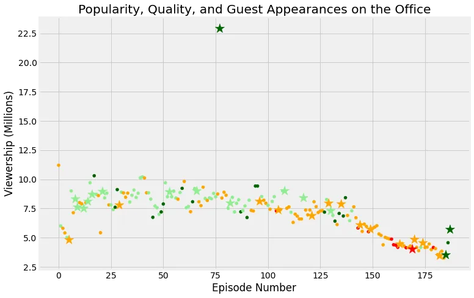

## Introduction
In this blog we try to explain how a simple data investigation task can be done on a dataset,we will try to get some hands on coding skills on how to use Python libraries - specifically Pandas and Matplotlib - to answer questions about data and try to manipulate data to find useful insights and information that we wouldn't notice without those techniques, the used dataset in this article is 'Office Series Investigation Dataset' and the part explained are part of a DataCamp project that you'll fully understand after finishing this article, though this investigation can be generalized and be used in the same manner for even bigger and more complex datasets with slightly small changes.


**The Office!** What started as a British mockumentary series about office culture in 2001 has since spawned ten other variants across the world, including an Israeli version (2010-13), a Hindi version (2019-), and even a French Canadian variant (2006-2007). Of all these iterations (including the original), the American series has been the longest-running, spanning 201 episodes over nine seasons.

The data set was downloaded from Kaggle [here](https://www.kaggle.com/nehaprabhavalkar/the-office-dataset). And also this is one of the DataCamp projects.

We will go through the available data set which contains some characteristics and features for each episode as follows:

- **episode_number:** Canonical episode number.
- **season:** Season in which the episode appeared.
- **episode_title:** Title of the episode.
- **about:** Description of the episode.
- **ratings:** Average IMDB rating.
- **votes:** Number of votes.
- **viewership:** Number of US viewers in millions.
- **duration:** Duration in the number of minutes.
- **Date:** Airdate.
- **guest_stars:** Guest stars in the episode (if any).
- **director:** Director of the episode.
- **writers:** Writers of the episode.

**First:**

Import libraries Like Pandas and Matplotlip to read a dataset:

```python
import pandas as pd
import matplotlib.pyplot as plt
```

Second Step:

Read a date from a file

```python
plt.rcParams['figure.figsize'] = [11, 7]
office_df = pd.read_csv('datasets/office_episodes.csv',parse_dates=["release_date"])
office_df.info()
```

Output of first 2 steps

```python
<class 'pandas.core.frame.DataFrame'>
RangeIndex: 188 entries, 0 to 187
Data columns (total 14 columns):
 #   Column          Non-Null Count  Dtype
---  ------          --------------  -----
 0   episode_number  188 non-null    int64
 1   season          188 non-null    int64
 2   episode_title   188 non-null    object
 3   description     188 non-null    object
 4   ratings         188 non-null    float64
 5   votes           188 non-null    int64
 6   viewership_mil  188 non-null    float64
 7   duration        188 non-null    int64
 8   release_date    188 non-null    datetime64[ns]
 9   guest_stars     29 non-null     object
 10  director        188 non-null    object
 11  writers         188 non-null    object
 12  has_guests      188 non-null    bool
 13  scaled_ratings  188 non-null    float64
dtypes: bool(1), datetime64[ns](1), float64(3), int64(4), object(5)
memory usage: 19.4+ KB
```

Third Step:

Let's visualize the Episode Number vs Viewers in Millions in a plot befre any label and title:

```python
#Create Scatter Plot in Beginning Before Any Thing
fig = plt.figure()

plt.scatter(x=office_df['episode_number'],y=office_df['viewership_mil'])
plt.show()
```



Fourth step:

A **color scheme** reflecting the **scaled ratings** of each episode, so that we put a condition to each rate:

We can a full visualization for the data that can describe it very well, we will plot the same as before except that we will put colors to describe how well each episode is rated, red color less than 0.25, orange color between 0.25 and 0.5, lightgreen color for rates between 0.5 and 0.75, darkgreen color more than 0.75 which are very high rates, let's code this

```python
#Make Column list to Scaled_rating
cols =[]

for ind, row in office_df.iterrows():
    if row['scaled_ratings'] < 0.25:
        cols.append('red')
    elif row['scaled_ratings'] < 0.50:
        cols.append('orange')
    elif row['scaled_ratings'] < 0.75:
        cols.append('lightgreen')
    else:
        cols.append('darkgreen')
cols[:20]
```

Output to first 20 column before see in scatter plot:

```python
['orange',
 'lightgreen',
 'orange',
 'orange',
 'lightgreen',
 'orange',
 'lightgreen',
 'orange',
 'lightgreen',
 'lightgreen',
 'orange',
 'orange',
 'lightgreen',
 'orange',
 'lightgreen',
 'lightgreen',
 'lightgreen',
 'darkgreen',
 'lightgreen',
 'orange']
```

fifth step we make:

Knowing a size of Guest

We want to create one last column, which will be the size of our plots. So in case, we have guest stars its value will be 250 otherwise it will be 25.

```python
#Knowing Size of Guest
size = []

for ind, row in office_df.iterrows():
    if row['has_guests'] == False:
        size.append(25)
    else:
        size.append(250)
size
```

Output of Size in small scale to see some of visualize our data:

```python
[25,
 25,
 25,
 25,
 25,
 250,
 25,
 25,
 250,
 250,
 ]
```

Define a color to cols and sizes to size:

```python
office_df['colors']=cols
office_df['sizes']=size

office_df.info()
```

Now let's move to some visualization to present our findings and analysis by visualizing the viewership across years:

```python
#Add Col and size to Scatter plot
fig = plt.figure()

plt.scatter(x=office_df['episode_number'],
            y=office_df['viewership_mil'],
            c=cols,
            s=size

           )
plt.show()
```



Know we add a tittle and label to our visualize our Dataset:

```python
#put title,xlabel,ylabel to Scatter plot
fig = plt.figure()

plt.scatter(x=office_df['episode_number'],
            y=office_df['viewership_mil'],
            c=cols,
            s=size
            )
plt.title("Popularity, Quality, and Guest Appearances on the Office")
plt.xlabel("Episode Number")
plt.ylabel("Viewership (Millions)")
plt.show()
```



Let's make two data frames from the original ,that contains guest stars and one that has not:

```python
non_guest_df= office_df[office_df['has_guests']==False]
guest_df= office_df[office_df['has_guests']==True]
```

Know we make a scatter plot after we make a classfication to non_guest and guest and see this in code and scatter plot:

```python
#Make A classfication to non_guest and guest
fig = plt.figure()
plt.style.use('fivethirtyeight')

plt.scatter(x=non_guest_df['episode_number'],
            y=non_guest_df['viewership_mil'],
            c=non_guest_df['colors'],
            s=non_guest_df['sizes']
            )
plt.scatter(x=guest_df['episode_number'],
            y=guest_df['viewership_mil'],
            c=guest_df['colors'],
            s=guest_df['sizes'],
            marker='*'
            )
plt.title("Popularity, Quality, and Guest Appearances on the Office")
plt.xlabel("Episode Number")
plt.ylabel("Viewership (Millions)")
plt.show()
```



we should make a condition to get maximum guest to get our to star see this in code:

```python
#Put a condition to get top star
office_df[office_df['viewership_mil'] == office_df['viewership_mil'].max()]['guest_stars']
```

```python
#Get Name of top star
top_star = "Cloris Leachman"
```

Finally we visualize our Datset in a detail and move step by step in our project

### Acknowledgment

The dataset used for this article is downloaded from kaggle and you can find it [here](https://www.kaggle.com/nehaprabhavalkar/the-office-dataset) , and the project Unguided Project on DataCamp you can refer to the original project [here](https://projects.datacamp.com/projects/1170).

*That was part of the Data Insight's Data Scientist Program.*
