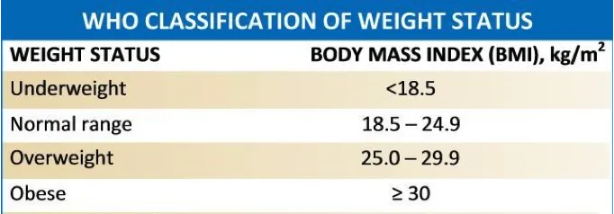
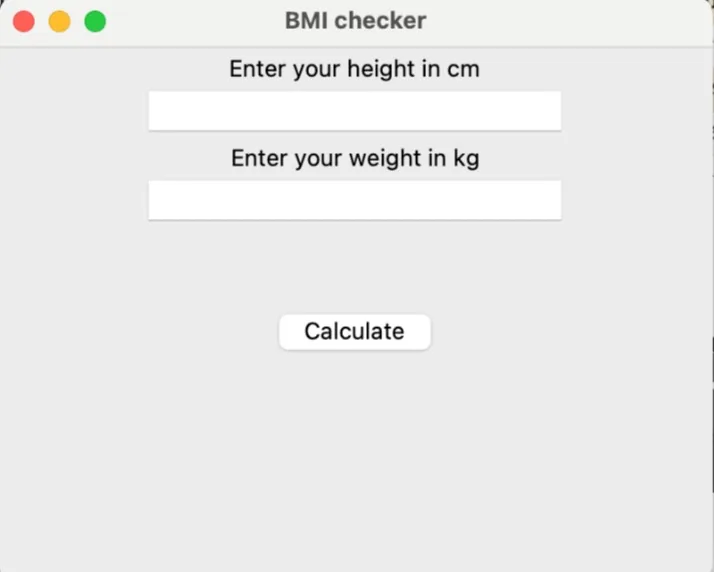

Hello and welcome to my first blog post. Tkinter, a Python GUI toolkit, was used to create a basic BMI checker. This post discusses BMI, its essence, how I went about writing the program and concludes with a very simple demonstration. Please leave a comment, question, or contribution.

First and foremost,


Body Mass Index (BMI) is a measure of a person's fat content that is primarily used to check for weight categories that may lead to health concerns. As a result, patients are classified as overweight, underweight, or obese. It does not, however, account for bones, tissues, or muscle mass.

I started by writing down the fundamental functions I anticipated to use in the code (simplistic flow of the app):

-Ask the user for feedback (height and weight)

-After that, do arithmetic on the inputs (weight and height).

-classify the individual based on their BMI

The categorization was based on a World Health Organization chart.



The application makes use of *Tkinter*, a Python GUI module. Tkinter allows the user to interact with the application by displaying it in a window. This is how the algorithm was implemented;



1. Importing the GUI package

```python
# imports tkinter a GUI package
import tkinter as tk
```

2. Declaring the variables and the BMI formulae

```python
# this function calculates the BMI
def calculate_bmi():

# takes the height input in centimeters
    get_height_cm = float(entry_height.get())

    # takes the weight input
    get_weight = float(entry_weight.get())

    # converts their height to meters
    height_m = get_height_cm / 100

    # the bmi formula
    bmi = get_weight / (height_m) ** 2
    label_bmi.configure(text=f'Your bmi is : {bmi}')
```

3. Commentary for the BMI ranges

```python
# commands for the various scenarios
    if bmi < 18.5:
        label_result.configure(text=f'You are underweight')
    elif bmi > 18.5 and bmi < 24.9:
        label_result.configure(text=f'You have a healthy weight')
    elif bmi > 25.0 and bmi < 29.9:
        label_result.configure(text=f'You are overweight')
    elif bmi > 30:
        label_result.configure(text=f'You are obese')
```

4. Tkinter Window.

This segment creates a window for the BMI, with labels and text areas as well as buttons.

```python
# specificaions for the GUI window

window = tk.Tk() # initialises a blank window
window.title('BMI checker')
window.geometry('400x300')

# caters for the label and the text area

label_height = tk.Label(text="Enter your height in cm")
entry_height = tk.Entry(width=25)
label_weight = tk.Label(text="Enter your weight in kg")
entry_weight = tk.Entry(width=25)

# the button, Calculate.
label_bmi = tk.Label()
label_result = tk.Label()

# when the button is pressed
# the bmi's output is printed
button_calc = tk.Button(text="Calculate", command=calculate_bmi)

label_height.pack()
entry_height.pack()
label_weight.pack()
entry_weight.pack()
label_bmi.pack()
label_result.pack()
button_calc.pack()

window.mainloop() # makes the window visible
```

5. The Demo:

You could find the full sample code [here](https://github.com/Joana-Mansa/BMI_checker).
