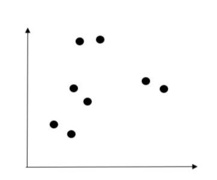
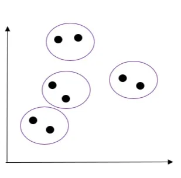
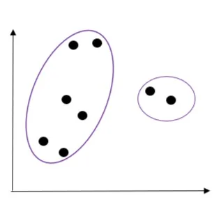
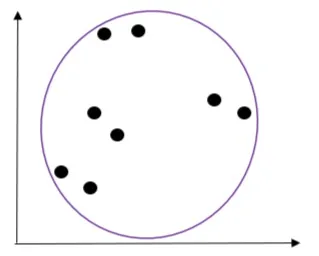

In machine learning, the method of grouping unlabeled data is called clustering. This involves segmenting data with similar characteristics into distinct groups. It is used to ascertain meaningful insights from unlabelled data. An example is, Streaming services such as Youtube and Netflix use clustering analysis to identify viewers who have similar behavior. They collect information such as the minutes watched per day, total viewing sessions per week, and the number of unique shows viewed per month. With this information, a streaming service can perform a cluster analysis to determine high and low usage subscribers. This will influence which subscribers they can spend most of their advertisement money on.

In this blog, we will be exploring the hierarchical clustering technique of unsupervised learning.

**Hierarchical Clustering.**

Hierarchical clustering is a technique of grouping similar objects. For example, given a set of data, grouping the values in the data into X number of clusters so that similar values in the data are close to each other. There are two techniques of hierarchical clustering:

**1. Agglomerative Clustering:** It starts with each data point as an individual cluster and merges the similar pairs of data points into clusters until only one cluster remains.

**2. Divisive Clustering:** It is the reverse of agglomerative clustering. It starts with one cluster that contains all data points and then split the data points into smaller clusters until each cluster contains one data point.

**HOW DOES AGGLOMERATIVE CLUSTER WORK**

1. Assuming the 8 data points on the 2-D plain below, each data point represents a single cluster.

2. The next step involves merging the nearest data points to form a cluster. The images below show the merging process until a single cluster is formed.

CLUSTER DISTANCE MEASURE

The distance between two clusters is determined by the linkage method. Below are some of the most used linkage methods:

1. Single Linkage: It is the shortest distance between the closest clusters.
2. Complete Linkage: It is the farthest distance between dissimilar clusters.
3. Average Linkage: It is the average distance between two clusters. That is the sum of the distance between each data point in the clusters divided by the number of data points.
4. Centroid Linkage: It is the distance between the centroids of two clusters.
5. Ward Linkage: It analyses the variance of clusters by how much the sum of squares will increase when the clusters merge.
