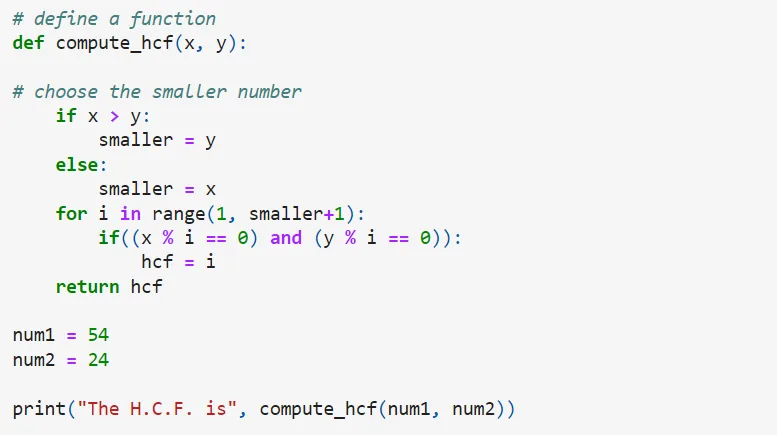

The **highest common factor** (HCF) is found by finding all common factors of two numbers and selecting the largest one. As we can see, 5 and 25 have common factors of 1 and 5.

**Properties**

(i) The H.C.F. of two or more numbers cannot be more than one of them.

(ii) If one number is a factor of the other numbers, their H.C.F. will be that smallest number.

(iii) The H.C.F. of the numbers is the product of the common prime factors.

**Code**

In the function, we first determine the smallest of the two numbers since H.C.F can be less than or equal to only the smallest number. We then use a for loop to go from 1 to that number.

In each iteration, we check whether our number divides both input numbers perfectly. If so, we save the number as H.C.F. When the loop ends, we end with the largest number that divides both numbers perfectly.
