***“Data analysts’ work varies depending on the type of data that they’re working with (sales, social media, inventory, etc.) as well as the specific client project,” says Stephanie Pham, analyst for*** [***Porter Novelli***](http://www.porternovelli.com/)

A data analyst collects, processes and performs statistical analyses on large datasets. He discover how data can be used to answer questions and solve problems. The work of a data analyst depends on where they work and what tools they work with. Some data analysts don’t use programming languages and prefer statistical software and Excel. Depending on the problems they are trying to solve, some analysts perform regression analysis or create data visualizations.

Let's explore what can a data analyst do by doing some time series analysis project of NAICS.

But first, let's give some highlights about the project we're going to realise throughout this blog.

**-** **What is NAICS?****:** The North American Industry Classification System (NAICS) is an industry classification system developed by the statistical agencies of Canada, Mexico and the United States, it is designed to provide common definitions of the industrial structure of the three countries and a common statistical framework to facilitate the analysis of the three economies.

**-** **NAICS Structure****:** NAICS uses a hierarchical structure. A "hierarchy" is the relationship of one item to a particular category:

**- Sector**: 2-digit code:

**- Subsector**: 3-digit code

**- Industry Group**: 4-digit code

**- NAICS Industry**: 5-digit code

**- National Industry**: 6-digit code

NAICS works as a hierarchical structure for defining industries at different levels of aggregation. For example, a 2-digit NAICS industry (e.g., 23 - Construction) is composed of some 3-digit NAICS industries (236 - Construction of buildings, 237 - Heavy and civil engineering construction, and a few more 3-digit NAICS industries). Similarly, a 3-digit NAICS industry (e.g., 236 - Construction of buildings), is composed of 4-digit NAICS industries (2361 - Residential building construction and 2362 - Non-residential building construction).

***So, What is the data that we're going to dig through ?***

**Raw data****:** 15 CSV files beginning with RTRA. These files contain employment data by industry at different levels of aggregation; 2-digit NAICS, 3-digit NAICS, and 4-digit NAICS. Columns mean as follows:

(***i) SYEAR: Survey Year***

***(ii) SMTH: Survey Month***

***(iii) NAICS: Industry name and associated NAICS code in the bracket (iv) _EMPLOYMENT_: Employment***

**-** **LMO Detailed Industries by NAICS****:** An excel file for mapping the RTRA data to the desired data. The first column of this file has a list of 59 industries that are frequently used. The second column has their NAICS definitions. Using these NAICS definitions and RTRA data, we will create a monthly employment data series from 1997 to 2018 for these 59 industries.

**-** **Data Output Template****:** An excel file with an empty column for employment. We should fill the empty column with the data we will prepare from our analysis.

Now, it's time to start playing...!

**-** **DATA PREPARATION****:**

We start by importing the libraries we need:

```python
#Imporing the Libararies
%matplotlib inline
import pandas as pd
import numpy as np
import matplotlib.pyplot as plt
import seaborn as sns
from datetime import date
```

Then, we start importing our files one by one:

```python
#read the flat files as data
lmo_detailed_industries=pd.read_excel('LMO_Detailed_Industries_by_NAICS.xlsx')
lmo_detailed_industries.head(10)
```

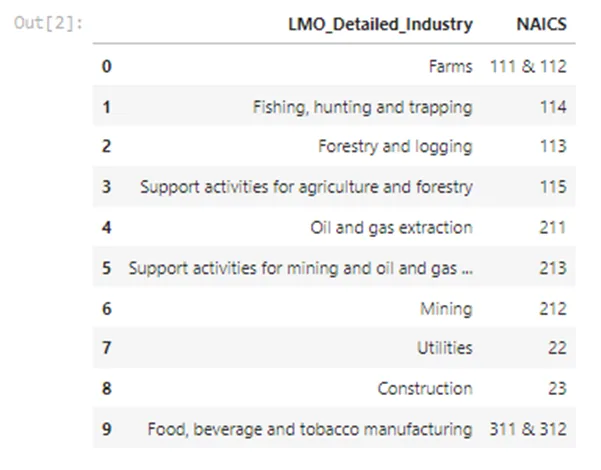

We can see that NAICS column needs some cleaning. we need to replace the & by a comma.

```python
#cleaning the'NAICS'column
lmo_detailed_industries['NAICS']=lmo_detailed_industries.NAICS.astype(str).str.replace('&',',')
lmo_detailed_industries.head(10)
```

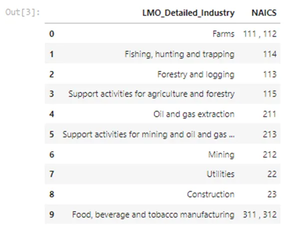

*RTRA files**:* We have 15 csv files, importing them one by one is heavy so we're going to create a function for this, the idea will be to pass a df that contains the first csv file and the list of the remaining one. The function will read the csv files one by one and append them to the DF.

```python
#creat a function to read our rtra files
def read_files(dataframe,list_p):
    """"
    The function will read our RTRA files and
    create a dataframe out of the data
    Args:
    -----------------------------------------
    dataframe: A dataframe containing the first file
    list_p: list of the rest of the files
    Returns:
    ----------------------------------------
     Dataframe
     """
    for file in list_p:
    df=pd.read_csv(file)
    dataframe=dataframe.append(df,ignore_index=True)
    return dataframe
```

```python
#read 2-digit RTRA FILES
df_2_naics = pd.read_csv('RTRA_Employ_2NAICS_97_99.csv')
list_2_digit_Naics= ['RTRA_Employ_2NAICS_00_05.csv','RTRA_Employ_2NAICS_06_10.csv','RTRA_Employ_2NAICS_11_15.csv','RTRA_Employ_2NAICS_16_20.csv']
df_2_naics= read_files(df_2_naics,list_2_digit_Naics)
df_2_naics.tail()
```

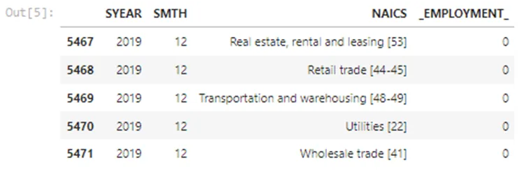

We need to create a column in the DF for the NAICS_CODE, because we need to join the RTRA files with Industries DF based on that code: we need to creat a function so we can use it for all our RTRA DF's:

```python
def clean_col (df):
     """"
     The function will clean the columns of our DF's
     Args:
     -----------------------------------------
     df: A dataframe
     Returns:
     ----------------------------------------
     Dataframe
     """"
     df1=pd.DataFrame(df.NAICS.astype('str')
     .str.split('[').to_list(),
     columns=['NAICS','NAICS_CODE'])
     df1['NAICS_CODE']=
     df1.NAICS_CODE.astype('str').str.strip(']')
     .str.replace('-',',')
     df['NAICS']=df1['NAICS']
     df['NAICS_CODE']= df1['NAICS_CODE']
     return df
```

```python
#applying the fct on our df
clean_col(df_2_naics)
df_2_naics.head(10)
```

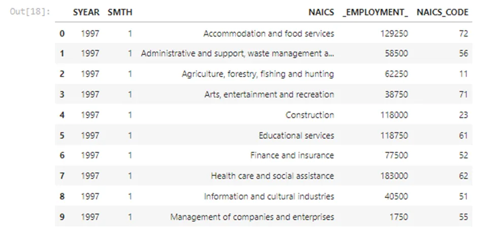

Now, we do the merge magic to get the industry name for every code:

```python
#left merging the df_2_naics with lmo_detailed_industries df1=df_2_naics.merge(lmo_detailed_industries, left_on='NAICS_CODE', right_on='NAICS', how='left').drop(columns=['NAICS_x','NAICS_y'],axis=1)
df1.tail(10)
```

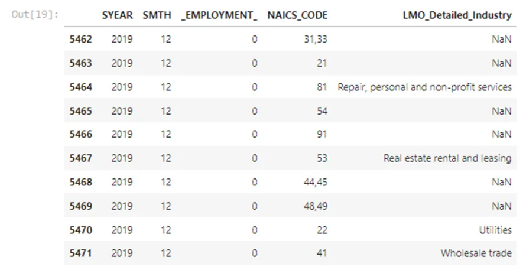

We need to create our datetime index and dropping the rows with missing values, because we'll be needing only the 59 industries for our analysis: we create a fuction that will combine the SYEAR and SMTH columns, converting them to a datetime using pd.to_datetime then setting them as an index.

```python
def index_datetime(df):
""""
The function will create a datetime indexto a dataframe            Args:
-----------------------------------------
df: A dataframe
Returns:
----------------------------------------
Dataframe
"""
combined= df.SMTH.astype('str').str
.cat(df.SYEAR.astype('str'),sep=' ')
df['DATE']= pd.to_datetime(combined)
.dt.strftime('%Y-%m')
df.set_index('DATE',inplace=True)
return df
```

here's our final 2_DIGIT DF:

```python
#applying the function int our  df
df1 = index_datetime(df1).dropna()
df1
```

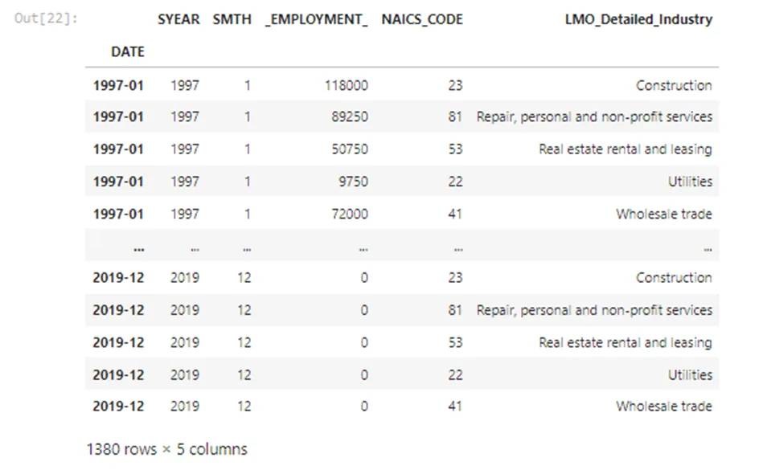

We'll do the same steps to create our 3_DIGITS DF and 4_DIGITS DF:

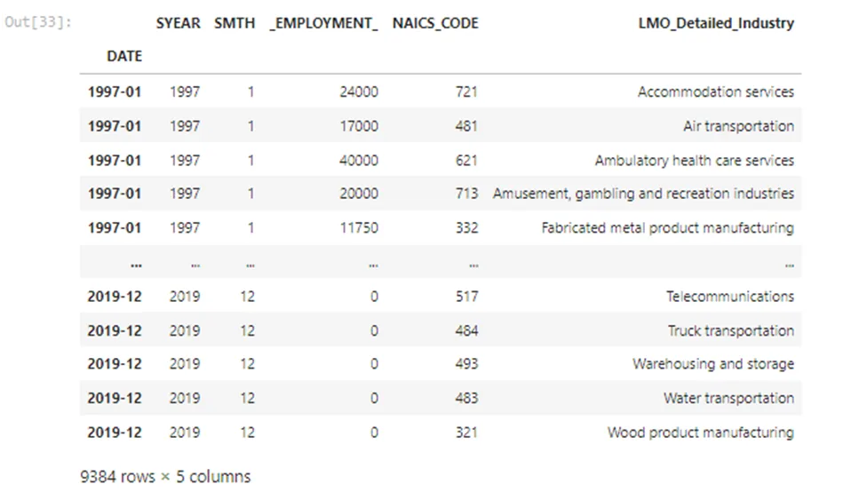

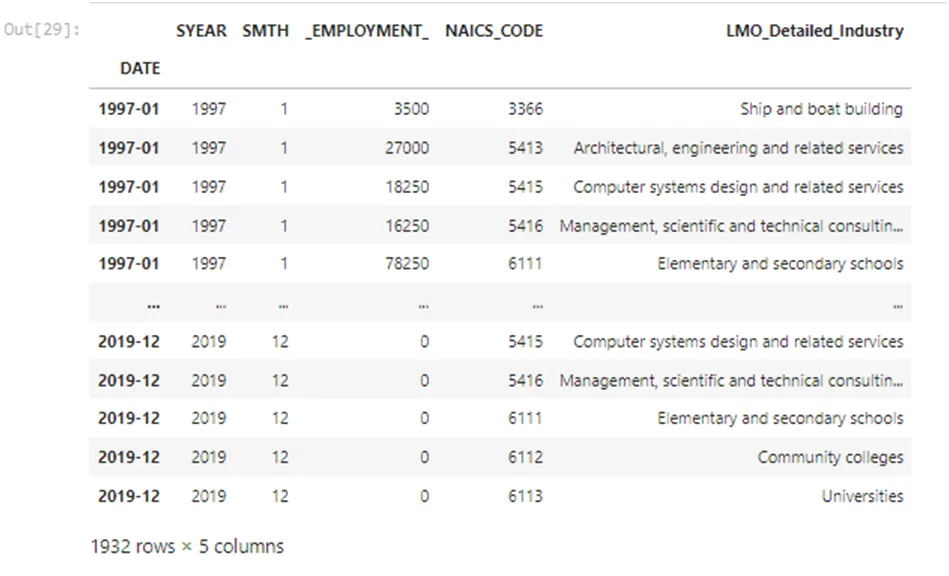

Now, we need to group these 3 DF's into one using the append() function:

```python
#appending our df's into one
df=df1.append(df2)
DF_NAICS=df.append(df3)
DF_NAICS
```

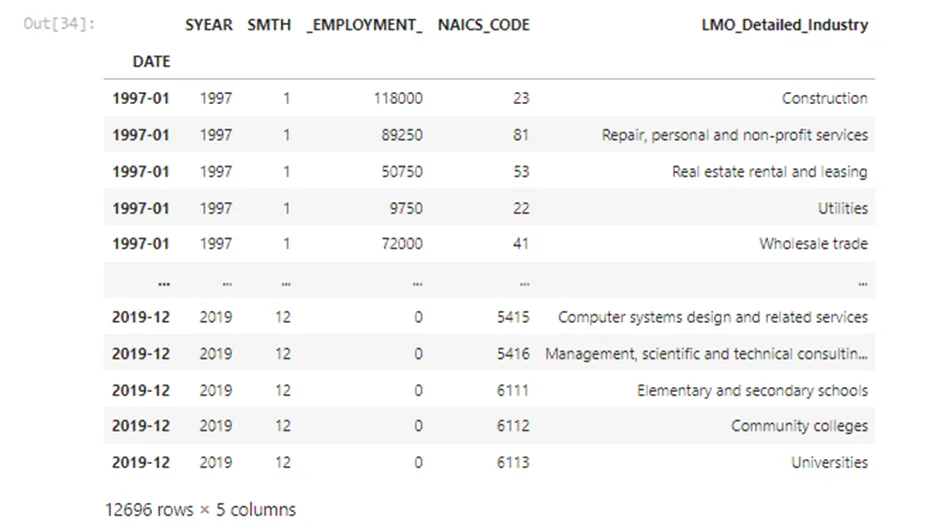

We need to perform our analysis from 1997 to 2018 so we need to drop 2019 rows:

```python
#filtering our df
DF_NAICS_97_18=
DF_NAICS[~((DF_NAICS.index).astype('str')>'2019')]
 DF_NAICS_97_18
```

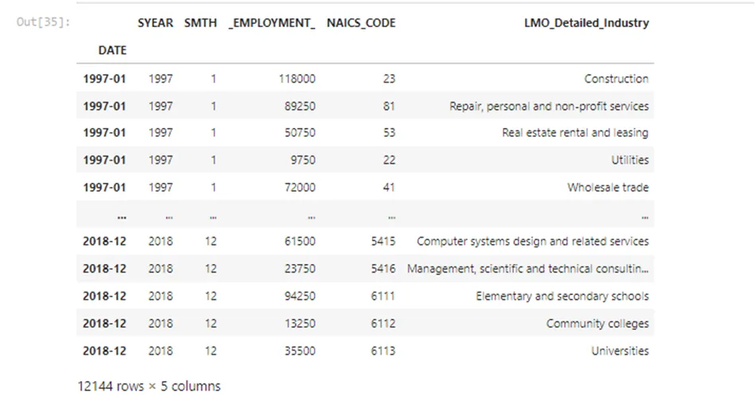

- Data_Output_Template File:

```python
#read the flat files as data
data_output= pd.read_excel('Data_Output_Template.xlsx')
data_output
```

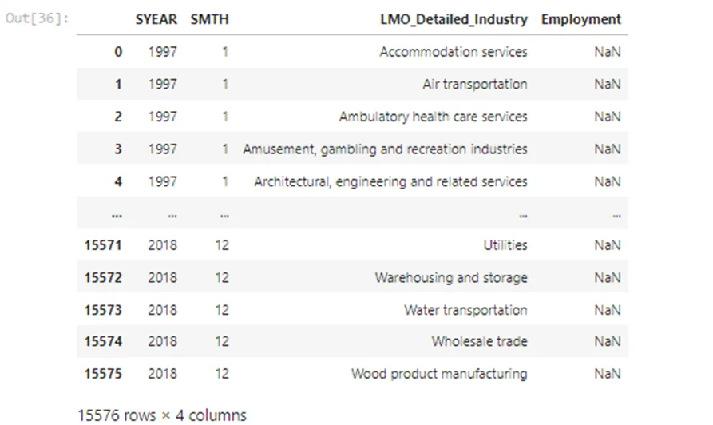

We need to fill the Employment column based on the data collected and cleaned above:

```python
#set datetime index
data_output= index_datetime(data_output)
```

```python
#merge
DF_OUTPUT= data_output.merge(DF_NAICS_97_18,
left_on=['DATE','LMO_Detailed_Industry'],
right_on=['DATE','LMO_Detailed_Industry'], how='left').drop(columns=['SYEAR_y','SMTH_y'],axis=1)
DF_OUTPUT['Employment']=DF_OUTPUT._EMPLOYMENT_
DF_OUTPUT=DF_OUTPUT.drop('_EMPLOYMENT_',axis=1)
DF_OUTPUT.rename(columns={'SYEAR_x': 'SYEAR', 'SMTH_x':'SMTH'},inplace=True)
DF_OUTPUT
```

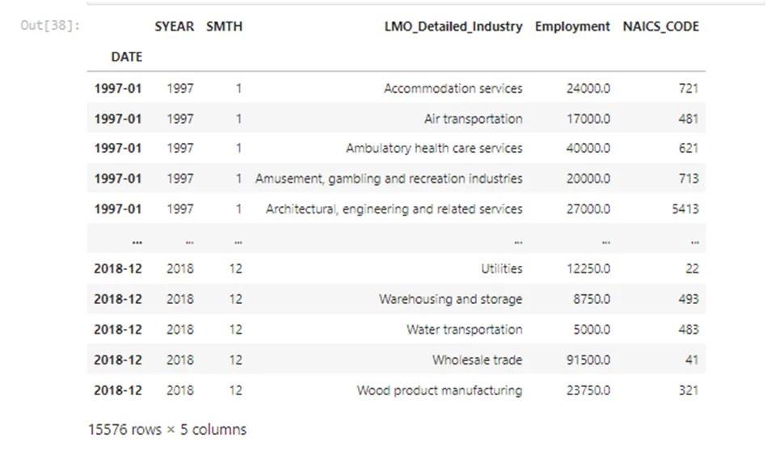

We check if there's any missing values:

```python
#checking if there's any missing valuesDF_OUTPUT.isnull().sum()
```

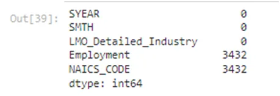

we fill the rows and here's our FINAL DATAFRAME, and it's ready for the game:

```python
#filling the missing values
DF_OUTPUT['Employment']=DF_OUTPUT['Employment'].fillna(0)
.astype(int)
DF_OUTPUT['NAICS_CODE']=DF_OUTPUT['NAICS_CODE'].fillna(0).astype(int)
```

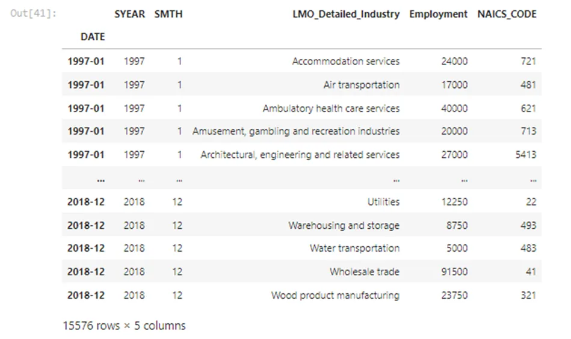

Before starting our exploration, we save the dataframe into an excel file:

```python
#saving our df into a file
DF_OUTPUT.to_excel('Data_Output.xlsx')
```

***DATA IS ONLY GOOD AS THE QUESTIONS YOU ASK***

The most important step that a data analyst must know is learning how to ask the right questions to get useful insights out from the data :

**-** **WHAT EXACTLY DO WE WANT TO FIND OUT****:** Answering this question requires understanding the data you gathered first: Here we have a dataframe containing the monthly evolution of employment in 59 industries from 1997 to 2018 then think about your goal: What do you want to take out from it and realise it by doing some relationship exploration.

**EXPLORATORY ANALYSIS**:

**1- HOW DID THE EMPLOYMENT EVOLVED OVER TIME ACROSS ALL INDUSTRIES?**

```python
employment_years=DF_OUTPUT.groupby('SYEAR')['Employment'].mean()
```

```python
#lineplot
sns.set_style('whitegrid')
sns.lineplot(data=employment_years)
plt.title('Variance of Employment Over Years')
plt.xlabel('YEARS')
plt.ylabel('Employment')
plt.show()
```

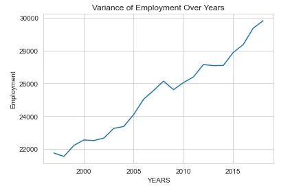

We can see that employment was always evolving throughout the years. Before 2000, it was at its lowest then started increasing slowly. There was a little peak between 2006 and 2007 it reached 26k than starting to decrease just after which interfere with 2008 economic crisis. Between 2010 and 2015 it was still instable , still some ups and downs then it started increasing from there till it reached 30k in 2018.

***what if we want to dig further into this evolution?***

**2- What is the eolution of the employment's frequency over the months of each year?**

To answer this, we're going to need a frequency table regrouping this three columns: and for that we're going to need one of pandas function: crosstab()

```python
plt.figure(figsize=(10,5))
A=pd.crosstab(DF_OUTPUT['SMTH'],DF_OUTPUT['SYEAR'],values=DF_OUTPUT['Employment'],aggfunc='mean').round(0)
g=sns.heatmap(A)
g.set_title('Evolution Of The Monthly Employment Over The Years')
g.set(xlabel='YEARS', ylabel='MONTHS')
```

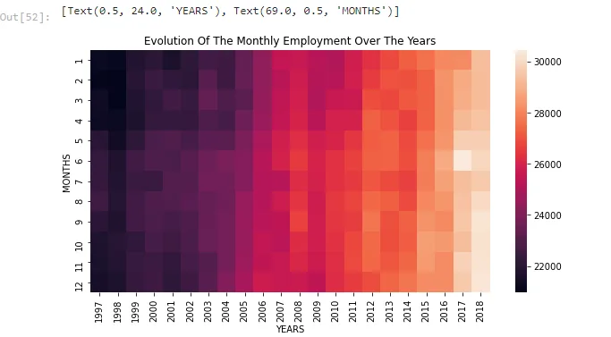

*THE COLOR GETS LIGHTER AS THE NUMBER INCREASES*

We can see that from 1997 to 2004 the employment frequency was very low as the color was darker. The employment was at its finest in 2018 and the peak month for employment was june 2017 as the color was the lightest.

**3-What is the total employment for each industry?**

```python
#grouping industries and create a df with the employment
employment_industry = pd.DataFrame(DF_OUTPUT.groupby(["LMO_Detailed_Industry"])["Employment"].sum())
```

```python
#barplot
sns.set_style('dark')
plt.figure(figsize=(20,15))
sns.barplot(x='Employment',y=employment_industry.index,data=employment_industry,orient ='h')
plt.title('Total Emplyment By Industries')
plt.xlabel('Employment')
plt.ylabel('industries')
plt.savefig('barchart.png')
#plt.xticks(rotation=90)
plt.show()
```

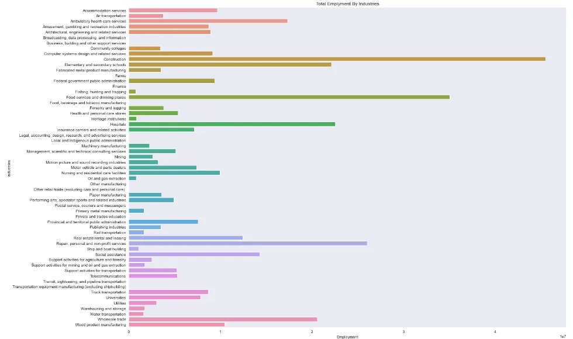

We can see that the construction industry had the biggest employment throughout the years.

a new question occurs:

**4- What are the top 5 employing industries ?**

```python
#filtering the top 5 industries
top_industries= employment_industry.sort_values(by='Employment',
ascending=False)
top_5_industries=top_industries.iloc[:5]
```

```python
#barplot
sns.barplot(x=top_5_industries.index,y='Employment',data=top_5_industries)
plt.title('Top 5 employing Industries')
plt.xlabel('industries')
plt.ylabel('Employment')
plt.xticks(rotation=90)
plt.show()
```

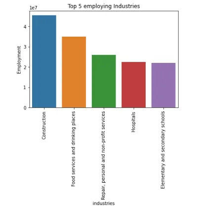

This proves that construction industry is a leading the employment from 1997 to 2018. Let's dig further into the top3 industries and see how the employment varied in each one compared to the total employment.

**5-How did the employment in Construction industry varied over years?**

```python
#construction over yearsconstruction_
df= DF_OUTPUT[DF_OUTPUT['NAICS_CODE']== 23]
construction_year= pd.DataFrame(construction_df.groupby('SYEAR')['Employment'].mean())
```

```python
#scatterplot
sns.set_style('darkgrid')
plt.figure(figsize=(10,5))
sns.scatterplot(x=construction_year.index, y='Employment',data=construction_year,size='Employment')
plt.title('Variance of Employment in Construction Over Years')
plt.xlabel('YEARS')
plt.ylabel('Employment')
plt.show()
```

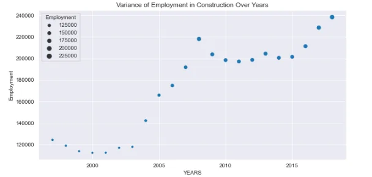

We can see that employment in constuction kept evolving across the years. We can see that there was a peak just befor 2010 we can assume that it was between 2007-2009 which means that even throughout the 2008 economic crisis the construction industry kept evolving and even had a bigger evolution, so the construction was the industry people turned to after losing their jobs or while not having any during the crisis.

**6-How did the employment in Food Services and Drinking places industry varied over years?**

```python
food_drinking_df= DF_OUTPUT[DF_OUTPUT['NAICS_CODE']== 722]
food_drinking_year= pd.DataFrame(food_drinking_df.groupby('SYEAR')['Employment'].mean())
```

```python
sns.set_style('darkgrid')
plt.figure(figsize=(10,5))
sns.scatterplot(x=food_drinking_year.index, y='Employment',data=food_drinking_year,size='Employment')
plt.title('Variance of Employment in food services and drinking places Over Years')
plt.xlabel('YEARS')
plt.ylabel('Employment')
plt.show()
```

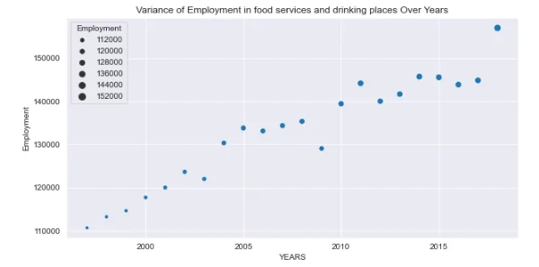

The second industry most employing is the food services and drinking places. It kept evolving throughout the time and reached its highest rate in 2018. Unlike the construction industry, the econmic crisis affected the sector, we can see that the evolution had its lowest peak in 2008. We can explain that by referring to people actually losing their jobs and the bankruptcy.

**7-How did the employment in Repair, personal and non-profit services industry varied over years?**

```python
repair_df= DF_OUTPUT[DF_OUTPUT['NAICS_CODE']== 81]
repair_year= pd.DataFrame(repair_df.groupby('SYEAR')['Employment'].mean())
```

```python
sns.set_style('darkgrid')
plt.figure(figsize=(10,5))
sns.scatterplot(x=repair_year.index, y='Employment',data=repair_year,size='Employment')
plt.title('Variance of Employment in Repair, personal and non-profit services Over Years')
plt.xlabel('YEARS')
plt.ylabel('Employment')
plt.show()
```

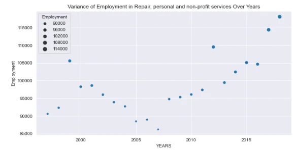

The third most employing industry is Repair, personal and non-profit services. kept evolving across the years but had a lot of ups and dows because we can see that its evolution wasn't steady.

**8-How did the employment in top 3 indstries varied over years compared to the total employment variance?**

```python
sns.set_style('darkgrid')
plt.figure(figsize=(10,5))
sns.scatterplot(x=construction_year.index,y='Employment',
data=construction_year)
sns.scatterplot(x=food_drinking_year.index,y='Employment',
data=food_drinking_year)
sns.scatterplot(x=repair_year.index,y='Employment',
data=repair_year)
sns.lineplot(data=employment_years)
plt.title("The Variance of Employment throughout the top 3 industries compared to the total employment")
plt.xlabel('YEARS')
plt.ylabel('EMPLOYMENT')
plt.show()
```

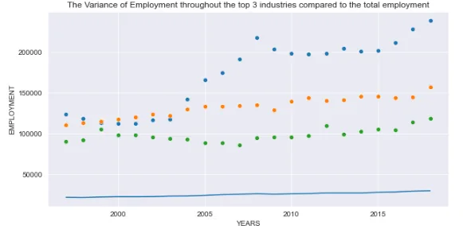

From this plot, we can see that the top 3 industries provided the highest rates of employment from 1997 to 2018 than all the industries gathered could've done in the same periode.

**9-What is the industry that have the less contribution in Employment?**

```python
low_level_industries= employment_industry.sort_values(by='Employment',ascending=True)
df= low_level_industries[low_level_industries['Employment']!=0]
df.nsmallest(1,columns='Employment')
```

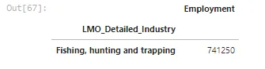

**10-How did it evolve comparing to the construction industry and total employment?**

```python
fishing_df= DF_OUTPUT[DF_OUTPUT['NAICS_CODE']== 114]
fish_hunt_year= pd.DataFrame(fishing_df.groupby('SYEAR')['Employment'].mean()
```

```python
sns.set_style('darkgrid')
plt.figure(figsize=(10,5))
sns.scatterplot(x=fish_hunt_year.index, y='Employment',data=fish_hunt_year)
sns.scatterplot(x=construction_year.index, y='Employment',data=construction_year)
sns.lineplot(data=employment_years)
plt.title('Variance of Employment in Fishing, hunting and trapping Over Years comparing to the construction industry and total employment',y=1.05)
plt.xlabel('YEARS')plt.ylabel('Employment')
plt.show()
```

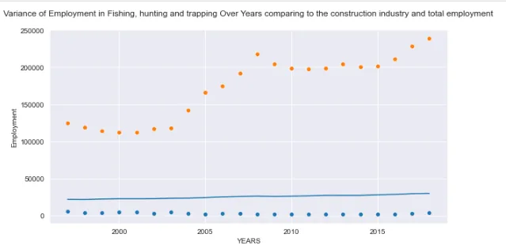

The rate of employment is so low comparing to construction or the rest of the industries. The focus should turn into the industries with the less contribution in the employment, see what problems are affecting the sectors and try to provide solutions to what is possibly holding them from evolving.

**-** **Conclusion****:** The 3 most important points that we could gather out from this analyse is:

- The economic crisis affected the industries sectors badly as there was an employment decrease due to people losing there actual jobs and not needing any new employers.

- The construction Industry is the first main contributor in employment, adding to it : the food serving and drinking places as well as the repair and personal services.

- Understanding the needs/problems of each sectors can boost them into evolving their employment contribution.

***For the futurs Data Analyst's out there, Starting needs only one step, but persevering requires learning. What a Data analyst should learn, in addition to what was shown above:***

- ***Creative and analytical thinking***
- ***Statistics***
- ***Database querying***
- ***Data mining***
- ***Data cleaning***

***If there's a will, the whole universe will conspire into making you achieve it.***

Thank you for your time And Happy Learning!

***Data Insight's Project :***

***References:***

## - [How to Become a Data Analyst in 2022](https://www.mastersindatascience.org/careers/data-analyst/)

Check Out [GITHUB](https://github.com/asmakrl/datacampstd/tree/main/Project%20Time%20Series%20Analysis%20of%20NAICS).
