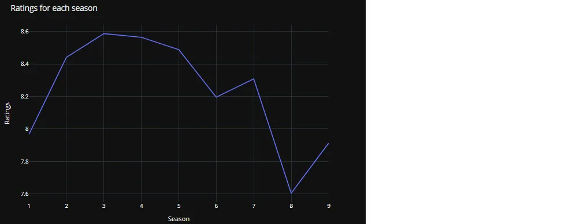
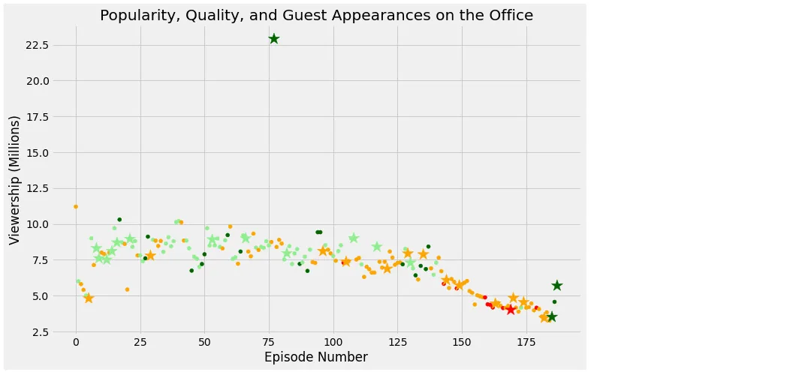

The Office is an American mockumentary sitcom television series that depicts the everyday work lives of office employees in the Scranton, Pennsylvania branch of the fictional Dunder Mifflin Paper Company. From March 24, 2005, it aired on NBC to May 16, 2013, lasting **nine** seasons.

The Office was met with mixed reviews during its short first season. Still, the following seasons, particularly those featuring **Steve Carell**, received significant acclaim from television critics as the show's characters, content, structure, and tone diverged considerably from the British version. Later seasons were criticized for declining quality. Many saw Carell's departure in season seven as a contributing factor; however, the final season ended the series' run with a generally positive response.

The Office was by far the most popular show to stream on **Netflix** in **2018**. Viewers spent **52.1 billion** minutes streaming the completed NBC series.

This notebook analyzes how the TV show has performed over the years, along with some interesting insights.

In this notebook, we will look at a dataset of The Office episodes and try to understand how the popularity and quality of the series varied over time. To do so, we will use the following dataset: datasets/office_episodes.csv, which was downloaded from Kaggle [here](https://www.kaggle.com/nehaprabhavalkar/the-office-dataset).

This dataset contains information on a variety of characteristics of each episode. In detail, these are:

**datasets/office_episodes.csv**

- **episode_number:** Canonical episode number.
- **season:** Season in which the episode appeared.
- **episode_title:** Title of the attack.
- Description**:** Description of the episode.
- Ratings**:** Average IMDB rating.
- **votes:** Number of votes.
- **viewership_mil:** Number of US viewers in millions.
- **duration:** Duration in the number of minutes.
- **release_date:** Airdate.
- **guest_stars:** Guest stars in the episode (if any).
- Director**:** Director of the episode.
- **writers:** Writers of the episode.
- **has_guests:** True/False column for whether the episode contained guest stars.
- **scaled_ratings:** The ratings scaled from 0 (worst-reviewed) to 1 (best-reviewed).

Let's Start

*Use this cell to begin your analysis, and add as many as you would like!*

```python
import pandas as pd
import matplotlib.pyplot as plt

plt.rcParams['figure.figsize'] = [11, 7]
office_df=pd.read_csv('datasets/office_episodes.csv')
office_df.info()
```

Output


Ratings for each season

```python
rats = pd.DataFrame(df.groupby(['Season'])['Ratings'].mean()).reset_index()

fig = px.line(rats,x='Season',y='Ratings')
fig.update_layout(title_text='Ratings for each season',template='plotly_dark')
fig.show()
```

Output



We see that the show's ratings have an inverted-U shape, with the ratings of the performance increasing for the first few seasons, then showing a drastic decrease. There has been a decline in the average ratings of Season **8** as compared to previous seasons. The season recorded the lowest ratings of all times, i.e., **7.6**. I wonder if this happened because of Steve Carell's exit?

Some Observations and Personal Notes:

- Season 1 of the show has a rating of around 8; this can be attributed to the fact that the show is particularly unique in its portrayal of humor, which can be pretty cringy for first-time viewers. I loved the first season, but I can understand it would require some getting used to realize that The Office is not - 'OMG Hahaha,' but rather - 'Ummm...that is hilarious but I'm not sure if I should laugh.'

  - Also, season 1 only had six episodes, thus serving as a way for the writers to see how the audience reacted and based on those responses, they could adapt and modify characters in the subsequent seasons. Also, season 1 could be served as the gateway to all the seasons; new viewers would try The Office based on some recommendation and then might find things not what they expected, while not realizing the other seasons are much more enjoyable.
- The show was at its peak rating at Season 3, and after that, there was a steady decline until Season 5. Season 6 was a sharp dip, which was recovered in Season 7. As an Office fan, I tend to ignore the existence of Season 8. Season 9 was pretty good for most parts.
- The Average Duration of episodes has also changed across seasons. Season 3, which has the highest Rating, has an average episode duration of 25 minutes, while Season 4 has the highest average episode duration of 32.5 minutes.

Check the dataset, if it adequately imported and its column

```python
office_df['colors'] = colsoffice_df['sizes'] = sizesoffice_df.info()non_guest_df = office_df[office_df['has_guests'] == False]guest_df = office_df[office_df['has_guests'] == True]
```

Output


And finally, Plot the scatter plot by checking two critical conditions based on the availability of guest stars.

```python
 # Plotting non-guest starring episodes data
 fig = plt.figure()
 plt.style.use('fivethirtyeight')
 plt.scatter(x= non_guest_df['episode_number'],
             y= non_guest_df['viewership_mil'],
             c= non_guest_df['colors'],
             s= non_guest_df['sizes'])
 # Plotting guest starring episodes data
 plt.scatter(x= guest_df['episode_number'],
             y= guest_df['viewership_mil'],
             c= guest_df['colors'],
             s= guest_df['sizes'],marker ="*")
 # Create a title
plt.title("Popularity, Quality, and Guest Appearances on the Office")
plt.xlabel("Episode Number")
plt.ylabel("Viewership (Millions)")
plt.show( )
```

Output



In the above scatter plot, dark green data points represent the episodes with the highest ratings. Among them, the bigger ones represent the episodes that have guest stars. From the plot illustration, we can see that there is one top watched episode with ratings of more than 75% and has guest stars in our dataset.

Finally, let's Get the most popular guest stars who appeared in the most viewed episode.

```python
office_df[office_df['viewership_mil'] == office_df['viewership_mil'].max()]['guest_stars']
```

Output


Now, from the analysis result, it is found out that three guest stars participated in the most-watched, which has the highest rating episode. They are Cloris Leachman, Jack Black, and Jessica Alba.

you can find the source code on [GitHub](https://github.com/mahmudmursi/Investigating-Netflix-Movies-and-Guest-Stars-in-The-Office)

**References:**

1- Datasets for 'The Office' series were downloaded from Kaggle [**here**](https://www.kaggle.com/nehaprabhavalkar/the-office-dataset)**.**

2- DataCamp's Unguided Project: "Investigating Netflix Movies and Guest Stars in The Office" [**here**](https://projects.datacamp.com/projects/1170)**.**
