**Data analysis** is a process of inspecting, cleansing, transforming, and modeling data with the goal of discovering useful information, informing conclusions, and supporting decision-making.

Data analysts must ask good questions to make the best use of his data.

**Insightful Analysis Begins With Asking the Right Questions:**

- What do you want to know?
- Do you have the data to answer your question?
- How will you approach analysis?
- Has this question been asked before?

**Our Role**

**The North American Industry** Classification System or NAICS is a classification of business establishments by type of economic activity. It is used by the government and businesses in Canada, Mexico, and the United States of America.
It has largely replaced the older Standard Industrial Classification (SIC) system, except in some government agencies, such as the U.S. Securities and Exchange Commission (SEC).
An establishment is typically a single physical location, though administratively distinct operations at a single location may be treated as distinct establishments. Each establishment is classified to an industry according to the primary business activity taking place there. NAICS does not offer guidance on the classification of enterprises (companies) which are composed of multiple establishments.
NAICS is designed to provide common definitions of the industrial structure of the three countries and a common statistical framework to facilitate the analysis of the three economies.

**The data provided contains:**

**a- Raw data:**
15 CSV files beginning with RTRA.
These files contain employment data by industry at different levels of aggregation; 2-digit NAICS, 3-digit NAICS, and 4-digit NAICS.

Columns mean as follows:

- SYEAR: Survey Year
- SMTH: Survey Month
- NAICS: Industry name and associated NAICS code in the bracket
- _EMPLOYMENT_: Employment

**b- LMO Detailed Industries by NAICS:**
An excel file for mapping the RTRA data to the desired data.
The first column of this file has a list of 59 industries that are frequently used.
The second column has their NAICS definitions.
Using these NAICS definitions and RTRA data, you would create a monthly employment data series from 1997 to 2018 for these 59 industries.

**c- Data Output Template:**
An excel file with an empty column for employment.

**Task**

In this task, we need to understand how the NAICS works as a hierarchical structure for defining industries at different levels of aggregation.

**For example:**
In NAICS 2017 – Statistics Canada.pdf (see page 22), a 2-digit NAICS industry (e.g., 23 - Construction) is composed of some 3-digit NAICS industries (236 - Construction of buildings, 237 - Heavy and civil engineering construction, and a few more 3-digit NAICS industries).

Similarly, a 3-digit NAICS industry (e.g., 236 - Construction of buildings), is composed of 4-digit NAICS industries (2361 - Residential building construction and 2362 -Non-residential building construction).

## Let's Get started

**1-Get, and prepare the Dataset:**

**a- Loading and exploring the LMO_Detailed_Industries_by_NAICS data:**

```python
# Loading LMO_Detailed_Industries_by_NAICS data
LMO_Detailed_Industries_df = pd.read_excel("Data\LMO_Detailed_Industries_by_NAICS.xlsx")
LMO_Detailed_Industries_df.head()
```

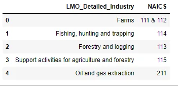

NAICS column needs some cleaning. we need to replace the & with a comma.

And then put the cleaned code into a new column.

```python
# Create a list of NAICS for industries
LMO_Detailed_Industries_df['NAICS'] = LMO_Detailed_Industries_df['NAICS'].replace({'&':','}, regex=True)

LMO_Detailed_Industries_df=LMO_Detailed_Industries_df[['NAICS','LMO_Detailed_Industry']]
LMO_Detailed_Industries_df1= LMO_Detailed_Industries_df[~LMO_Detailed_Industries_df['NAICS'].str.contains(',', na=False)]
LMO_Detailed_Industries_df2=LMO_Detailed_Industries_df[LMO_Detailed_Industries_df['NAICS'].str.contains(',', na=False)]
LMO_Detailed_Industries_df2=

LMO_Detailed_Industries_df2.assign(NAICS=LMO_Detailed_Industries_df2['NAICS'].str.split(',')).explode('NAICS')

LMO_Detailed_Industries_df=LMO_Detailed_Industries_df1.append(LMO_Detailed_Industries_df2, ignore_index=True)
LMO_Detailed_Industries_df.columns=['CODE','LMO_Detailed_Industry']
```

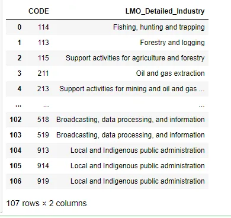

### Loading and exploring the Digit NAICS Industries data:

### 2-Digit NAICS
```python
# Get the data of 2digit NAICS industries
df_2_NAICS = pd.concat(map(pd.read_csv, ['Data/RTRA_Employ_2NAICS_00_05.csv', 'Data/RTRA_Employ_2NAICS_06_10.csv',
                                         'Data/RTRA_Employ_2NAICS_11_15.csv', 'Data/RTRA_Employ_2NAICS_16_20.csv',
                                         'Data/RTRA_Employ_2NAICS_97_99.csv']))
```

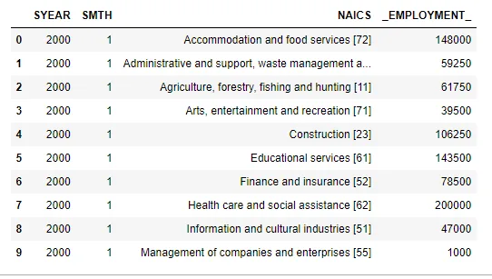

We need to separate the NAICS Code from the industries name, so after the separation, it would be in this form:

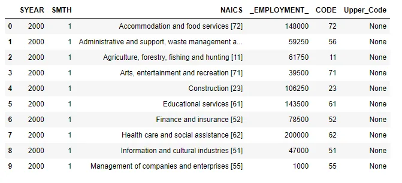

and same for 3, 4 Digit NAICS

### 3-Digit NAICS

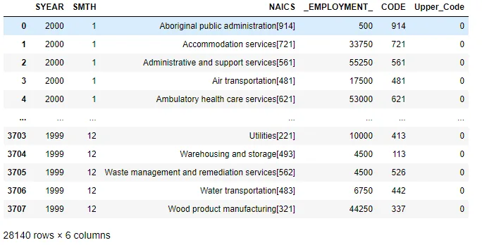

**4-Digit NAICS**

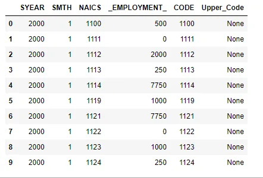

Now, we need to combine all the datasets together.
Note that in these analyses, we are just interested to perform it from 1997 to 2018, so we need to drop all rows from 2019.

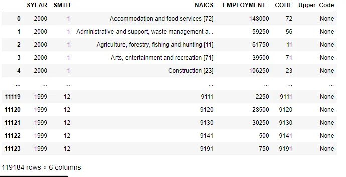

## 2- Exploratory Data Analysis

### HOW DID THE EMPLOYMENT** EVOLVE **OVER TIME ACROSS ALL INDUSTRIES?
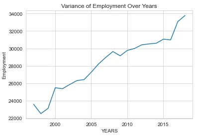

We can see that employment was always evolving throughout the years.

Before 2000, it was at its lowest and decreasing and then started increasing slowly.

There was a little peak between 2005 and 2010, then started to decrease just after which interfere with 2008 economic crisis. Between 2010 and 2015 it was still unstable, still some ups and downs then it started increasing from there till it reached more than 30k in 2018.

### 2- what is the employment wise top Industries
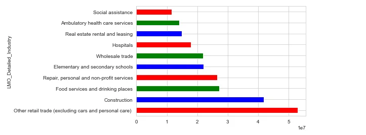

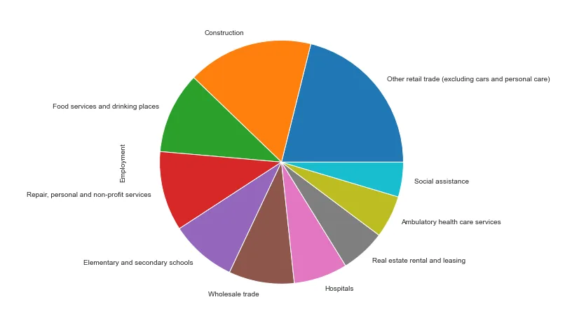

As we can see, Other retail trade (excluding cars and personal care), and Construction is the employment wise top two Industries with 53025000 and 41848750 representatively.

### 3- What are the 5 sectors with** the **lowest numbers of Employees currently and investigate their evolution?
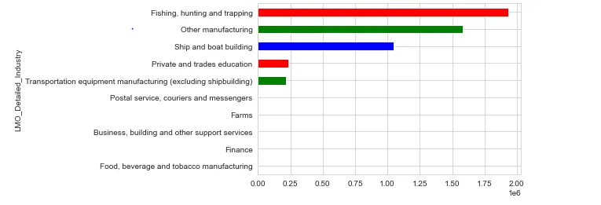

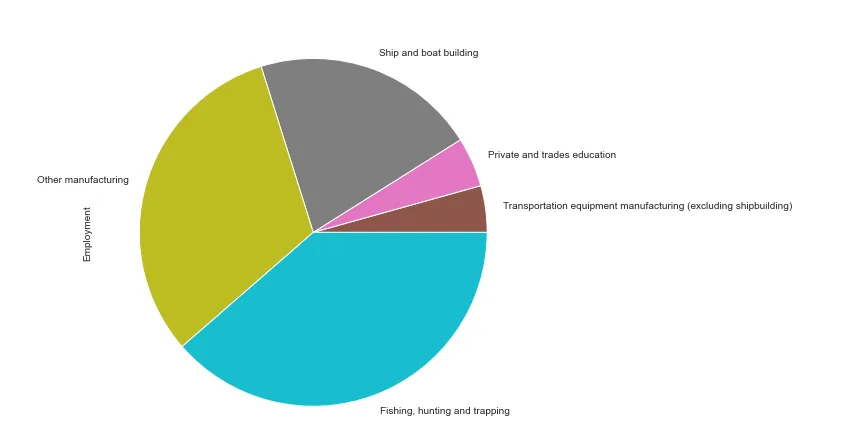

we can see from the graphs, Transportation equipment manufacturing (excluding shipbuilding) and Private and trades education are the sectors with the lowest numbers of Employees currently and investigate their evolution with 217000 and 231250.0 representatively.

### 4- How has employment in the Construction industries evolved** over time**?
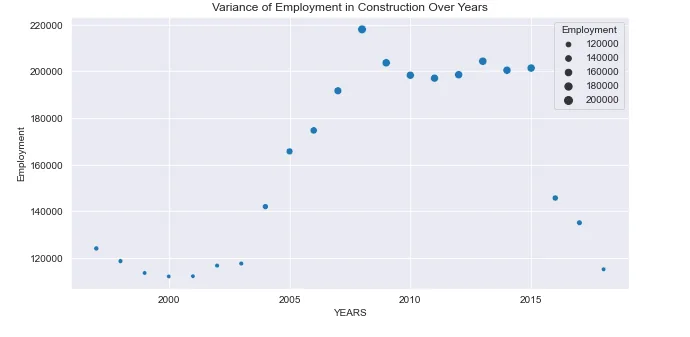

We can see that employment in construction kept evolving across the years.

We can see that there was a peak just before 2010, we can assume that it was between 2007-2009 which means that even throughout the 2008 economic crisis the construction industry kept evolving and even had a bigger evolution, so the construction was the industry people turned to after losing their jobs or while not having any during the crisis.

### 5- Comparing employment in Construction with employment across all industries

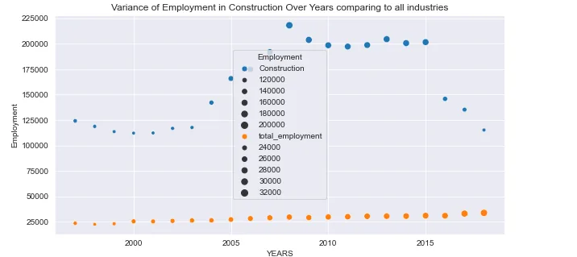

The rate of employment is so low compared to construction or the rest of the industries.

The focus should turn into the industries with less contribution in employment, see what problems are affecting the sectors and try to provide solutions to what is possibly holding them from evolving.

## Conclusion
- Understanding the needs/problems of each sector can boost them into evolving their employer contribution.
- The construction industry is the first main contributor in employment,
- The economic crisis affected the industries sectors badly as there was an employment decrease due to people losing their actual jobs and not needing any new employers.

Check the code from here: <https://github.com/geehaad/Time-Series-Analysis-of-NAICS>

Thank you.
