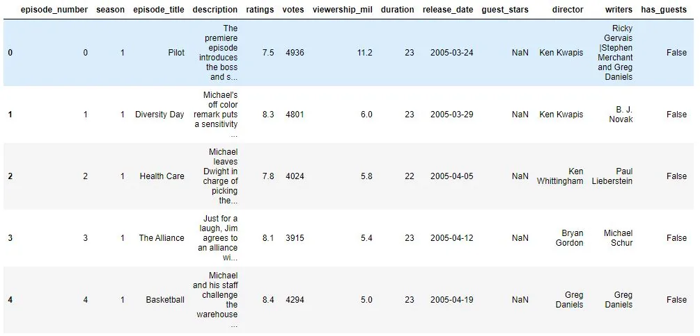
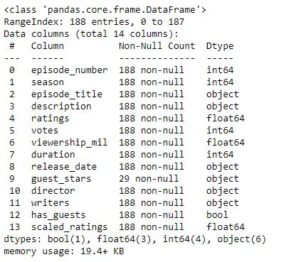
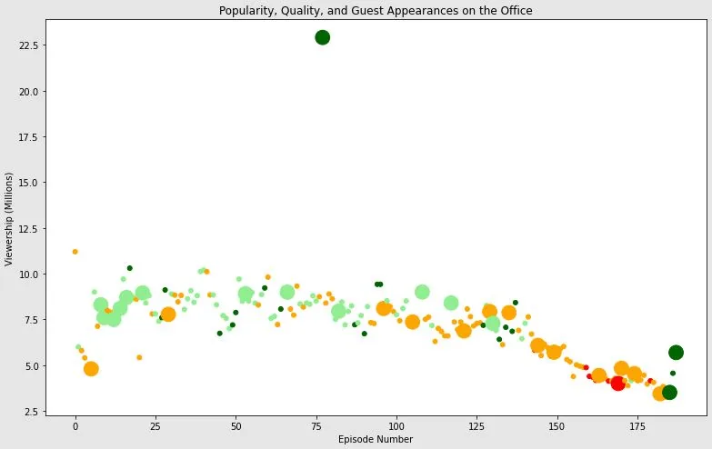
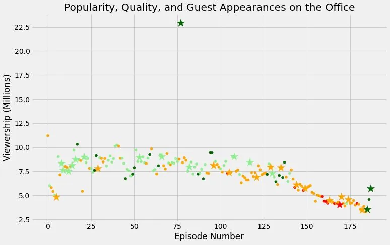

The Office was a British mockumentary series about office culture in 2001. The American adaptation of the series depicts the everyday lives of office employees in the Scranton, Pennsylvania, branch of the fictional Dunder Mifflin Paper Company. The series had been the longest-running, spanning 201 episodes over nine seasons.

For this project, we will take a look at a dataset of The Office episodes, and try to understand how the popularity and quality of the series varied over time. To do so, we will use the following dataset: datasets/office_episodes.csv, which was downloaded from Kaggle [here](https://www.kaggle.com/nehaprabhavalkar/the-office-dataset).

This dataset contains information on a variety of characteristics of each episode. In detail, these are:

**datasets/office_episodes.csv**

- **episode_number:** Canonical episode number.
- **season:** Season in which the episode appeared.
- **episode_title:** Title of the episode.
- **description:** Description of the episode.
- **ratings:** Average IMDB rating.
- **votes:** Number of votes.
- **viewership_mil:** Number of US viewers in millions.
- **duration:** Duration in number of minutes.
- **release_date:** Airdate.
- **guest_stars:** Guest stars in the episode (if any).
- **director:** Director of the episode.
- **writers:** Writers of the episode.
- **has_guests:** True/False column for whether the episode contained guest stars.
- **scaled_ratings:** The ratings scaled from 0 (worst-reviewed) to 1 (best-reviewed).

***Import Libraries and Datasets***

First we need to import the necessary libraries for the analysis and visualizations and also, read the required data sets.

```python
import pandas as pd
import matplotlib.pyplot as plt

#to enable the larger version of the plots
plt.rcParams['figure.figsize'] = [11, 7]

#reading the office datasets
office_df = pd.read_csv('datasets/office_episodes.csv')
office_df.head()
```



***Data Information***

One way to inspect the dataframe is by using the '.info()' method that returns the summary of the data frame.

```python
#to view the summary of the dataframe
office_df.info()
```



Every column seems to have all the data except for the 'guest_stars'. The 'guest_stars' columns seem to have fewer values since the episodes with the guest stars are obviously less.

***Data Analysis***

For the purpose of the analysis, we are going to create a matplotlib scatter plot of the data based on the ratings, that contains each episode's episode number plotted along the x-axis and each episode's viewership (in millions) plotted along the y-axis.

But before that, to make the ratings more distinct and the plot more informative, we are going to create an array *cols* that contains the color scheme reflecting the scaled ratings of each episode such that:

- Ratings < 0.25 are colored "red"
- Ratings >= 0.25 and < 0.50 are colored "orange"
- Ratings >= 0.50 and < 0.75 are colored "lightgreen"
- Ratings >= 0.75 are colored "darkgreen"

```python
cols = []

for ind, row in office_df.iterrows():
    if row['scaled_ratings'] < 0.25:
        cols.append('red')
    elif row['scaled_ratings'] < 0.5:
        cols.append('orange')
    elif row['scaled_ratings'] < 0.75:
        cols.append('lightgreen')
    else:
        cols.append('darkgreen')
```

Next, to make the episodes with guest stars distinguishable from the rest,

we create another array called *sizes,* with a sizing system such that episodes with guest appearances have a marker size of 250 and episodes without are sized 25.

```python
sizes = []

for ind, row in office_df.iterrows():
    if row['has_guests'] == False:
        sizes.append(25)
    else:
        sizes.append(250)
```

Now, plotting the scatter plot:

```python
fig = plt.figure()

plt.scatter(x = office_df['episode_number'],
            y = office_df['viewership_mil'],
            c = cols,
            s = sizes)

plt.title("Popularity, Quality, and Guest Appearances on the Office")
plt.xlabel("Episode Number")
plt.ylabel("Viewership (Millions)")
plt.show()
```



We can further modify the above scatter plot by using a different marker to differentiate guest appearances not just with size, but also with a star. But for that we need to call two scatter plots, one only containing guest appearances data and the other only containing rest data, and change the marker as required for each plot.

First we create two columns, *colors* and *sizes*, for the dataframe and assign the lists colors and sizes respectively. This helps us to have all the size and color information when generating the plot.

```python
office_df['colors'] = cols
office_df['sizes'] = sizes
office_df.info()
```


Next, we split the dataframe by guest and non guest appearances by subsetting the dataframe.

```python
non_guest_df = office_df[office_df['has_guests'] == False]
guest_df = office_df[office_df['has_guests'] == True]
```

Now, we visualize the plot with *non-guest* dataframe and *guest* dataframe which is marked by a '\*' .

```python
fig = plt.figure()
plt.style.use('fivethirtyeight')

plt.scatter(x = non_guest_df['episode_number'],
            y = non_guest_df['viewership_mil'],
            c = non_guest_df['colors'],
            s = non_guest_df['sizes'])

plt.scatter(x = guest_df['episode_number'],
            y = guest_df['viewership_mil'],
            c = guest_df['colors'],
            s = guest_df['sizes'],
            marker = '*')

plt.title("Popularity, Quality, and Guest Appearances on the Office")
plt.xlabel("Episode Number")
plt.ylabel("Viewership (Millions)")
plt.show()
```



From the above scatter plot, we can significantly notice the popularity and quality of the series throughout its entire seasons. From episodes 0 to 125, we can see that the show was very popular with consistent viewership of 7 millions and above. This also coincides with the fact that the series had consistently received good ratings at the same time, as indicated by the majority of light green markers. After the 125th episode, the series seem to have gone through the downward spiral as suggested by the bad ratings and decreasing viewership.

We also see from the plot that an episode with guest stars had a viewership of more that 22.5 million. Now this might seem to be an outlier but the reason for such massive viewership was due to its telecast being right after the Super Bowl.

Despite the disappointing run towards the end, the show still managed to end on a high with the last episode achieving great rating.

[Github link.](https://github.com/AbhishekTuladhar/Data-Insight/tree/main/Project%20-%20Guest%20Stars%20in%20The%20Office)
