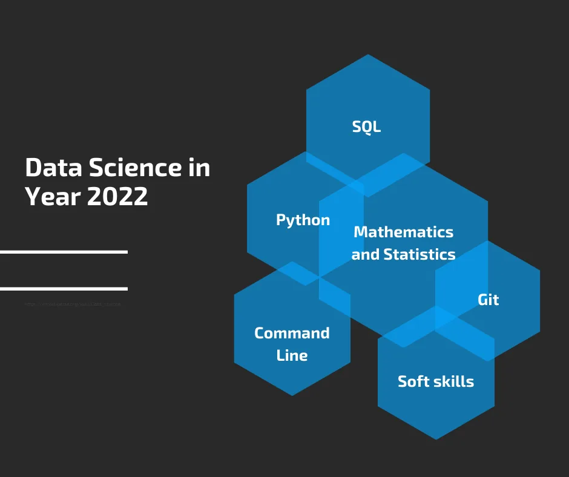

Yes, 2021 has come and gone and it is not unusual to come across blog posts tagging the new year! While we at **Data Insight** are also about to share our own cliché yearly article with you, let this serve as a reminder that the Data Science community is an evolving field and the content is only relevant as per the changes that have occurred in the field in the past few months, and will remain relevant for as long as time permits, perhaps just two months or two years!

Having said that, it is good to quickly remind you that as a data scientist, you will ideally not be working alone but rather in a team of other professionals like data engineers, data analyst, cloud engineers, and business developers, and so you do not have to put the whole world on your head! This is essential so that you will not be forced to align with employers that ask for unbelievable skill sets to hire you this year.

Now that we have a simple but fairly representative list of what most data scientists do, we can now proceed to how to become one. Also, we will touch on the soft skills first before going into the technical areas.

### What Exactly is the Job of Data scientists
1. Identify problems that when solved create opportunities
2. Determine the type of data needed and communicate with Data Engineers and other important member to set it up
3. Access datasets from their storage
4. Clean and validate the datasets
5. Carry out data preprocessing such as feature engineering, standardization, etc. as required
6. Build predictive and/or prescriptive models
7. Build visualization tools and reports to communicate results

### Important Soft Skills
**Develop an Analytical Mindset**

As stated above, the first and major step towards being a data scientist is to be a problem spotter. Not just any problem though, but one that can open doors to profitable, risk-mitigating, optimal-solution opportunities. And to do this requires that you have that analytical knack or better still develop one. While this may sound a little vague as compared to when you are asked to learn Python or R, you are likely to fall a victim of hot air and end up solving problems that have no real usefulness.

Analytical skills help you think in a stepwise, rational manner which is critical to not just spotting the right problem but knowing how to navigate the solution path.

Activities such as being observant, reading frequently, going beyond the surface to understand how things actually work, and playing brain-teasers are some of the many ways you can improve your analytical powers.

**Be Ready to Research for Domain Knowledge**

Data Science goes beyond just jumping on data and doing the technical stuff that everybody and MOOCs seem to only talk about. After prepping yourself with the analytical part of problem identification and simplification, you will definitely need to go deeper to understand the subject matter. Except you are some sort of Renaissance man, you obviously cannot be adept in several fields, which, as we have it, is usually the case with Data Science, and Year 2022 will not be different.

Another way to navigate this is to specialize in time, that is, focus your Data Science on just a sector, say finance or healthcare. That way you can be a master in that area. However, specializing does not mean you should only know one thing, but rather that you are best at doing it.

**Learn to Communicate Effectively**

This obviously cannot be emphasized enough. Everything you do as a Data Scientist requires sound communication. From communicating your needs to other team members down to communicating results to stakeholders and sometimes end users, you really will be flexing your speaking and writing skills.

Poor communication will not only make working with you difficult for others, it will also make your efforts, however great, to go underappreciated. So do well to leverage the wealth of free resources online to hone your communication.

### Technical Skills
**Many Things are Sequel to SQL**

Yes! I can’t say the first technical skill you must have seen elsewhere, but I can tell you that SQL is still the de facto data language entering 2022. Many reasons for this assertion. First, except if you use Data Science for some personal, small-scale project where your data are on downloaded files or dependent on some API, you would 100 percent be working with SQL as most standard businesses have their datasets residing in databases and data warehouses. And both of these are built on SQL, that is, you need to write queries to access them.

Also, save a role or two, all other roles within the Data Science spectrum also work with SQL and there will be a lot of collaboration to keep everyone in sync. Querying and manipulating are indispensable parts of your role and that is just what SQL does. Plus, its syntax is almost like plain English and you would have no trouble grabbing it.

I can go on and on about the importance of SQL for you to stay relevant in your data Science career but you will do well to go on and on to at least an intermediate level of expertise.

**Brush up your Mathematics and Statistics**

This is one step many Data Scientists shy away from, and need I say that you’re not one if your basic Statistics sulk. You wonder? Very easy! Everything we do in Data Science has its theoretical footing in these two fields, and we are only leveraging the powers of computers and programming languages to make the calculations and complex mathematics easier for us. So without an intuitive understanding of the underlying Mathematics, then you run the risk of building blind models.

Of course it may not be a palatable part of the learning curve, but video resources abound on YouTube where these Mathematical concepts are delineated to their simplest form. Plus, you don’t have to learn it all or once.

**Pick up Python or R**

Well, you can’t do without at least one scripting language and one of these two languages will serve you very well as I know of no other way you clean and model your data without either of these tools, at least by popular opinion. Thankfully both languages are fairly easy to learn. If you opt for Python, you can start with [concepts](https://www.datainsightonline.com//post/40-must-know-python-concepts-for-beginners-in-data-science) like data types, operators, data structures, control flow, and functions. Then work your way up to important libraries like Pandas, Numpy, Matplotlib Scipy, Scikit-Learn, etc. With these you can start getting your hands dirty with models.

**Have More Command of Command Line**

Since you will be working with a programming language, a knowledge of command line is essential to ease many of your tasks. From managing your packages, using custom modules, running your scripts to keeping your tools free of niggling issues, Unix Shell command is what you can’t afford to have missing in your toolkit this year as it exposes you to the inner workings of computer systems. Generally the flexibility of the command line makes you much more productive and isn’t that what you aspire for in 2022?

**If you Don’t Git it, Forget it**

There was a lot of concern years before that working with many Data Scientists is a separate job on its own as many do not have good knowledge of Git and Github for sharing their codes collaboratively, creating branches and versions, etc. This is one of the reasons many online courses now preach software engineering practices to Data Scientists. In fact the knowledge of Git is almost becoming a must for anyone who codes. So if you’re working towards a Data Science career this year, hold Git very dear.

**One More Thing**

If you have been following the trend of things lately, you must have heard of the new guy in the spectrum; Analytics Engineering. Many are already predicting it will nudge data Science and the rest to be the toast of 2022. Anyway, time will tell. But what you may want to look out for in your journey this year is, how can I take advantage of this new guy to ease my work?

For one thing, the knowledge of Analytics Engineering makes collection of massive amounts of data easy viz a viz the powerful combination of data warehousing platforms and ingestion tools. Plus transforming and cleaning data seems to have taken a new approach.

Note that this is not asking you to pick up Analytics engineering but rather look for ways you can also benefit from it without necessarily crisscrossing roles.

***Finally...***

one mistake you shouldn’t make while learning any of these is to stay too long on learning, maybe in your bid to know it all. Nobody can know it all; just learn the basics first and the rest will ease while you work on projects.

Happy New Year!
