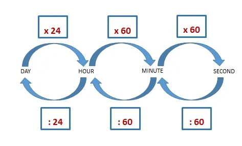

To convert a second measurement to a year measurement, divide the time by the conversion ratio.

Since one year is equal to 31,556,952 seconds, you can use this simple formula to convert:

years = seconds ÷ 31,556,952

The time in years is equal to the seconds divided by 31,556,952.

**Seconds**
The second has historically been defined as 1/60 of a minute or 1/86,400 of a day. According to the SI definition, the second is the duration of 9,192,631,770 periods of the radiation corresponding to the transition between the two hyperfine levels of the unperturbed ground state of the caesium 133 atoms.
The second is the SI base unit for a time in the metric system. Seconds can be abbreviated as *sec*; for example, 1 second can be written as 1 sec.

**Years**
One year is the time it takes for the Earth to complete its orbit around the Sun. There are 365 days in a year, with the exception of the leap year when there are 366.
Years can be abbreviated as *yr*, and are also sometimes abbreviated as *y*. For example, 1 year can be written as 1 yr or 1 y.

**Understanding date and time**

**Python**, being a multi-purpose language, can be used for vivid purposes. Python contains various libraries to offer us ease for tasks related to the manipulation of data. In the conversion of timestamp, i.e. conversion of seconds to hours or minutes, various different techniques can be considered to attain the same.

Let us now have a look at the different ways to convert seconds to hours, minutes, etc.

Method 1: Defining a Python function to convert seconds to hours and minutes

[Python function](https://www.askpython.com/python/python-functions) can be defined to convert the second's value into hours, minutes, etc. Initially, we convert the input seconds value according to the 24-hour format

```python
seconds = seconds % (24*3600)
```

Further, as 1 hour is equivalent to 3600 seconds and 1 minute is equivalent to 60 seconds, we follow the below logic to convert seconds to hours and minutes,

```python
hour = seconds//3600
min = seconds // 60
```

Example:

```python
def conversion(sec):
   sec_value = sec % (24 * 3600)
   hour_value = sec_value // 3600
   sec_value %= 3600
   min = sec_value // 60
   sec_value %= 60
   print("Converted sec value in hour:",hour_value)
   print("Converted sec value in minutes:",min)
sec = 50000
conversion(sec)
Output:
Converted sec value in hour: 13
Converted sec value in minutes: 53
```

Method 2: Python time module for the conversion of seconds to hours and minutes

[Python time module](https://www.askpython.com/python-modules/python-time-module#:~:text=The%20Python%20time%20module%20contains,%2C%20hour%2C%20seconds%2C%20etc.) contains time.strftime() function to display the timestamp as a string in a specified format by passing the format codes.

The time.gmtime() function is used to convert the value passed to the function into seconds. Further, time.strftime() function displays the value passed from time.gmtime() function into hours and minutes using the specified format codes.

Example

```python
import time
sec = 123455
ty_res = time.gmtime(sec)
res = time.strftime("%H:%M:%S",ty_res)
print(res)
Output:
10:17:35
```

Method 4: Python datetime module to convert seconds into hours and minutes

[Python datetime module](https://www.askpython.com/python/examples/current-date-and-time-in-python#the-datetime-module) has various in-built functions to manipulate date and time. The datetime.timedelta() function manipulates and represents the data in a proper time format.

Example:

```python
import datetime
sec = 123455
res = datetime.timedelta(seconds =sec)
print(res)
Output:
1 day, 10:17:35
```

**Convert Seconds to Years**

The time() method of Python's time module returns the seconds since the epoch (1/1/1970 at midnight). To convert the number of seconds to years with Python, divide by seconds in a minute, minutes in an hour, hours in a day, and days in a year.



1. Start with a number of seconds. time.time() will return something in the neighbourhood of 1466604569.0708675:

```python
import time
seconds = time.time()
print(seconds)
Output:
1466604569.0708675
```

2. Divide by 60 to get the number of minutes:

```python
minutes = seconds / 60
print(minutes)
Output:
24443409.48451446
```

3. Divide by 60 to get the number of hours:

```python
hours = minutes / 60
print(hours)
Output:
407390.158075241
```

4. Divide by 24 to get the number of days:

```python
days = hours / 24
print(days)
Output:
16974.58991980171
```

5. Divide by 365.25 to get the number of years:

```python
years = days / 365.25
print(years)
Output:
46.47389437317374
```

Or you can do it all in one step, like this:

```python
import time
seconds = time.time()
years = seconds / 60 / 60 / 24 / 365.25
print(years)
Output:
46.47389437317374
```
