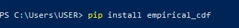
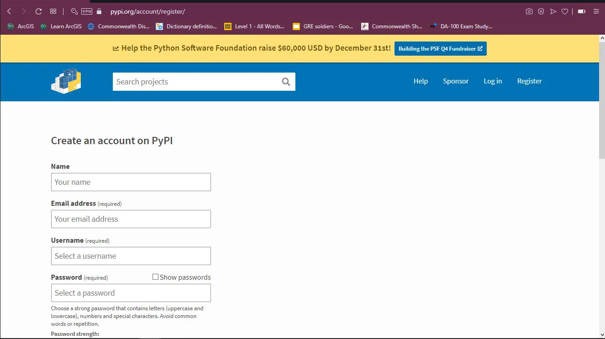
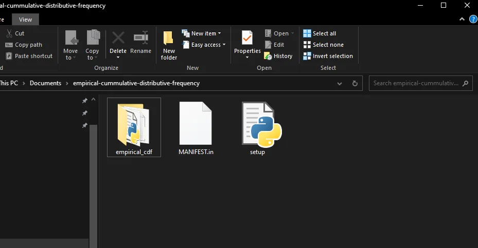
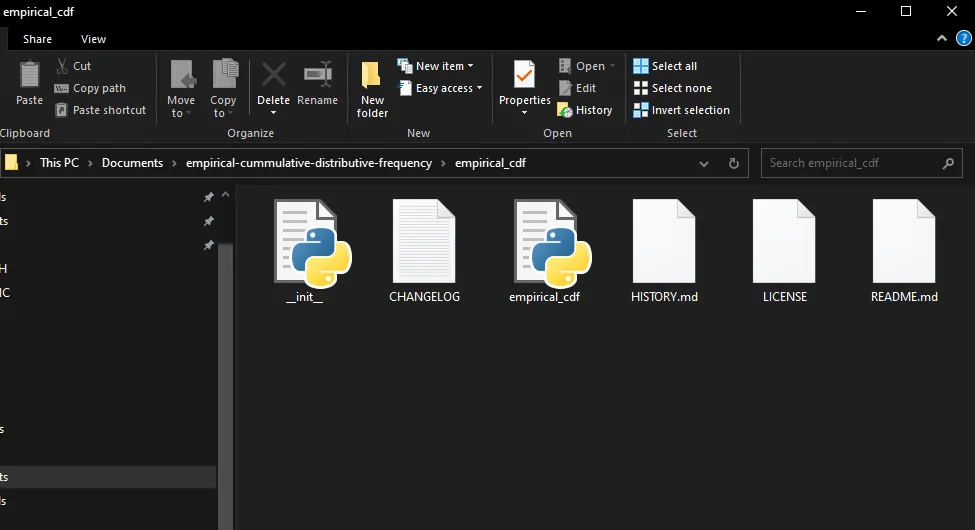
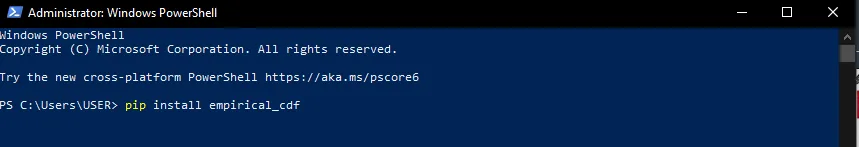
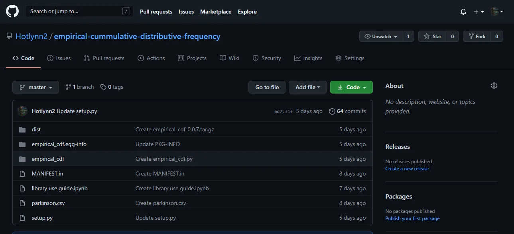

Python Package Index (PyPI), also known as the **Cheese Shop,** is the official third-party [software repository](https://en.wikipedia.org/wiki/Software_repository) for [Python](https://en.wikipedia.org/wiki/Python_(programming_language)). It is analogous to [CPAN](https://en.wikipedia.org/wiki/CPAN), the repository for [Perl](https://en.wikipedia.org/wiki/Perl). It houses all the packages we can pip install as python users. For example, the creator of **Numerical Python (NumPy)** first had to upload his package to **PyPI** before anyone anywhere could *pip install numpy*on his or her personal PC. This is exactly what we are going study in this tutorial.

PyPI has two repositories; the main [pypi.org](http://www.pypi.org) repository (repo) and the [test.pypi.org](http://pypi.org) repo. The pypi.org contains the final product of all packages that all python users can directly pip install on their PCs anywhere in the world. However, the test.pypi.org is the beta repository that houses the same python packages for testing purposes. Once everything is set, it is then uploaded to the main [pypi.org](http://pypi.org) repo. One important to know is that, if the package is in the [test.pypi.org,](http://test.pypi.org) only the author of the package or even any user with the ***unique link*** to pip install can try the installation to see everything works fine. The unique link looks like the figure below.

Once everything is set, you can upload it to the main [pypi.org](http://pypi.org) repo and directly pip installed like shown in the figure below.

Thus, to publish your package on Pypi, you first need to create an account on [pypi.org](http://www.pypi.org)for the main upload or[test.pypi.org](http://pypi.org) for the beta upload; *you do not need to upload to the test repo first before you upload to the main repository.* In this tutorial, we will upload our package to the main pypi repo. Nevertheless, I will teach you how to also upload it to the test.pypi repo. So first let's create an account on [pypi.org](http://www.pypi.org). Head over to the website and fill in your name, email address, username and password as shown below.

The package we will upload is one that helps will help us get the empirical cumulative distribution of a dataset column and identify its first quartile, median and third quartile as points on the graph. To create the package, open [Visual Studio code](https://code.visualstudio.com/download) on your PC and create the necessary files that will help you upload the package. These files are ***__init.py__, CHANGELOG.txt, empirical_cdf.py,*** [***HISTORY.md,***](http://HISTORY.md) ***LICENSE.txt,*** [***README.md***](http://README.md)***,*** [***MANIFEST.in***](http://MANIFEST.in) ***and*** [***setup.py***](http://setup.py)The functions of the various files are mentioned in the video below.

The arrangement of the files after creating them in your preferred local repository should be as follows:

1. One main folder should be created.
2. Within the main folder, create another folder within. Within this folder, place in the following files:

a. ***__init.py__***

b. ***CHANGELOG.txt***

c. ***empirical_cdf.py***

d. [***HISTORY.md***](http://HISTORY.md)

e. ***LICENSE.txt***

f. [***README.md***](http://README.md)

3. Finally, place these two files outside the folder within the main folder:

a. [***MANIFEST.in***](http://MANIFEST.in)

b.[***setup.py***](http://setup.py)

The orientation should look like these figures below after everything has been created.

The video below tells you how create all the aforementioned files and graphically shows you how to arrange the files as shown in the above figures. The video contains all the vivid explanations to complement this blog. Have a look at it.

[Link to video](https://youtu.be/KBb_-nsYqF8)

After uploading your package to the pypi repository, do pip install empirical_cdf in your *Windows shell* or *Command prompt* as shown below.

After installation, have a look at this github repo which contains the **library use guide**. It helps you know more about how to use this *empirical_cdf* package.

This is the link to this repository, do not forget to follow me on github, :).

<https://github.com/Hotlynn2/empirical-cummulative-distributive-frequency>

Kindly comment if you have further questions or you are facing challenges. Feel free to connect and follow me on LinkedIn and Github too.

[Github](https://github.com/Hotlynn2/)

[LinkedIn](https://www.linkedin.com/in/franklin-koomson-adjei-227bb5130/)

My name is Franklin Adjei, thanks for your time.

