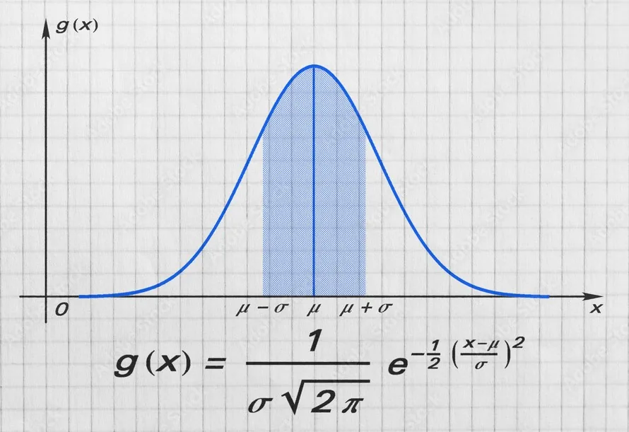
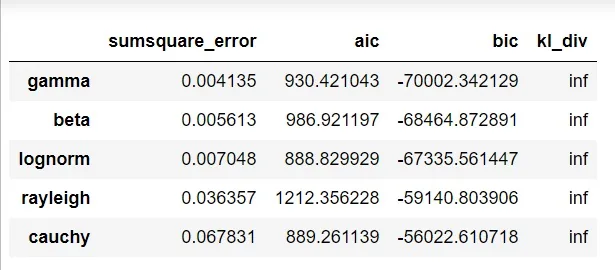
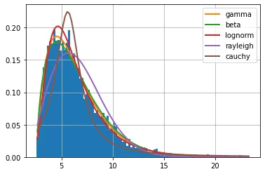
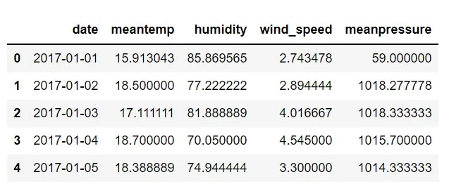
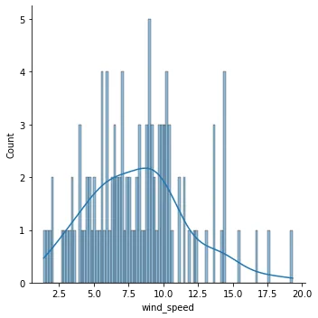
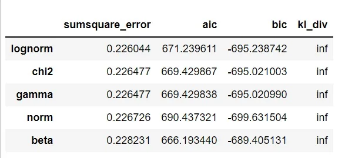
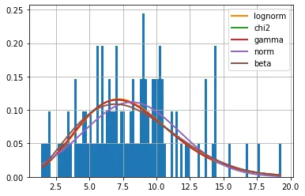

You probably won’t argue if someone tells us that they tossed a fair dice and noticed each of the six digits has an equal chance of showing up. That’s saying the chance that 1 would appear is the same as the chance that 2 would appear and so on. But how would you react if that same person tells you that when they step outside their apartment, the chances they would see either a gorilla, a goat, a gopher, a whale, or a mosquito are equal? Perhaps true if the person lives in some sort of utopia. But in the world we live in, having equal likelihood for seeing each of this set of creatures around your immediate habitation is very unlikely. Put otherwise, their probabilities of occurrence are not the same.

Now let's imagine the vast possibilities of events that we could define and that way we can foretell the vast possibilities of probability distributions too.



As data professionals, we tend to do a lot to have a reasonable understanding of our data. Name it, from identifying our data type to doing summary statistics and exploratory data analysis. We do a lot, no doubt, except that we sometimes omit this small but very crucial part of understanding our data. It’s like someone who boasts of a great knowledge of their country but has little knowledge of their own immediate surroundings.

In this article we are going to explore an easy way of understanding our data using the Python **Fitter** library. We will:

- first generate random data that follows a certain probability distribution using the **Scipy** library
- use the Fitter package to check which distribution best fits the data.
- then repeat the process on a real dataset

Before that let's answer a quick question!

### Why is it Good to Check Data Distribution?
Yes, understanding our data distribution is to actually know not just the behavior of our data but to know its background so we can easily predict its values. Common among the numerous benefits of knowing the distribution of our data are:

1. Many of the models we build in data science assume that the data follows a certain distribution. Using a data that does not align with the underlying assumption will create a weak model
2. Knowing the distribution our data follow will help us define the required probability distribution function. And that way we can assign confidence interval to the range of values our data can have
3. With the parameters that define the distribution, we can easily monitor our data to check for changes. This is particularly useful when we are working with a lifetime or continuous stream of data.
4. Every distribution has defined statistical properties. This can greatly assist us not only in exploratory data analysis but also when interpreting the outcome of whatever the data is used for.

Now let's find the distribution of our data!

### Fitting Distribution on a Random Data
First we import the necessary libraries

```python
import numpy as np
import pandas as pd
import seaborn as sns
import matplotlib.pyplot as plt
from scipy import stats
from fitter import Fitter
```

Then we generate a random variable; here we use a gamma distribution to generate 5000 data points. The **Numpy** library can also serve this purpose

```python
random_data = stats.gamma.rvs(2, loc=2.5, scale=2, size=5000)
```

The next thing is to assume we don't know the distribution of the data and create an instance of the **Fitter** class to fit the distribution. The Fitter class contains two arguments: **data** which takes an array of our data and **distributions** which takes a list of the distributions we think our data might follow.

As it may not be easy to tell these probable distributions, fitter has a **get_common_distribution** method that we can supply the **distributions** argument, a far better option compared to the default state which runs through about 80 different distributions and thus takes time.

In our case, however, we will try out four distributions in addition to gamma distribution, use the **fit** method on the created instance and generate our result by calling the **summary** method:

```python
dist_fitter = Fitter(random_data,
                   distributions = ["cauchy",
                                    "rayleigh",
                                    "beta",
                                    "gamma",
                                    "lognorm"])
dist_fitter.fit()
dist_fitter.summary()
```

Two results are generated: a table (containing the sum of squares error, Akaike information criterion, and Bayesian information criterion) and probability density plots of the chosen distributions fitted over a histogram of the data.

The **summary** method lists the best performing models ascendingly with respect to the **sumsquare_error**. However, depending on your use case, you can consider the **aic** or **bic** instead, both of which focus on relative quality of the models.





So going by the sum of squares error criterion, the gamma distribution fits the data best. Note, however, that the sum of squares error can be altered by a random change in the values of the data and thus affect the ranking, particularly with the fact that some of the distributions are very closely related and approximate to one another.

Lastly, we can also print the parameters behind each of the distributions using the fitted_param attribute with the name of the distribution as index.

### Fitting Distribution on a Dataset
Since we already established the whole process above, this will be a quick run-through. The dataset was obtained from [Kaggle](https://www.kaggle.com/sumanthvrao/daily-climate-time-series-data/version/3).

```python
df = pd.read_csv("dataset.csv")
df.head()
```



We will work with the **wind_speed** variable. First, a cursory look on the distribution of the data with a histogram:



So as before, we create an instance of the **Fitter** class, fit the selected distributions on the data, and summarize the result:

```python
dist_fitter = Fitter(wind_speed,
                     distributions = ["uniform",
                                      "beta",
                                      "gamma",
                                      "lognorm",
                                      "norm")]
dist_fitter.fit()
dist_fitter.summary()
```

And below are the results:





And finally let's see the parameters with which the lognorm distribution fits the data:

```python
dist_fitter.fitted_param["lognorn"]
```

**(0.18905281073196528, -10.662171758433743, 18.473624627225075)**

which corresponds to the shape, location, and scale respectively.

### Summary
While many dataset follow the normal distribution or are transformed into it before analysis, because of its robustness, a good understanding of other distributions and their use cases will aid both understanding and interpretation of your data.
