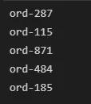
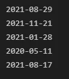
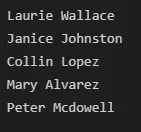
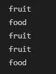
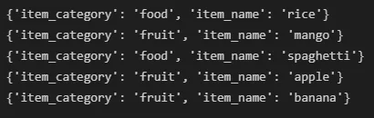
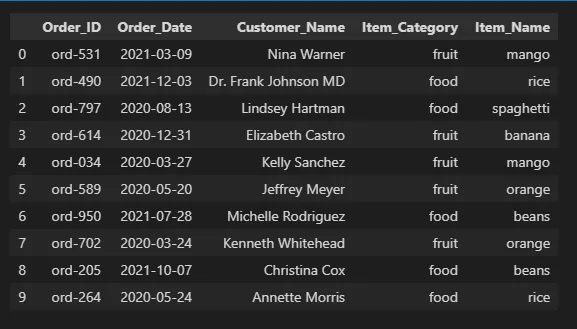

Yes, it is a common knowledge that data is the lifeblood of data science. It is also well known that data can be collected from several resources. So why do we still need to create fake datasets when there are real datasets?

Spoiler alert! You don't always have real datasets at your beck and call. Also, the dataset you need may be costly, proprietary, difficult to collect or altogether non-existent. That's why you need a way around getting these datasets without much hassle. And here comes **Faker**.


### Faker
**Faker** is a Python Library for generating custom fake datasets. Unlike the **Numpy** random module that basically generates numerical data (and which would depend largely on Python functions to create varied data ), **Faker** can easily generate different data types, thanks to its intuitive properties method.

For instance, once you initiate the **Faker** generator and create an instance of the class, say *fake*, you can easily use *fake.colour()* (colour being the property method) to print out any random colour as stored in the provider. A provider is simply an extension of the **Faker**base class and there are several of them grouped under **Standard**, **Community** and **Local** categories. You can read more about them [here](https://faker.readthedocs.io/en/master/index.html).

In this article, we will be using the **Faker** library to create our own dataset.

### Exploring Faker and Creating a Dataset
While on the path of creating our dataset, we will:

- Touch a few **Faker** functions
- Create our own custom provider
- Learn the importance of linking variables
- And finally create a **DataFrame** of our dataset

The dataset to be created will contain information about the orders made by customers of a hypothetical grocery store with the following variables: ***Order ID, Order Date, Customer Name, Item Category,*** and ***Item Name***.

##### 1) A Few Faker Functions
As usual, the first step is to install the package using ***pip install faker***, after which we import the **Faker** generator class into our workspace. Since we will be putting the final dataset in a **DataFrame**, we will also import **Pandas**

```python
from faker import Faker
import pandas as pd
```

Then we create an instance of the generator

```python
fake = Faker()
```

With this instance, we can start exploring **Faker**. Let's do this by creating five values for each of the variables that make up our proposed dataset.

Let start by creating the ***OrderID*** from the standard provider method *bothify()*

```python
for i in range(5):
    print(fake.bothify(text='ord-###'))
```



Then the ***Order Date*** is created with the *date_between()* property of the ***date_time*** provider

```python
for i in range(5):
    print(fake.date_between(start_date='-2y',                                  end_date='today'))
```



Then we can create the customer name in the same vein

```python
for i in range(5):
    print(fake.name())
```



##### 2) Creating a Provider
For the next variable, ***Item Category*** (which refers to product type), we do not have a readily available provider from which to generate our values. So we will create a simple one. Let's say our hypothesized grocery store deals only in foodstuff and fruits, so we have:

```python
from fake.providers import BaseProvider

class MyProvider(BaseProvider):
    __provider__='item_category'
    item_categories=['food, 'fruit']

    def item_category(self):
         return self.random_element(self.item_categories)

for i in range(5):
    print(fake.item_category())
```



##### 3) Linking Variables
So far we've been creating our variables independently, which is fine. However, there are certain variables whose values are dependent on each other. A simple example is gender and title. If the gender type is male for instance, then ultimately the title can never be Mrs. or Ms. But if we create the columns separately as we have been doing, there is a possibility of having mismatched values across the rows, and that is why linking variables is an essential part of creating fake data.

The next variable on our list is the ***Item Name***, which is the specific name of the food or fruit ordered. So in our case if a certain row of ***Item Category*** is a fruit, as can be seen in the first row above, then what we must in the corresponding ***Item Name*** row must be a particular fruit and never a food for our data to be valid. And to achieve this let us first modify the provider we created above to accommodate the fruit and food variables

```python
from fake.providers import BaseProvider

class MyProvider(BaseProvider):
    __provider__ = 'item_category'
    __provider__ = 'food'
    __provider__ = 'fruit'
    item_categories = ['food, 'fruit']
    foods = ['rice, 'yam', 'beans', 'spaghetti']
    fruits = ['orange, 'mango', 'banana', 'apple']

    def item_category(self):
         return self.random_element(self.item_categories)
    def food(self):
         return self.random_element(self.foods)
    def fruit(self):
         return self.random_element(self.fruits)
```

Then we can now create the function that will link the two variables

```python
def link_variables():
    item_cat = fake.item_category()
    item = fake.fruit() if item_cat == 'fruit' else    fake.food()
    return {'Item_Category': item_cat, 'Item_Name':item}
```

Now we can print out 5 values of the two variables to check

```python
for i in range(5):
    print(link_variables())
```



##### 4) Putting Everything in a DataFrame
```python
thelist = []
for x in range(100):
    dataset = {'Order_ID': fake.bothify(text='ord-###'),
            'Order_Date': fake.date_between(start_date='-2y', end_date='today'),
            'Customer_Name': fake.name()}

    dataset_copy = dataset.copy()
    for key, value in link_variables().items():
        dataset_copy[key] = value

    thelist.append(dataset_copy)

dataset_frame = pd.DataFrame(thelist)
dataset_frame.head(10)
```



### Where you need Fake Datasets
Fake datasets can be very useful in, but not limited to, the following cases:

1. **Practicing/learning**: Anyone learning data science hands-on will definitely need datasets to use for practicing. Yes there are numerous data resources online, but sometimes you may need tailored datasets.
2. **Teaching**: Passing knowledge across usually requires going far and beyond, and this is inclusive of the data to be used.
3. **Model Testing and Tuning**: After building a machine learning model and you need to test it, and probably tune it, **Faker** will definitely be handy.
4. **Unit Testing**: After completing a data science project and you need to test if every unit or component is working as expected, a fake data is a sure way.

Thanks for reading!
