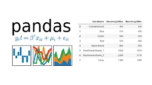

If you're just getting to know datasets and you are at the beginning of your pandas journey, well let me tell you that you came to the right address!

In this tutoriel, we're gonna learn the basics tools that will help us go through data in order to get valuable insights from it.

How are we going to realise this? Here it is:

1. ***Getting to know how to Read datasets with Pandas.***
2. ***Getting useful insights by Plotting our data.***
3. ***Map and apply functions.***
4. ***Merging and concatenating Dataframes.***
5. **to_datetime*****, nsmallest and nlargest functions.***

**1-** **Reading Datasets with Pandas****:**

*you can find our csv file here:* [*Iris.csv*](https://www.kaggle.com/saurabh00007/iriscsv?select=Iris.csv)

**-** Pandas is a high level data manipulation tool. It is used for solving data science problems. For Data scientists, the first step towards manipulating data is importing the data file into the workspace. Here's where pandas**read_csv** function come into action: we can use the name of the file directly if it is on the same directory. If not, we'll have to sepcify the path of our file.

The easiest way to do it is:

```python
import pandas as pd
data= pd.read_csv(r"C:\Users\HP\Documents/Data science project/Assignments/3rd assignment/Iris.csv")
data.head()
```

Calling this function will return a Dataframe! **Let's do a quick recap about Pandas Datafames:** It's a 2 dimensional labeled data structure with columns of potentially different types. looking quite alike as a spreadsheet! We display our Dataframe using head(), it will retrurn the first 5 rows by default:

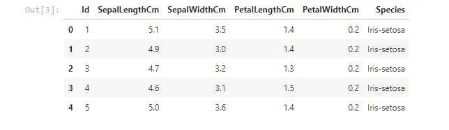

**2-** **Plotting with pandas****:**

Pandas Provides multiple options for visualizing our data. So, using the Iris dataset, we'll be creating basics plots that will help us revealing valuable insights from our data.

Now let's plot the species column. value_counts() **returns object containing counts of unique values**. The resulting object will be in descending order so that the first element is the most frequently-occurring element. Excludes NA values by default.

```python
data['Species'].value_counts().plot(kind='bar')
```

This gives us a bar graph for the different species:

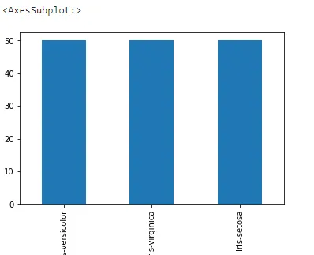

We can change the kind of plot by line or pie according to our requirement:

```python
data['SepalLengthCm'].value_counts().plot(kind='line')
```

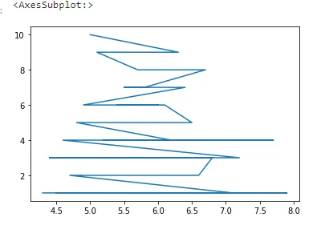

```python
data['Species'].value_counts().plot(kind='pie')
```

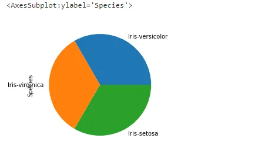

So visualizing data provides us with a quick and clear understanding of the information. We can easily draw conclusions about the data by visualizing it.

**3-**  **Map and apply functions****:**

- Map() calls a specified function for each item of an iterable and returns a list of results. In our example we want to turn the petal length to millimiters, so we need to multiply the given values by 10.

To do so we need to:

- Define a function that multiply a given number by 10

```python
def function(x):
return x*10
```

- Then, use the map function to get the desired result.

```python
data['PetalLengthMm'] = data['PetalLengthCm'].map(function)
data
```

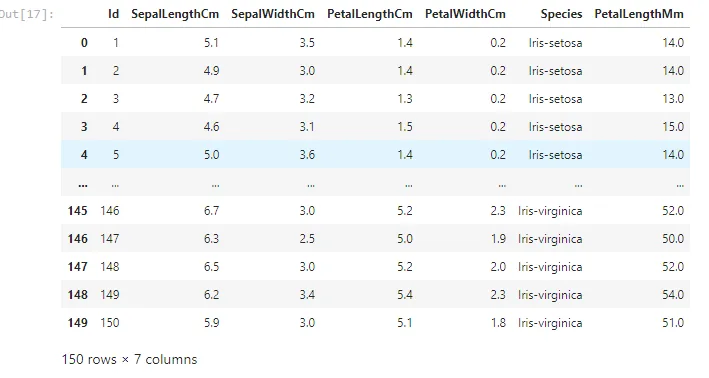

If we try to use the map function with two columns, we'll get an error we can only use it with series.

```python
data[['PetalWidthCm','SepalWidthCm']].map(function)data
```

In case of dataframes, we need another function called: apply()

```python
data=data[['SepalWidthCm','PetalWidthCm']].apply(function)
data
```

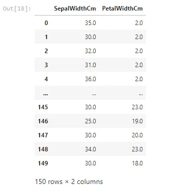

**4-** **Merging and concatenating DataFrames****:**

Merging two datasets is the process of bringing two datasets together into one, and aligning the rows from each based on common attributes or columns. There are four types of joins in python:

- inner join: combines two dataframes based on a **common key** and returns a new dataframe that contains only rows that have matching values in both of the original dataframes.

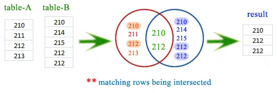

- outer join: returns all those records which either have a match in the left or right dataframe. When rows in both the dataframes do not match, the resulting dataframe will have NaN for every column of the dataframe that lacks a matching row.

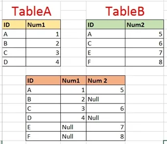

- left join: returns a dataframe containing all rows of left dataframe. All the non-matching rows of the left dataframe contain NaN for the columns in the right dataframe.

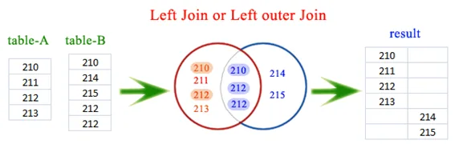

- left join: returns a dataframe containing all rows of left dataframe. All the non-matching rows of the left dataframe contain NaN for the columns in the right dataframe.

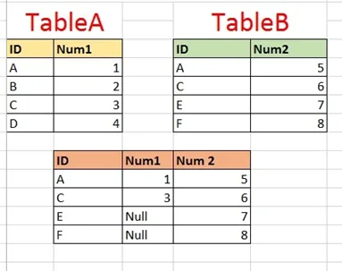

So we have two csv files: [market_fact](https://www.kaggle.com/kerneler/starter-global-market-sales-data-3072b289-1/data?select=market_fact.csv) and [orders_dimen](https://www.kaggle.com/kerneler/starter-global-market-sales-data-3072b289-1/data?select=orders_dimen.csv).

```python
import pandas as pd
#Reading ourdatasets
data1=pd.read_csv(r'C:\Users\HP\Documents/Data science project/Assignments/3rd assignment/market_fact.csv')
data2=pd.read_csv(r'C:\Users\HP\Documents/Data science project/Assignments/3rd assignment/orders_dimen.csv')
```

Our dataframes will be containing

data1:

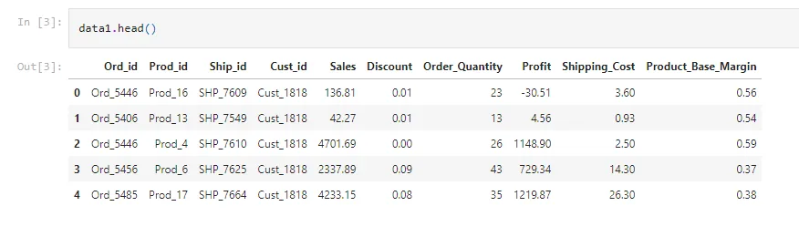

data2:

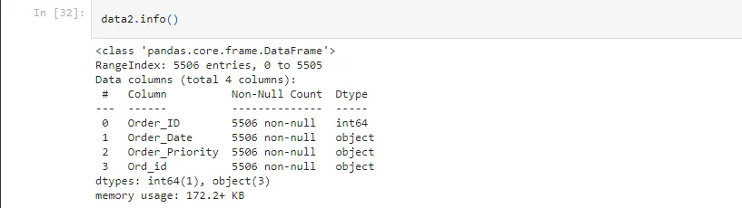

We can see that the common column is : Ord_id, we pass to the merge function our 2 dataframes, with 'on' equal to the common column and we precise which join we want to perform and change the 'how' argument as we need to.

```python
#Merging our datasets
cust_order = pd.merge(data1,data2, on = 'Ord_id', how = "inner")
cust_order.head()
```

And this will be our first 5 rows of our merged DF:

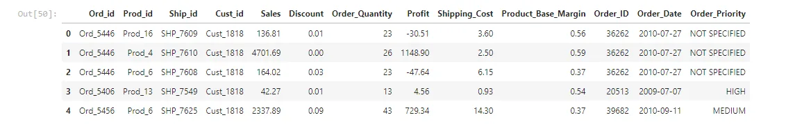

- Concat function of Pandas is used to concatenate the dataframes. We create two dataframes both containing three columns: name, age and gender.

```python
# dataframes having the same columns
df1 = pd.DataFrame({'Name': ['Asma', 'Sarah', 'Chakib', 'Ilyes'],'Age': [29, 28, 21, 18],'Gender': ['F', 'F', 'M', 'M']})
df2 = pd.DataFrame({'Name': ['Mohamed', 'Islam', 'Meryem'],'Age': [31, 22, 19],'Gender': ['M', 'M', 'F']})
```

We want to concatenate the two dataframes, as both are having the same columns: we need to reset our index for our new DF and drop the precedent one.

```python
df = pd.concat([df1, df2])
df= df.reset_index()
df = df.drop(['index'], axis = 1)
df
```

We get the result below after the two dataframes are concatenated:

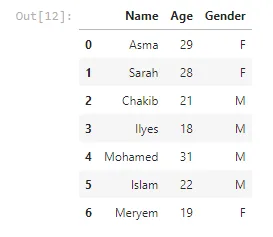

we have an alternative method of concatenating, which is by using the append function. We simply have to place one data frame inside the parentheses and we get the same result above.

```python
df = df1.append(df2)
df=df.reset_index()
df = df.drop(['index'], axis = 1)
df
```

**5- to_datetime****, nlargest and nsmallest Functions****:**

- While reading a CSV file, the DateTime objects in the file are read as string objects and therefore, it’s a little difficult to perform DateTime operations like time difference on a string. So, this is where the pandas “to_datetime()” comes into play. You can provide various formats as per your requirement.

cust_order is the merge resulting dataframe:

```python
cust_order.info()
```

```python
<class 'pandas.core.frame.DataFrame'>
Int64Index: 8399 entries, 0 to 8398
Data columns (total 13 columns):
 #   Column               Non-Null Count  Dtype
---  ------               --------------  -----
 0   Ord_id               8399 non-null   object
 1   Prod_id              8399 non-null   object
 2   Ship_id              8399 non-null   object
 3   Cust_id              8399 non-null   object
 4   Sales                8399 non-null   float64
 5   Discount             8399 non-null   float64
 6   Order_Quantity       8399 non-null   int64
 7   Profit               8399 non-null   float64
 8   Shipping_Cost        8399 non-null   float64
 9   Product_Base_Margin  8336 non-null   float64
 10  Order_ID             8399 non-null   int64
 11  Order_Date           8399 non-null   object
 12  Order_Priority       8399 non-null   object
dtypes: float64(5), int64(2), object(6)
memory usage: 918.6+ KB
```

the Order_Date column is an object we need to turn it into date using to_datetime:

```python
cust_order["Order_Date"]=pd.to_datetime(cust_order['Order_Date'])
cust_order.info()
```

```python
<class 'pandas.core.frame.DataFrame'>
Int64Index: 8399 entries, 0 to 8398
Data columns (total 13 columns):
 #   Column               Non-Null Count  Dtype
---  ------               --------------  -----
 0   Ord_id               8399 non-null   object
 1   Prod_id              8399 non-null   object
 2   Ship_id              8399 non-null   object
 3   Cust_id              8399 non-null   object
 4   Sales                8399 non-null   float64
 5   Discount             8399 non-null   float64
 6   Order_Quantity       8399 non-null   int64
 7   Profit               8399 non-null   float64
 8   Shipping_Cost        8399 non-null   float64
 9   Product_Base_Margin  8336 non-null   float64
 10  Order_ID             8399 non-null   int64
 11  Order_Date           8399 non-null   datetime64[ns]
 12  Order_Priority       8399 non-null   object
dtypes: datetime64[ns](1), float64(5), int64(2), object(5)
memory usage: 918.6+ KB
```

We can see that the type of Order_Date did change from object to datetime.
-“nsmallest() & nlargest()” functions are used to obtain “n” numbers of rows from our dataset which are lowest or highest respectively.

from cust_order we need to trace back the 4 orders which have the biggest Order_Quantity:

```python
cust_order.nlargest(4,'Order_Quantity')
```

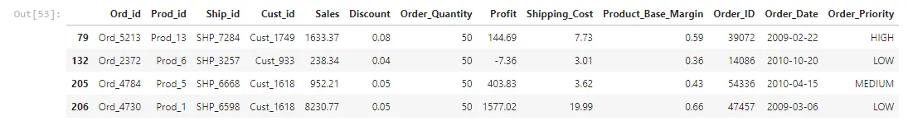

Again, from cust_order we need to trace back the 4 orders which have the lowest Shipping_cost:

```python
cust_order.nsmallest(4,'Shipping_Cost')
```

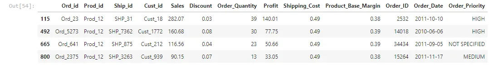

Here we come to the end of our tutoriel, if you want to get further knowledge about data manipulation with pandas check this [Datacamp link](https://app.datacamp.com/learn/courses/data-manipulation-with-pandas)

You can find the code here: [Notebook1](https://github.com/asmakrl/datacampstd/blob/main/Reading%20and%20Plotting.ipynb), [Notebook2](https://github.com/asmakrl/datacampstd/blob/main/Merging%20and%20Concatenating%20DataFrames.ipynb)
