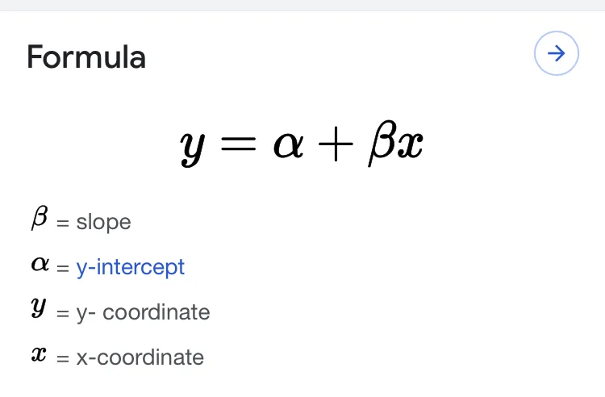
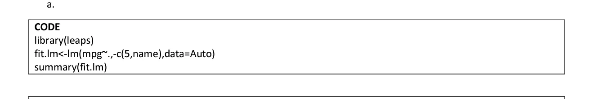
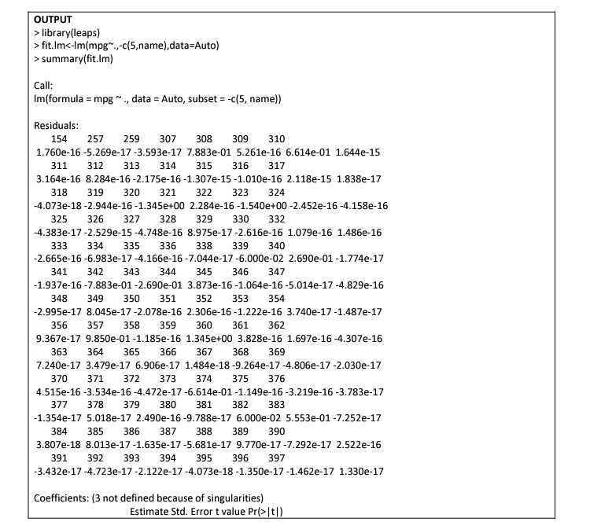
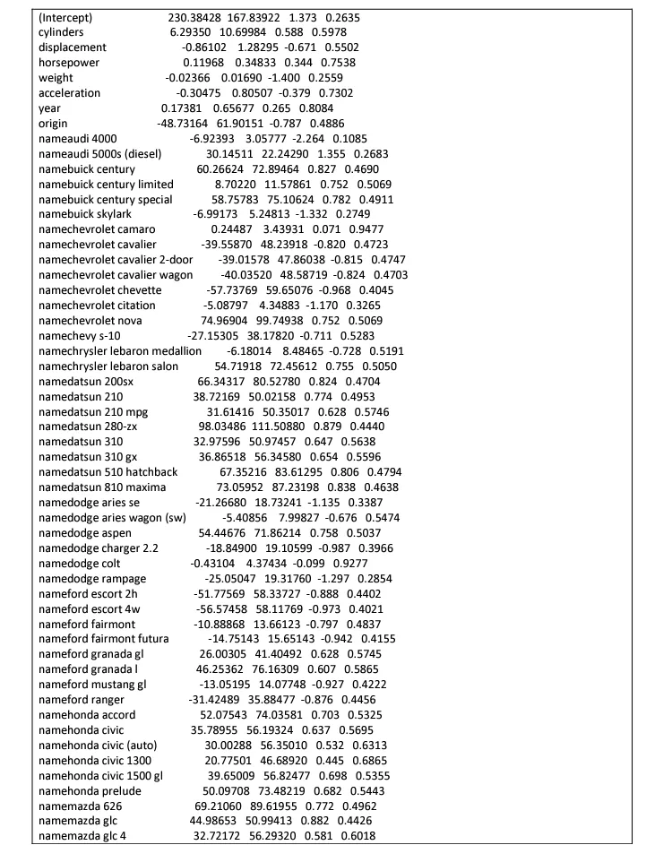
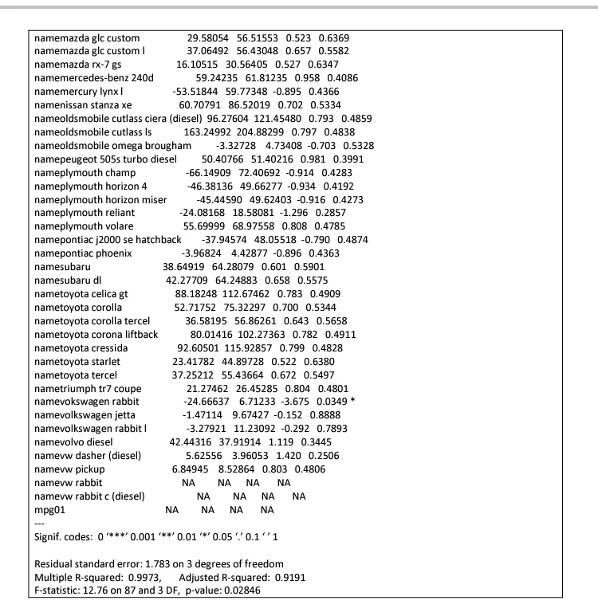
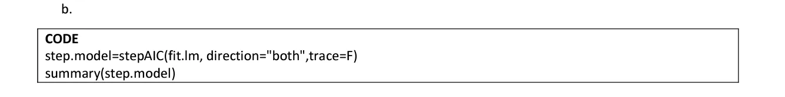
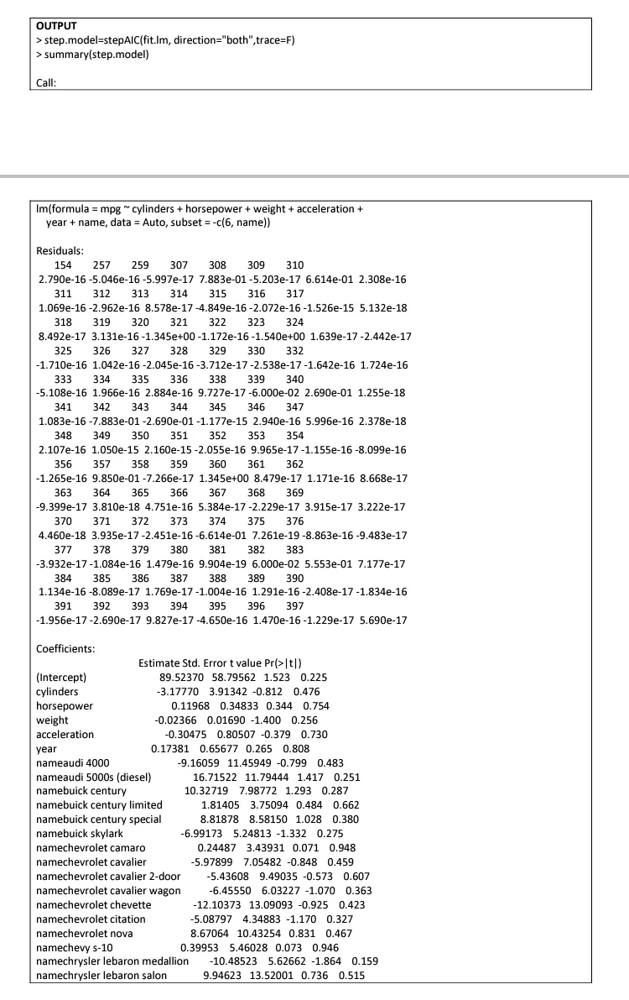
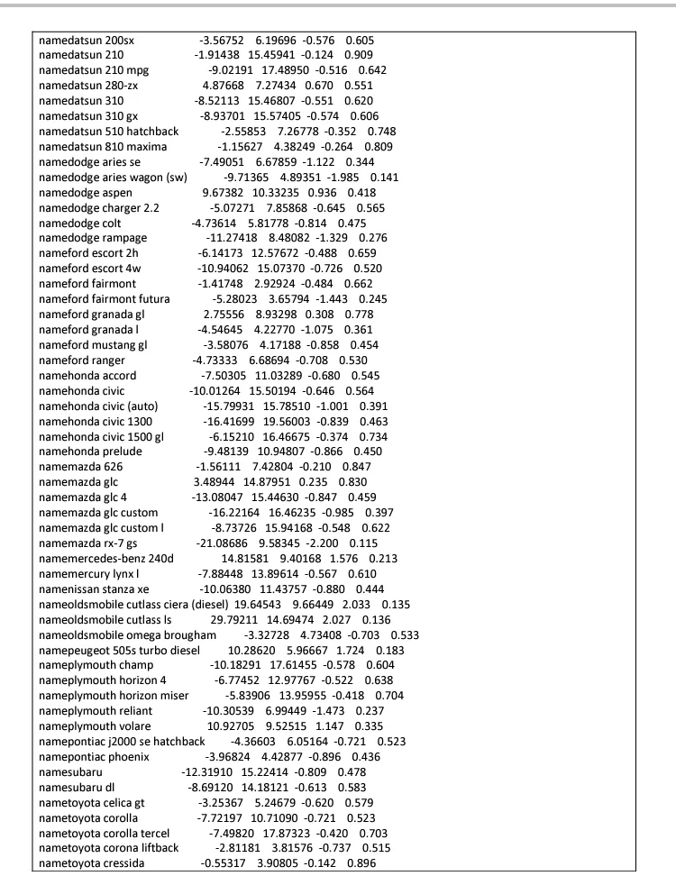
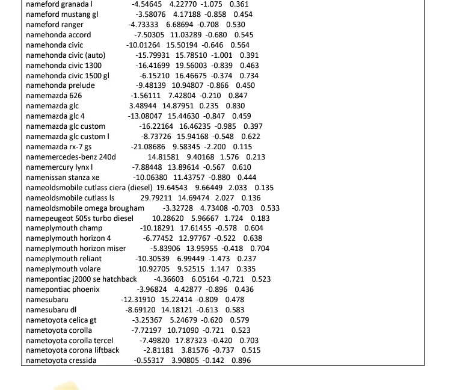

Let’s start by looking at basic definitions, examples, explanations, Assumptions, types of regression Analysis before taking you through the steps in R.

What is regression analysis?

Regression analysis is the linear relationship that exist between independent variables and dependent variables. The independent variables can be referred to as Explanatory variables and the dependent variables as Response variable.

Before we continue, let’s understand a Variable. A Variable is any factor that is liable to change. For example; In most cases, “x” variable is used to denote the explanatory variable while “y” variable is used to denote the response variable as well.

Explanatory variables are factors that one suspect to have an impact on the response/dependent variables and the Response variables are the main factors that we are trying to predict or Understand. For example; Predicting Crop yields based on the amount of rainfall. In this example the dependent/explanatory variable is yield and the independent/response variable is the measure of precipitation.

For the purpose of the topic in discussion, let’s quickly state the basic assumptions of any regression model which include Homogeneity of Variance (Homoscedasticity), Independence of Observations and normality assumption.

There are three different types of regression model namely; simple linear regression, multiple linear regression and polynomial linear regression model.

For the purpose of this blog, we will look at simple linear regression and how to perform it using R.

Simple linear regression is a linear regression model with a single explanatory variable. It can be represented below;

Now; let’s look at a practical example in R using “leap” data set loaded from library.

The “leap” data set has the following: mpg ~ cylinders + horsepower + weight + acceleration +year+name .

Step 1: load “leap” from library and fit a regression model.using lm() as indicated below

The output becomes;

Step 2; we would like to balance the model,fitness and its complexity. Code below

And the out becomes;

Quite easy right?

The above codes and output should guide you to perform a simple linear regression in R.

Please leave your Comments, Questions and suggestions. Thanks!

Reference: google.com, ISLR 4 pdf
