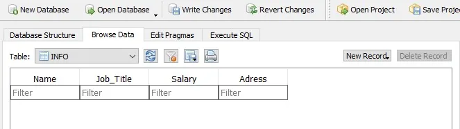
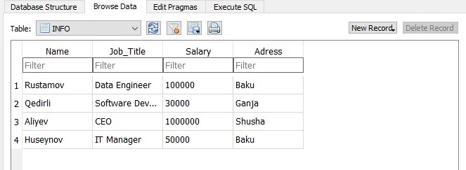
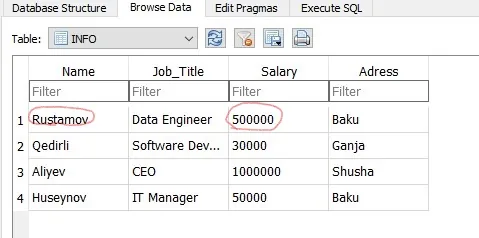
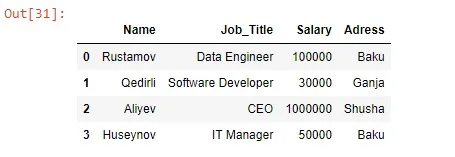

Much of the work of data scientists is related to data. And in some cases (especially for bank employees) we have to pull the data from the database.

Most database programs require you to install a complex program on your local machine or on a server that you can access, which can cause some problems. Popular database programs include Microsoft SQL Server and MySQL.

For the purposes of this article, we will focus on a very simple database program known as SQLite. The reason for choosing SQLite is because it is a file-based database system that uses Python. There is no need for any configuration or additional installation. This allows us to focus on the basics of what a database is and how it works, while also eliminating the risk of loss in installation and setup details.

In this article we will learn about:

○ Creating an SQLite Database

○ Adding data to our Database

○ Searching over our Database and showing it on console

○ Editing data in our Database

○ Deleting selected data from our Database

## Creating an Sqlite Database
SQLlite supports this type of data: **NULL, INTEGER, REAL, TEXT, BLOB.** We can store data in databases for these data types.

Now it is time to create a Database! Let's see a code snippet for better understanding.

First we import SQLite library. After that we connect to a database file which we defined or sqlite3 module will create new empty database if it does not exist. Once the database file is created we need to define a TABLE to work with in the database. Let's see a code snipped of creating a TABLE.

In SQLite it doesn't matter if the code is uppercase or lowercase, CREATE == Create == create. However, in order to easily separate the text from the code, we will write the code with uppercase, and the text with Mixed- or lower-case.

CREATE TABLE command will create a table using the specified name.

Via cursor we send SQL commands to our database, using its execute function. And in the execute function we define our column names of database and its data types.



After creating the table in our database, it will look as shown in the figure above. Now, as we see our column inputs are empty we have to insert values to these. We use INSERT to add information to the database, corresponding to the INSERT command in SQL. Let's see a code snippet for this.

Again we use execute() function and call INSERT INTO and pass 4 values into it. To save the inputs which we made, we need to call commit() method to apply changes.

In some cases we need to add data to the database as input. Let's imagine that we are given a database but we want to add some variables to this.

As you can see, we've added an input using tuple and we will see that we get information as tuple data structure. This is done because we cant change tuples.



### Select Operation

Our main aim is to extract data from databases. To do this we use the SELECT method.

To get all records from table we use the following command: SELECT \* FROM table_name. This means that we want to get all data from the Table. To get list of variables we define cursor.fetchall(). Additionally, we can use fetchone() and fetchmany() to get just one row and selected number of rows, respectively from the database. Then we loop over the list (arr) to get:

```python
 Name: Rustamov

        Job: Data Engineer

        Salary: 100000

        Adress: Baku
______________________________

        Name: Qedirli

        Job: Software Developer

        Salary: 30000

        Adress: Ganja
______________________________

        Name: Aliyev

        Job: CEO

        Salary: 1000000

        Adress: Shusha
______________________________

        Name: Huseynov

        Job: IT Manager

        Salary: 50000

        Adress: Baku
```

Sometimes we want to get data with some conditions. For example,

Let's suppose that we want just Rustamov's information. To do this, we need the **WHERE** method.

```python
  Name: Rustamov

        Job: Data Engineer

        Salary: 500000

        Adress: Baku

______________________________
```

We could also be interested in just a few number of features from our database. In this case, we will use the name of the columns (features) instead of \* (all).

And we get:

```python
        Name: Rustamov
        Salary: 100000
______________________________

        Name: Qedirli

        Salary: 30000
______________________________

        Name: Aliyev

        Salary: 1000000
______________________________

        Name: Huseynov

        Salary: 50000
______________________________
```

#### Updating Table in Databases
Sometimes we need to update some information in a database.

For updating Table we need 2 SQL commands.

○ UPDATE

○ SET

We use **UPDATE** for updating a specific table.

We use **SET** for updating specific field in table.

In the example above we can see that we updated INFO table and we set Rustamov's Salary to 500000. Again for saving changes we use con.commit().



From the above figure, we have successfully changed Rustamov's Salary.

#### Deleting Item from Databases
Sometimes data must be removed from a database. To do this we use DELETE method.

DELETE method is similar to UPDATE in terms of usage. We define DELETE with table name and condition which we want to delete variables. In the end we write con.commit() to save changes.

#### Converting Database Table to Pandas DataFrame
We create tables, insert, update, and delete informations from the table in in a database. Now what if we need selected items in a DataFrame? Let's see how to do this.

We pass a list into Pandas DataFrame and define column names.

And we get:



#### Conclusion
There may be more to do with databases. In this blog, we have acquired basic knowledge. As Data Scientists, we will always need to get data from databases. Therefore, SQLite is an important knowledge for us. If you want to see the full code, you can check [here](https://github.com/Ibrahimbeu/Sqlite3_python).
