How to make graphs using Matplotlib, Pandas, and Seaborn.


Data visualization is the discipline of trying to understand data by placing it in a visual context so that patterns, trends, and correlations that might not otherwise be detected can be exposed.

Python offers multiple great graphing libraries that come packed with lots of different features. No matter if you want to create interactively, live, or highly customized plots python has an excellent library for you.

To get a little overview here are a few popular plotting libraries:

- **Matplotlib:**low level, provides lots of freedom
- **Pandas Visualization:**easy to use interface, built on Matplotlib
- **Seaborn:**high-level interface, great default styles

In this article, we will learn how to create basic plots using Matplotlib, Pandas visualization, and Seaborn as well as how to use some specific features of each library.

**Importing Datasets**

In this article, we will use two datasets that are freely available. The [Iris](https://archive.ics.uci.edu/ml/datasets/iris) and [Wine Reviews](https://www.kaggle.com/zynicide/wine-reviews) dataset, which we can both load in using pandas read_csv method.

```python
import pandas as pd
iris = pd.read_csv('iris.csv', names=['sepal_length', 'sepal_width', 'petal_length', 'petal_width', 'class'])
print(iris.head())
```

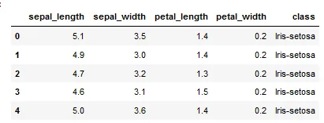

```python
wine_reviews = pd.read_csv('winemag-data-130k-v2.csv', index_col=0)
wine_reviews.head()
```

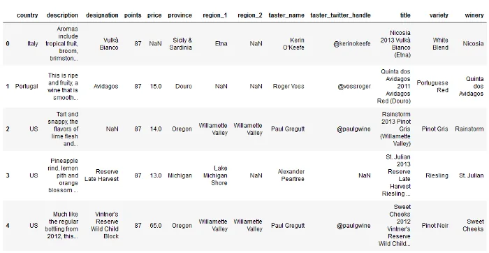

**Matplotlib**

Matplotlib is the most popular python plotting library. It is a low-level library with a Matlab-like interface that offers lots of freedom at the cost of having to write more code.

To install Matplotlib pip and conda can be used.

```python
pip install matplotlib
or
conda install matplotlib
```

Matplotlib is specifically good for creating basic graphs like line charts, bar charts, histograms, and many more. It can be imported by typing:

```python
import matplotlib.pyplot as plt
```

**Scatter Plot**

To create a scatter plot in Matplotlib we can use the scatter method. We will also create a figure and an axis using plt.subplots so we can give our plot a title and labels.

```python
# create a figure and axis
fig, ax = plt.subplots()

# scatter the sepal_length against the sepal_width
ax.scatter(iris['sepal_length'], iris['sepal_width'])
# set a title and labels
ax.set_title('Iris Dataset')
ax.set_xlabel('sepal_length')
ax.set_ylabel('sepal_width')
```

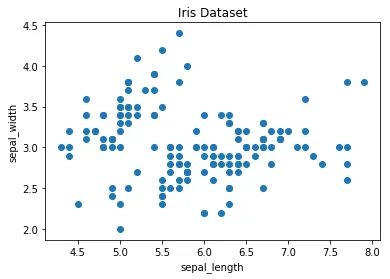

We can give the graph more meaning by coloring each data point by its class. This can be done by creating a dictionary that maps from class to color and then scattering each point on its own using a for-loop and passing the respective color.

```python
# create color dictionary
colors = {'Iris-setosa':'r', 'Iris-versicolor':'g', 'Iris-virginica':'b'}
# create a figure and axis
fig, ax = plt.subplots()
# plot each data-point
for i in range(len(iris['sepal_length'])):
    ax.scatter(iris['sepal_length'][i], iris['sepal_width'][i],color=colors[iris['class'][i]])
# set a title and labels
ax.set_title('Iris Dataset')
ax.set_xlabel('sepal_length')
ax.set_ylabel('sepal_width')
```

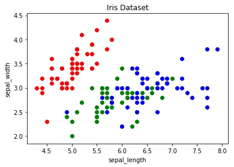

**Line Chart**

In Matplotlib we can create a line chart by calling the plot method. We can also plot multiple columns in one graph, by looping through the columns we want and plotting each column on the same axis.

```python
# get columns to plot
columns = iris.columns.drop(['class'])
# create x data
x_data = range(0, iris.shape[0])
# create figure and axis
fig, ax = plt.subplots()
# plot each column
for column in columns:
    ax.plot(x_data, iris[column], label=column)
# set title and legend
ax.set_title('Iris Dataset')
ax.legend()
```


**Histogram**

In Matplotlib we can create a Histogram using the hist method. If we pass categorical data like the points column from the wine-review dataset it will automatically calculate how often each class occurs.

```python
# create figure and axis
fig, ax = plt.subplots()
# plot histogram
ax.hist(wine_reviews['points'])
# set title and labels
ax.set_title('Wine Review Scores')
ax.set_xlabel('Points')
ax.set_ylabel('Frequency')
```

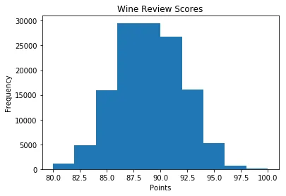

**Bar Chart**

A bar chart can be created using the bar method. The bar chart isn’t automatically calculating the frequency of a category so we are going to use the pandas value_counts function to do this. The bar chart is useful for categorical data that doesn’t have a lot of different categories (less than 30) because else it can get quite messy.

```python
# create a figure and axis
fig, ax = plt.subplots()
# count the occurrence of each class
data = wine_reviews['points'].value_counts()
# get x and y data
points = data.index
frequency = data.values
# create bar chart
ax.bar(points, frequency)
# set title and labels
ax.set_title('Wine Review Scores')
ax.set_xlabel('Points')
ax.set_ylabel('Frequency')
```

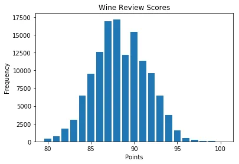

**Pandas Visualization**

Pandas is an open-source high-performance, easy-to-use library providing data structures, such as data frames, and data analysis tools like the visualization tools we will use in this article.

Pandas Visualization makes it really easy to create plots out of a pandas dataframe and series. It also has a higher-level API than Matplotlib and therefore we need less code for the same results.

Pandas can be installed using either pip or conda.

```python
pip install pandas
or
conda install pandas
```

**Scatter Plot**

To create a scatter plot in Pandas we can call <dataset>.plot.scatter() and pass it two arguments, the name of the x-column as well as the name of the y-column. Optionally we can also pass it a title.

```python
iris.plot.scatter(x='sepal_length', y='sepal_width', title='Iris Dataset')
```

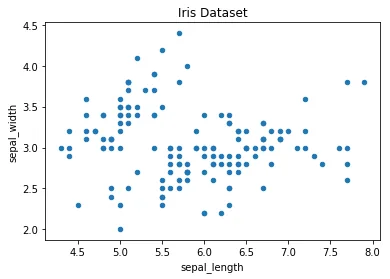

As you can see in the image it is automatically setting the x and y label to the column names.

**Line Chart**

To create a line-chart in Pandas we can call <dataframe>.plot.line(). Whilst in Matplotlib we needed to loop through each column we wanted to plot, in Pandas, we don’t need to do this because it automatically plots all available numeric columns (at least if we don’t specify a specific column/s).

```python
iris.drop(['class'], axis=1).plot.line(title='Iris Dataset')
```

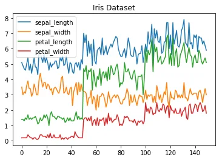

**Histogram**

In Pandas, we can create a Histogram with the plot.hist method. There aren’t any required arguments but we can optionally pass some like the bin size.

```python
iris.plot.hist(subplots=True, layout=(2,2), figsize=(10, 10), bins=20)
```

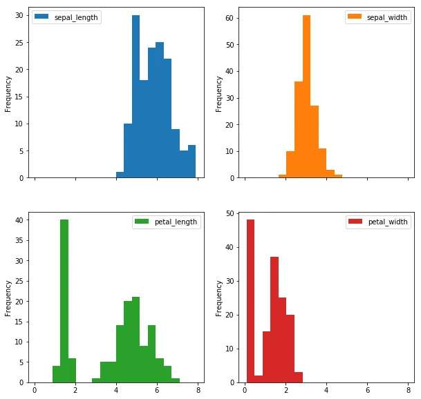

The subplots argument specifies that we want a separate plot for each feature and the layout specifies the number of plots per row and column.

**Bar Chart**

To plot a bar-chart we can use the plot.bar() method, but before we can call this we need to get our data. For this, we will first count the occurrences using the value_count() method and then sort the occurrences from smallest to largest using the sort_index() method.

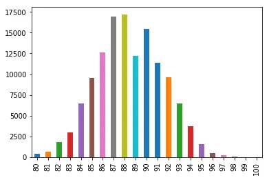

**Seaborn**

Seaborn is a Python data visualization library based on Matplotlib. It provides a high-level interface for creating attractive graphs.

Seaborn has a lot to offer. You can create graphs in one line that would take you multiple tens of lines in Matplotlib. Its standard designs are awesome and it also has a nice interface for working with pandas data frames.

It can be imported by typing:

```python
import seaborn as sns
```

**Scatter plot**

We can use the .scatterplot method for creating a scatterplot, and just as in Pandas we need to pass it the column names of the x and y data, but now we also need to pass the data as an additional argument because we aren’t calling the function on the data directly as we did in Pandas.

```python
sns.scatterplot(x='sepal_length', y='sepal_width', data=iris)
```

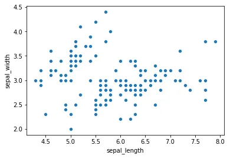

**Histogram**

To create a histogram in Seaborn we use the sns.distplot method. We need to pass it the column we want to plot and it will calculate the occurrences themselves. We can also pass it the number of bins, and if we want to plot a gaussian kernel density estimate inside the graph.

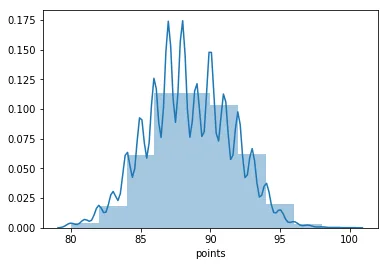

**Bar chart**

In Seaborn, a bar-chart can be created using the sns.countplot method and passing it the data.

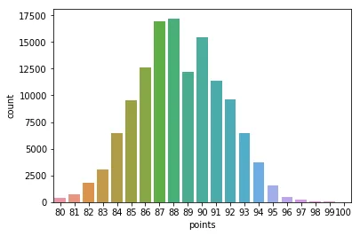

**Other graphs**

Now that you have a basic understanding of the Matplotlib, Pandas Visualization, and Seaborn syntax I want to show you a few other graph types that are useful for extracting insides.

For most of them, Seaborn is the go-to library because of its high-level interface that allows for the creation of beautiful graphs in just a few lines of code.

**Box plots**

A Box Plot is a graphical method of displaying the [five-number summary](https://en.wikipedia.org/wiki/Five-number_summary). We can create box plots using seaborns sns.boxplot method and pass it the data as well as the x and y column name.

```python
df = wine_reviews[(wine_reviews['points']>=95) & (wine_reviews['price']<1000)]
sns.boxplot('points', 'price', data=df)
```

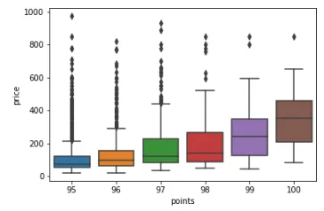

**Conclusion**

Data visualization is the discipline of trying to understand data by placing it in a visual context so that patterns, trends, and correlations that might not otherwise be detected can be exposed.

Python offers multiple great graphing libraries that come packed with lots of different features. In this article, we looked at Matplotlib, Pandas visualization, and Seaborn.
