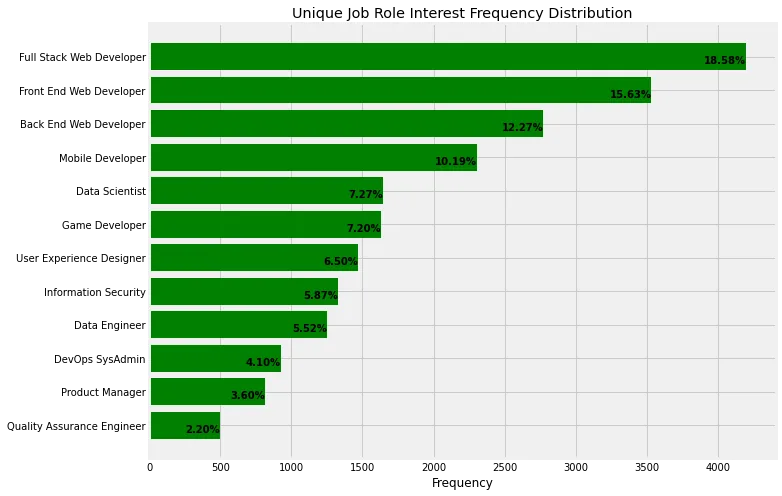
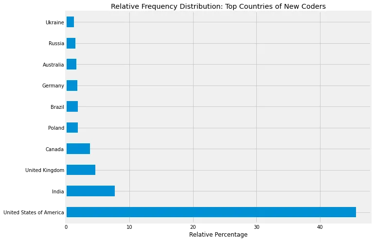
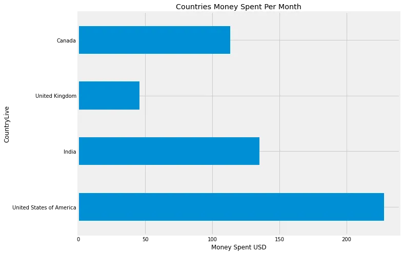
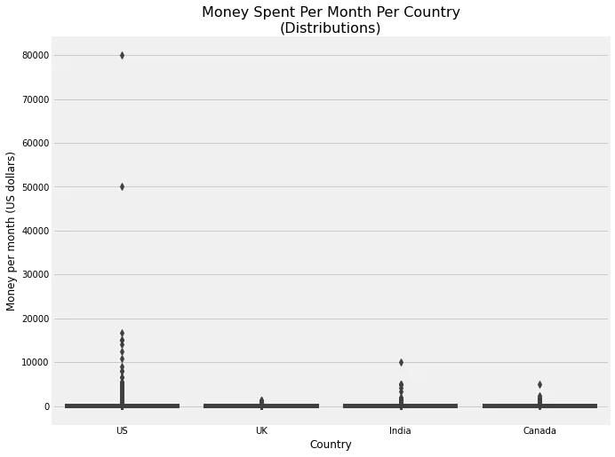
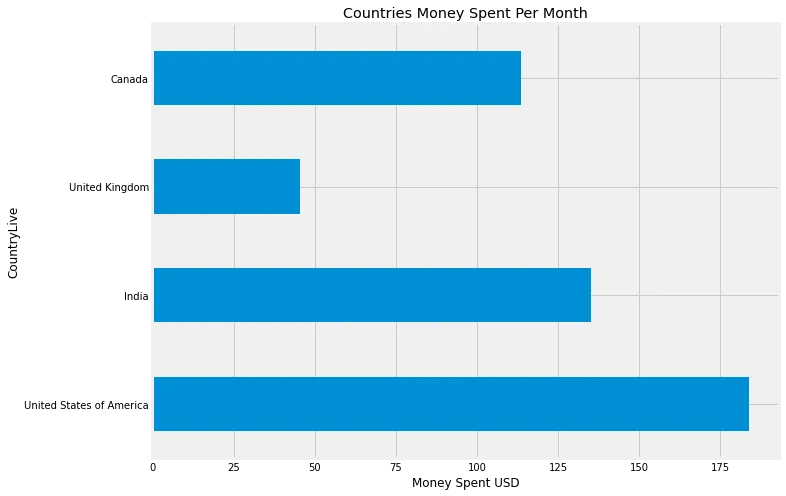
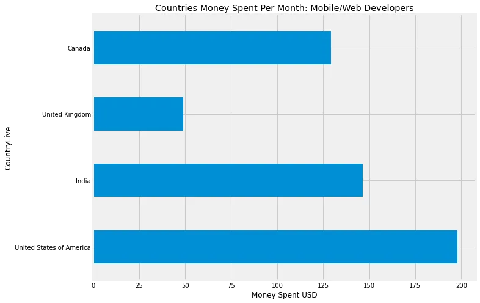
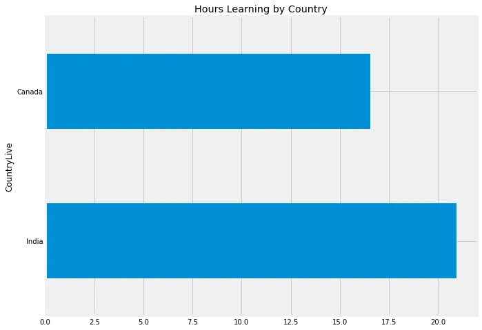

The goal of this analysis is to identify the two greatest markets for advertising e-commerce programming courses that specialize in web and mobile development.

We're looking at existing data on new coders and the markets they're interested in. As a result, we can reasonably estimate the ideal market to advertise in. To do this efficiently, we must first comprehend:

- The locations of new programmers
- The locations with the greatest number of new programmers
- How much money new programmers are willing to spend

Summary of Results
After reviewing the data, we found that the United States is the ideal target market for promoting e-commerce programming courses. India and Canada are neck and neck for the second best market.

Exploring Existing Datasets - New Coder Survey Data
Under some conditions, surveys might be required to acquire the essential data. However, if the data is useful and trustworthy, it is more cost-effective and faster to leverage existing data.
FreeCodeCamp made this dataset publicly availble on [github](https://github.com/freeCodeCamp/2017-new-coder-survey). Below we will explore what's inside by loading in the raw clean data from the repository located [here](https://raw.githubusercontent.com/freeCodeCamp/2017-new-coder-survey/master/clean-data/2017-fCC-New-Coders-Survey-Data.csv)

```python
# Read data
import pandas as pd
data = pd.read_csv('Survey-Data.csv', low_memory = False)
# Examine Data
print(data.shape)pd.options.display.max_columns = Nonedata.head()
```

The following are the columns out of 136 that we are interested in:

- Age,
- BootCamp,
- BootcampLoanYesNo,
- CodeEvents(All),
- CommuteTime(Radio Advertising?),
- CountryLive,
- EmploymentStatus,
- HoursLearning,
- Income,
- JobRoleInterest,
- JobApplyWhen (For structuring length of courses?),
- MoneyForLearning,
- MonthsProgramming,
- Podcast(All),
- Resource(All),
- YouTube\*

## Verifying the Sample

To proceed with the study, we must ensure that our sample can answer our questions regarding a population of new programmers interested in online programming classes that are being offered.

We want to make sure that this sample can answer questions concerning new coders interested in online and mobile development, and then we may check into the following variables:

- The locations of new programmers
- The locations with the greatest number of new programmers
- How much money new programmers are willing to spend

From our brief reseach above, we found the JobRoleInterest column which shows each participants job role(s) interest. Let's look at this column to see if web and mobile development are represented, as well as what other types of professions the survey respondents are interested in.

```python
# Generate frequency distribution for JobRoleInterest data['JobRoleInterest'].value_counts(normalize=True)*100 # Returns percentage
```

## Finding The Most Interesting Jobs

To redistribute the grouped interests based on work roles, we will need to:

- Drop all NA values if there is any
- Split grouped interests by ','
- Remove all NonAlphaNumeric characters
- Count the frequency of unique interests
- Generate a new frequency plot showing the frequency of each categorical job role.

We can do a length count after splitting the grouped interests and appending them to a new list and find that we now have a list that is more than three times longer than our original. This implies that a large proportion of respondents are interested in more than one job role.

Let's take a look at the top jobs that the majority of new developers are looking for.

\*(Some interests separated by '/' and 'or' could be appended further, adding a few extra interests to the length of unique interests, but are insignificant for our needs.)

```python
# Sort the Job interests from highest Frequency to Lowest
sorted_unique_interests = sorted(interest_frequency.items(), key=lambda x: x[1], reverse=True)
```

```python
# Graph for the frequency table above
import matplotlib.pyplot as plt
import numpy as np
plt.style.use('fivethirtyeight')
%matplotlib inline
plt.rcParams['figure.figsize'] = (10.0, 8.0)

# Separate list of Tuples
x,y = zip(*sorted_unique_interests)
total = sum(y) # Used for percentage

# Configure plot
fig, ax = plt.subplots()

# Reassign variables for readability and Select top Values
job_role = x[:12]
frequency = y[:12]

# Configure y axis for Job Role Labeling
y_pos = range(len(job_role))
ax.set_yticks(y_pos)
ax.set_yticklabels(job_role)
ax.invert_yaxis()  # labels read top-to-bottom
ax.tick_params(right=0, left=0, top=0, bottom=0) # Remove ticks

# Add percentage text on respective bars
for i, v in enumerate(frequency):
    ax.text(v,
            i + .2,
            '{:1.2f}{}'.format((v/total)*100,'%'),
            color='black',
            ha='right',
            picker=4,
            fontweight='bold')

# Assign Labels for plot
ax.set_xlabel('Frequency')
ax.set_title('Unique Job Role Interest Frequency Distribution')

# Plot Horizontal Bars
ax.barh(y_pos, frequency, align='center',
        color='green', ecolor='black')

plt.show()
```



It shows that approximately 46% of respondents are interested in some form of web development. Only 10% are interested in mobile device development.

Because this e-commerce site focuses on web and mobile development, they will be able to capture more than half of the whole market share. This is a good sign because it demonstrates that our sample group is representative of the population of interest.

## Finding the best country to Advertise

We can now zoom out and look at where these folks live to begin targeting our market locations now that we know what types of occupations they are interested in.

We'll be looking at the CountryLive column from our dataset to determine where the majority our new coders live. This way any ads we run can reach the greatest number of people.



We can instantly see that the United States of America and India have the most aspiring programmers. The United States accounted for 37.76% of all respondents, while India accounted for 9.12%.

We could stop here and market to these two countries, but we should go deeper for a more thorough research, especially since we have all of this data to make an informed decision.

## Digging Deeper: Filtering Out The Freeloaders

As we dig deeper into our research, we'll concentrate our focus to the top four countries: the United States, India, the United Kingdom, and Canada. These countries had a sizable number of responses, and they all spoke English.

In the future, we will determine how much money these people have to spend so that we may avoid targeting areas that are oversaturated with free learners and/or people who cannot buy our courses.

## The Approach

The MoneyForLearning column describes how much money respondents have spent since they started learning coding. The e-commerce site will be selling monthly subscriptions at a price of $59 per month, so well want to determine how much money each new coder spends per month. We'll use the MonthsProgramming column to determine this number.

```python
# Find per month spending and replace 0 values with 1 in MonthsProgramming column to avoid div/0
data_good['MonthsProgramming'].replace(0,1, inplace=True)
data_good['MoneySpentPerMonth'] = data_good['MoneyForLearning']/data_good['MonthsProgramming']
```

```python
# Number of Nan values in new column counting total length - total Non-NaN values
nancount = len(data_good['MoneySpentPerMonth']) - data_good['MoneySpentPerMonth'].count()
nancount
```

```python
# Group the columns by country and compute the mean
countries_mean = data_good.groupby('CountryLive').mean()

# Select the top 4 countries and show the average money spent per month
plt.xlabel('Money Spent USD')
title = ('Countries Money Spent Per Month')
countries_mean['MoneySpentPerMonth'][['United States of America',
                            'India', 'United Kingdom',
                            'Canada']].plot.barh(title=title)
plt.show()
```



According to the frequency graphic above, the United States spends the most money per month. It's strange that the UK spends the least amount given that its GDP is somewhat larger than India's.

Checking For Extremes
Because the data appears to be a little strange, we will create a box plot of each country's distributions to examine whether there are any severe outliers distorting our averages.

```python
# Box plots to visualize distributions
import seaborn as sns
sns.boxplot(y = 'MoneySpentPerMonth', x = 'CountryLive',
            data = top_4)
plt.title('Money Spent Per Month Per Country\n(Distributions)',
         fontsize = 16)
plt.ylabel('Money per month (US dollars)')
plt.xlabel('Country')
plt.xticks(range(4), ['US', 'UK', 'India', 'Canada']) # avoids tick labels overlap
plt.show()
```



We can observe that the United States spends between 50,000 and 80,000 every month. This isn't impossible, but it's exceedingly unlikely that someone would spend that much money, so we'll remove the outliers and recalculate the mean.

```python
# Select the top 4 countries and show the average money spent per month
plt.xlabel('Money Spent USD')
title = ('Countries Money Spent Per Month')
countries_mean['MoneySpentPerMonth'][['United States of America',
                            'India', 'United Kingdom',
                            'Canada']].plot.barh(title=title)
plt.show()
```



At this point, it's rather obvious that one of the countries to advertise in would be the United States. But what would the second best country look like?

In terms of the amount of money spent by new developers, India and Canada are fairly close. Let's see if we can spot any important differences between the countries that may assist us in making a more informed decision.

We looked at all of the responses when calculating the average monthly spending. However, because we are mostly developing programs for online and mobile development, it may be worthwhile establish construct averages with just these new developers in mind.

## Finding the Average Amount of Money Spent Per Month: Looking at Web and Mobile Developers

```python
# First we'll filter out all other new coders so were only looking at web and mobile
mobile_web = data_good[data_good['JobRoleInterest'].str.contains(
    'Web|Mobile')]
# Then we'll filter by our top 4 countries
mobile_web_top_4 = mobile_web[mobile_web['CountryLive'].str.contains(
    'United States of America|India|United Kingdom|Canada')]
```

```python
# Group the columns by country and compute the mean
countries_mean = mobile_web.groupby('CountryLive').mean()

# Select the top 4 countries and show the average money spent per month
plt.xlabel('Money Spent USD')
title = ('Countries Money Spent Per Month: Mobile/Web Developers')
countries_mean['MoneySpentPerMonth'][['United States of America',
                            'India', 'United Kingdom',
                            'Canada']].plot.barh(title=title)
plt.show()
```



The sort of work role interest appears to have little impact on the amount of money new coders are willing to pay per month. This could be due to the fact that the majority of respondents were interested in more than one job function. It's also feasible that the job function has no effect on how much money new developers are ready to invest.

We can either continue examining the data or let the marketing department decide on a second country.

One indicator that comes to mind is how much time respondents spend studying per month. Because our e-commerce site is based on a monthly membership, marketing to the group of new coders with the least amount of time to learn would be great. They will study more and thus subscribe for a longer period of time this manner.

```python
data_good['HoursLearning'].describe()
```

We can see that the max hours learning is 168. This equates to one week. This is good to know because there was no documentation on the description for this column. We now know that HoursLearning describes the amount of hours a respondent spends learning each week.

Let's look at this metric by country to see whether we can choose between India and Canada.

## Hours Learning by Country

```python
title='Hours Learning by Country'
countries_mean['HoursLearning'][[
                            'India',
                            'Canada']].plot.barh(title=title)
plt.show()
```



It appears that Canada has a lower weekly learning average. This difference isn't significant, but it could imply an extra month of learning subscription. This information will be valuable in either case.

## Conclusion

In this analysis, we conducted a freecodecamp survey to determine the top two markets in which to advertise for an e-commerce company that specializes in web and mobile development.

The majority of new coders were interested in Web and mobile programming, according to our findings.

We defined market region based on where respondents lived and discovered the top four countries: the United States, India, Canada, and the United Kingdom.

Among these four countries, the United States was an obvious choice for a marketing effort. Choosing between India and Canada was more challenging because we have contradictory information supporting both countries. We can split our marketing spending across these three nations, focus solely on the United States, or some other combination. We believe it is appropriate for the marketing team to make the decision based on their domain knowledge.
