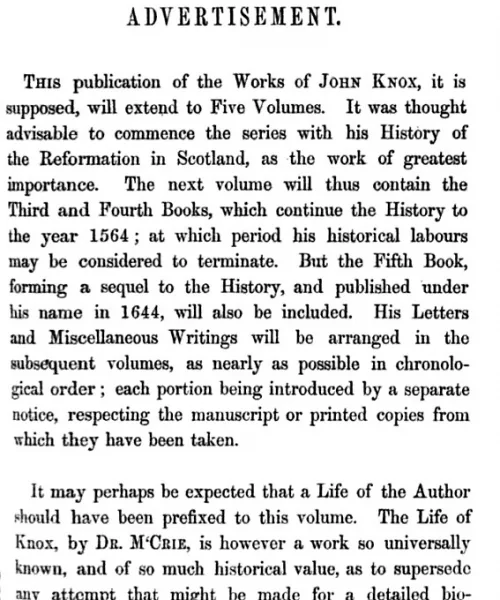
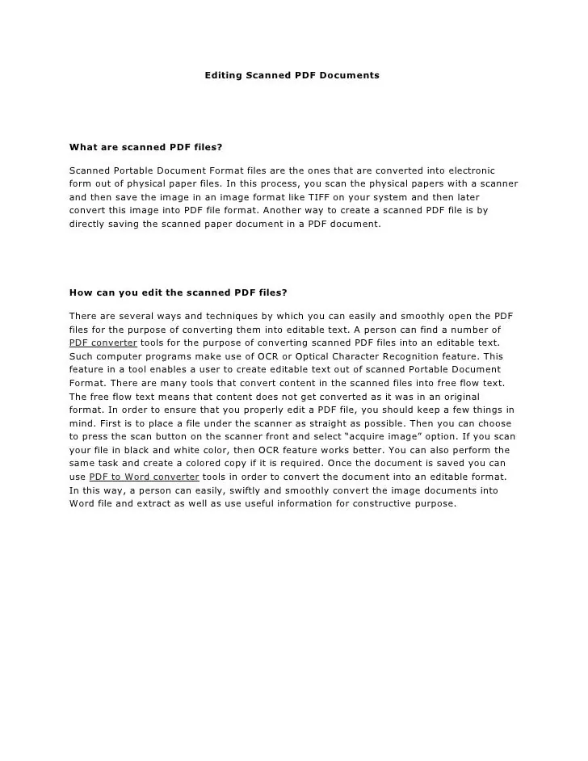

Hello and welcome to this new article, this article aims to explain an end-to-end use case of taking the advantage of a wonderful AI system into application that could be later added to production. The use case we take here is an image to text project with Python. Let's begin first with brief intro about the technologies used in that project and how do they integrate for having such an AI amazing product. Let's get started, shall we?

Github link is [here](https://github.com/omarmohamed2011/Image-to-text-JohnSnowLabs)


### Introduction

Natural Language Processing, or NLP for short, is broadly defined as the automatic manipulation of natural language, like speech and text, by software.

The study of natural language processing has been around for more than 50 years and grew out of the field of linguistics with the rise of computers. Natural language processing has its roots in the 1950s. Already in 1950, [Alan Turing](https://en.wikipedia.org/wiki/Alan_Turing) published an article titled "[Computing Machinery and Intelligence](https://en.wikipedia.org/wiki/Computing_Machinery_and_Intelligence)" which proposed what is now called the [Turing test](https://en.wikipedia.org/wiki/Turing_test) as a criterion of intelligence, though at the time that was not articulated as a problem separate from artificial intelligence. The proposed test includes a task that involves the automated interpretation and generation of natural language.

Natural language processing (NLP) is a subfield of [linguistics](https://en.wikipedia.org/wiki/Linguistics), [computer science](https://en.wikipedia.org/wiki/Computer_science), and [artificial intelligence](https://en.wikipedia.org/wiki/Artificial_intelligence) concerned with the interactions between computers and human language, in particular how to program computers to process and analyze large amounts of [natural language](https://en.wikipedia.org/wiki/Natural_language) data. The goal is a computer capable of "understanding" the contents of documents, including the contextual nuances of the language within them. The technology can then accurately extract information and insights contained in the documents as well as categorize and organize the documents themselves. Challenges in natural language processing frequently involve [speech recognition](https://en.wikipedia.org/wiki/Speech_recognition), [natural-language understanding](https://en.wikipedia.org/wiki/Natural-language_understanding), and [natural-language generation](https://en.wikipedia.org/wiki/Natural_language_generation). [wiki](https://en.wikipedia.org/wiki/Natural_language_processing)

Now introducing Computer vision field; Computer vision is an [interdisciplinary scientific field](https://en.wikipedia.org/wiki/Interdisciplinarity) that deals with how [computers](https://en.wikipedia.org/wiki/Computer) can gain high-level understanding from [digital images](https://en.wikipedia.org/wiki/Digital_image) or [videos](https://en.wikipedia.org/wiki/Video). From the perspective of [engineering](https://en.wikipedia.org/wiki/Engineering), it seeks to understand and automate tasks that the [human visual system](https://en.wikipedia.org/wiki/Human_visual_system) can do. Computer vision tasks include methods for [acquiring](https://en.wikipedia.org/wiki/Image_sensor), [processing](https://en.wikipedia.org/wiki/Image_processing), [analyzing](https://en.wikipedia.org/wiki/Image_analysis) and understanding digital images, and extraction of [high-dimensional](https://en.wikipedia.org/wiki/High-dimensional) data from the real world in order to produce numerical or symbolic information, e.g. in the forms of decisions. Understanding in this context means the transformation of visual images (the input of the retina) into descriptions of the world that make sense to thought processes and can elicit appropriate action. This image understanding can be seen as the disentangling of symbolic information from image data using models constructed with the aid of geometry, physics, statistics, and learning theory. [wiki](https://en.wikipedia.org/wiki/Computer_vision)

Now this task is clearly a combination of both fields, the computer vision part here is to read the text from an image, and the NLP part is to turn what's been written on a paper into a pdf you can interact with its words, letters, and sentences.

### Libraries

```python
import json
import os

from google.colab import files

# Installing pyspark and spark-nlp
! pip install --upgrade -q pyspark==3.0.2 spark-nlp==$PUBLIC_VERSION

# Installing Spark OCR
! pip install spark-ocr==$OCR_VERSION\+spark30 --extra-index-url=https://pypi.johnsnowlabs.com/$SPARK_OCR_SECRET --upgrade
```

Followed by importing necessary libraries for deep digs.

```python
import pandas as pd
import numpy as np
import os

#Pyspark Imports
from pyspark.sql import SparkSession
from pyspark.ml import PipelineModel
from pyspark.sql import functions as F

# Necessary imports from Spark OCR library
import sparkocr
from sparkocr import start
from sparkocr.transformers import *
from sparkocr.enums import *
from sparkocr.utils import display_image, to_pil_image
from sparkocr.metrics import score
import pkg_resourcesvgfd
```

Pandas and Numpy are well known in the area of mathematical calculations.

Pyspark for pipelining and databases functions.

SparkOCR for images to text task performance.

### Pipeline Creation

```python
# Read binary as image
binary_to_image = BinaryToImage()
binary_to_image.setInputCol('content')
binary_to_image.setOutputCol('image')

# Scale image
scaler = ImageScaler()
scaler.setInputCol('image')
scaler.setOutputCol('scaled_image')
scaler.setScaleFactor(2.0)

# Binarize using adaptive tresholding
binarizer = ImageAdaptiveThresholding()
binarizer.setInputCol('scaled_image')
binarizer.setOutputCol('binarized_image')
binarizer.setBlockSize(91)
binarizer.setOffset(70)

# Remove extraneous objects from image
remove_objects = ImageRemoveObjects()
remove_objects.setInputCol('binarized_image')
remove_objects.setOutputCol('cleared_image')
remove_objects.setMinSizeObject(30)
remove_objects.setMaxSizeObject(4000)

# Apply morphology opening
morpholy_operation = ImageMorphologyOperation()
morpholy_operation.setKernelShape(KernelShape.DISK)
morpholy_operation.setKernelSize(1)
morpholy_operation.setOperation('closing')
morpholy_operation.setInputCol('cleared_image')
morpholy_operation.setOutputCol('corrected_image')

# Extract text from corrected image with OCR
ocr = ImageToText()
ocr.setInputCol('binarized_image')
ocr.setOutputCol('text')
ocr.setConfidenceThreshold(50)
ocr.setIgnoreResolution(False)

# Create pipeline
pipeline = PipelineModel(stages=[
    binary_to_image,
    scaler,
    binarizer,
    remove_objects,
    morpholy_operation,
    ocr
])
```

Pipeline begins by reading the image input, scale it with a factor of 2. Binarization and standard scaling as preprocessing steps required for the image to be prepared for inferencing phase. Inference and get the output in the form of texts.

Then the last step is the pipeline application on input.

```python
result = pipeline.transform(image_df).cache()
for r in result.distinct().collect():
  display_image(r.image)
  print (r.text)
```

### Result

And the output will look such like:



```python
out:
>>>
ADVERTISEMENT.

Tuts publication of the Works of Jonn Kwox, it is
supposed, will extend to Five Volumes. It was thought
advisable to commence the series with his History of
the Reformation in Scotland, as the work of greatest
importance. The next volume will thus contain the
Third and Fourth Books, which continue the History to
the year 1564; at which period his historical labours
may be considered to terminate. But the Fifth Book,
forming a sequel to the History, and published under
his name in 1644, will also be included. His Letters
and Miscellancous Writings will be arranged in the
subsequent volumes, as nearly as possible in chronolo-
gical order; each portion being introduced by a separate
avtice, respecting the manuscript or printed copies from
which they have been taken.

It may perhaps be expected that a Life of the Author
thould have been prefixed to this volume. The Life of
Knox, by Dr. M-Crig, is however a work so universally
known, and of so much historical value, as to supersede
any attenint that mieht he made for a detailed Dia-
```

Another example on the image to text modeling:



```python
out:
>>>
Editing Scanned PDF Documents

What are scanned PDF files?

Scanned Portable Document Format fifes are the ones that are converted into electronic
form out of physical paper files. In this process, you scan the physical papers with a scanner
and then save the image in an image format like TIFF on your system and then later
convert this image into PDF file format. Another way to create a scanned PDF file is by
directly saving the scanned paper document in a PDF document.

How can you edit the scanned PDF files?

There are several ways and techniques by which you can easity and smoothly open the PDF
files for the purpose of converting them into editable text. A person can find a number of
PDF converter tools for the purpose of converting scanned PDF files into an editable text.
Such computer programs make use of OCR or Optical Character Recognition feature. This
feature in a tool enables a user to create editable text out of scanned Portable Document
Format. There are many tools that convert content in the scanned files into free flow text.
The free flow text means that content does not get converted as it was in an original
format. In order to ensure that you properly edit a PDF file, you should keep a few things in
mind. First is to place a file under the scanner as straight as possible. Then you can choose
to press the scan button on the scanner front and select “acquire image” option. If you scan
your file in black and white color, then OCR feature works better. You can also perform the
same task and create a colored copy if it is required. Once the document is saved you can
use PDF to Word converter tools in order to convert the document into an editable format.
In this way, a person can easily, swiftly and smoothly convert the image documents into
Word file and extract as well as use useful information for constructive purpose.
```

### Conclusion

Extracting texts of various sizes, shapes and orientations from images containing multiple objects is an important problem in many contexts, especially, in connection to e-commerce, augmented reality assistance system in a natural scene, content moderation in social media platform, etc. The text from the image can be a richer and more accurate source of data than human inputs which can be used in several applications like Attribute Extraction, Offensive Text Classification, Product Matching, Compliance use cases, etc. Extracting text is achieved in 2 stages. Text detection: The detector detects the character locations in an image and then combines all characters close to each other to form a word based on an affinity score which is also predicted by the network which is the case of our computer vision part of the task, since the model is at a character level, it can detect in any orientation. After this, the text is then sent through the Recognizer module. Text Recognition: Detected text regions are sent to the network to obtain the final text which is the NLP task in here.

### Final words

All credits come back to JohnSnowLABS for researches to provide such an amazing work and hopeful that it was explained in a good manner in a way that allows us to explain the full pipeline, hope that you enjoyed this article and until next time
