Food is an essential substance that human beings rely on for survival. As the world population rises, the demand for food is at an all-time high. To satisfy the nutrition demand of the increased population; food, energy, and water have seen a rapid increase. The effects of farming and food production have affected the environment in ways that we cannot ignore. The impacts on the environment depend on the type of food products being produced and the production practices that are involved in making those food products.

This blog focuses on the environmental impacts of food on the following:

1. Emission of greenhouse gases.

2. Eutrophication of water bodies

3. Land use.

4. Freshwater withdrawals

5. Scarcity-weighted water use.

The data for this blog was sourced from [Kaggle](https://www.kaggle.com/datasets/selfvivek/environment-impact-of-food-production/download?datasetVersionNumber=1). This dataset contains 43 most common foods grown across the globe and 23 columns as their respective land, water usage, and carbon footprints.

This blog aims to perform an Exploratory Data Analysis to determine how the world can sustainably access a nutritious diet.

**LOAD and PREPROCESSING DATA**

The raw data downloaded from Kaggle was a CSV file. It was imported as a dataframe and assigned to the variable **food.** An initial snippet of the data shows there are  **23** columns and **43** rows.

```python
food = pd.read_csv('food_production.csv')
food.tail() # shows the last 5 rows.
```

The output for checking missing values showed there were missing values. Columns such as Greenhouse gas emission, Eutrophication, Land use, Freshwater withdrawals, and Scarcity-weighted water use n relation to a kilogram of food produced, 100 grams of protein produced and 1000 kilo calories produced.

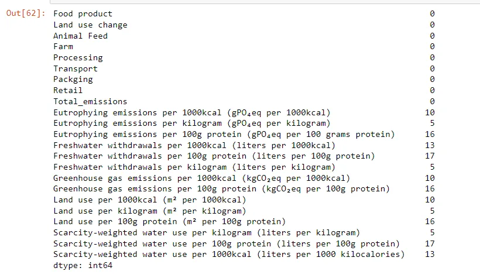

Since we need all 43 rows in order to analyze the data without losing most of the insights in it, dropping the missing rows will not be ideal. Since some missing values in a row also contain values for another column. So I opted to fill the missing values with zero, where I still kept all the relevant values in the data.

Descriptive summary statistics showed that all the numeric columns had their mean greater than the median. In order to fully visualize the information, a histogram chart was created using the code below.

```python
for col in food.columns:
    if food[col].dtypes == 'float':
        sns.histplot(x=col, data = food, bins=6, kde=True)
        plt.title(f'Distribution of {col}')
        plt.show()
```

Two of the outputs of the code above are below. The rest of the output can be accessed on my GitHub repository.

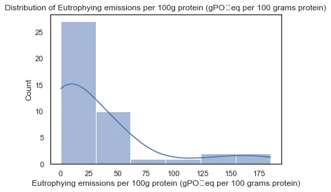

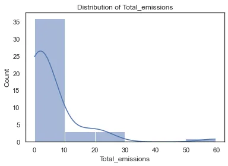

With the preprocessing complete, we can go ahead and explore the various columns in the dataset.

**GREENHOUSE GAS EMISSION**

The greenhouse gas (GHG) in this dataset is categorized into emissions per **kilogram of food products produced** and emissions **per nutritional value (in terms of protein and energy produced)**. Here, we measure GHG emissions based on:

1. Kilogram of Carbon dioxide equivalents per

2. Kilogram of Carbon dioxide equivalents per 1000 kilocalories produced.

3. Kilogram of Carbon dioxide equivalents per 100 grams of protein.

**GREENHOUSE GAS EMISSION PER KILOGRAM OF FOOD ACROSS THE FOOD PRODUCTION CYCLE**

There are 7 stages in the production cycle that is, land use change, farm, processing, transport, packaging, and retail. The greenhouse gases (GHG) are measured in kilograms of CO2-equivalents per kilogram of a food product. The total emission column encompasses GHG from the various steps of the production cycle. In order to plot a graph that will show the various stages of the production cycle, the following code was used. The idea behind the code was to subset the total emissions and color plot each step in the production cycle in relation to the GHG emission.

```python
# subset the food and their major GHG emission in the production cycle
t = food[['Food product', 'Land use change', 'Animal Feed', 'Farm',
       'Processing', 'Transport', 'Packging', 'Retail', 'Total_emissions']].set_index('Food product')\
        .sort_values('Total_emissions')
t = t.drop('Total_emissions', axis=1)
```

```python
#plot the total emission of the food production cycle.
fig,ax = plt.subplots(figsize=(15,15))
t.plot(kind='barh',stacked=True, ax=ax)
plt.ylabel('Total Emissions')
plt.title('Total Emission Of The Food Production Cycle')
plt.show()
```

This produces the chart below. The legend in the chart shows the amount of GHG emission at each stage of the production cycle. Beef (both heard and dairy), lamb and cheese are the 4 top emitters of more than 20 kg C02 equivalents per kilogram of food product. Animal-based foods mostly tend to have higher carbon footprints compared to plant-based foods. Herd beef emits 60 kg CO2 equivalents of greenhouse gases compared to 1 kg of maize per kilogram of respective products. This shows a massive difference between the greenhouse gases of the different foods in the plot. It's worth noting that, the least GHG emissions food products are plant-based foods that are, root vegetables, potatoes, apples, onions & leeks, and nuts.

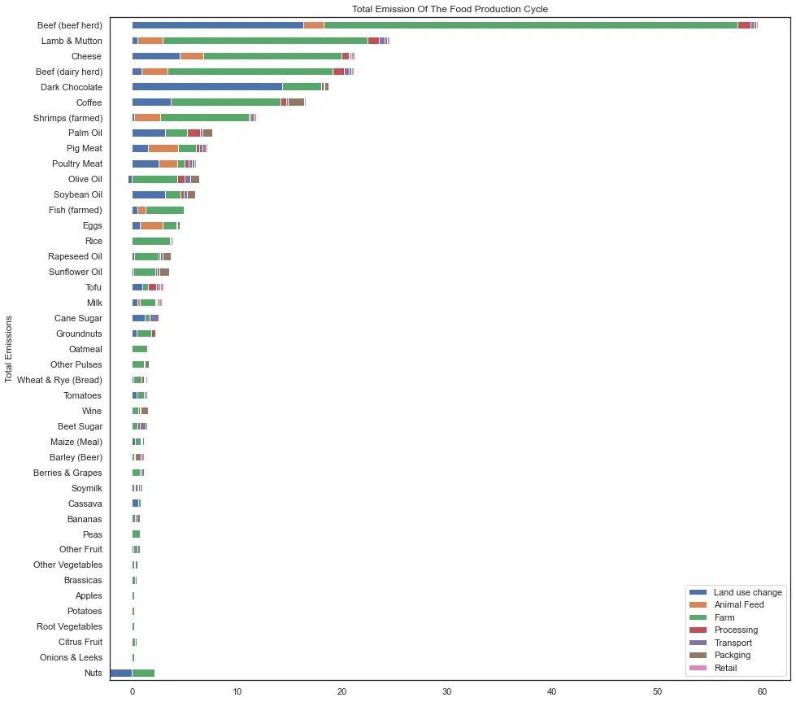

To further investigate which stage in the production cycle produces the most GHG emissions, a pie chart was created using the code below.

```python
plt.figure(figsize=(12,12))
percent= food.iloc[:, 1:8].sum()
plt.pie(percent, autopct = "%0.0f%%", explode = [0.1,0.01,0.1,0,0,0,0], shadow=True)
plt.legend(labels =percent.index,loc='upper right')
plt.title("Percentage of Greenhouse Gas Emissions During The Production Cycle")
plt.show()
```

This produced the pie chart below. For every kilogram of food produced, farm contributes to 58% of total greenhouse emission, followed by land use at 21%, Animal farm at 8%, packaging at 5% processing at 4%, Transport at 3%, and retail at 1%.

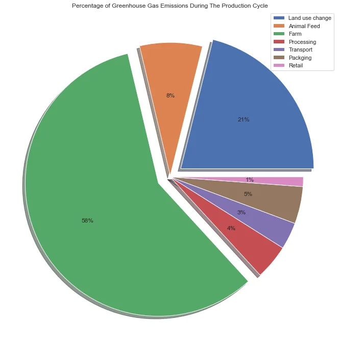

We will take a closer look at the emissions from the 7 stages in the production cycle. The Process is categorized into 7 stages. Land Use Change, Animal Feed, Farm, Processing, Transport, Packaging, and Retail. The visualization of detailed impacts of the various stages of food products on the climate.

For this to be done, we created a function that plots the emissions of food products at each stage.

```python
def food_emission(column,color):
    """This function requires a column name of stage of production emission and color for the bar graph, filter outs
    food products with zero emissions, calculates the total percentage of different stages in the lifecycle of food production
    in relation to total emission and plots the emission per food product.
    Args:
        column name as a string, color name as a string
    Returns:
        A bar graph of food product per emission and first five rows of emission, a new dataframe with product name,

    """
    emission= food[~(food[column] == 0)][['Food product',column]].sort_values(column,ascending=False)
    emission = emission[['Food product',column]]

    plt.figure(figsize=(12,12))
    sns.barplot(y='Food product',x=column,data=emission,color=color)
    plt.title(f'GreenHouse Gas Emission of {column} Per Food Product of Production Cycle')

    plt.show()

    return emission
```

**Land Use Change Greenhouse Gas Emission of Food Products**

Land use change is a process by which human activities transform the natural landscape. It refers to how the land has been used, usually emphasizing the functional role of land for economic activities like clearing forests for farmlands (deforestation).

From the chart below, Beef herd and dark chocolate are the top emitters of over 14 kg GHG per kilogram while production of nuts, wine, citrus fruits, and olive oil rank below 0 kg emission CO2 equivalents.

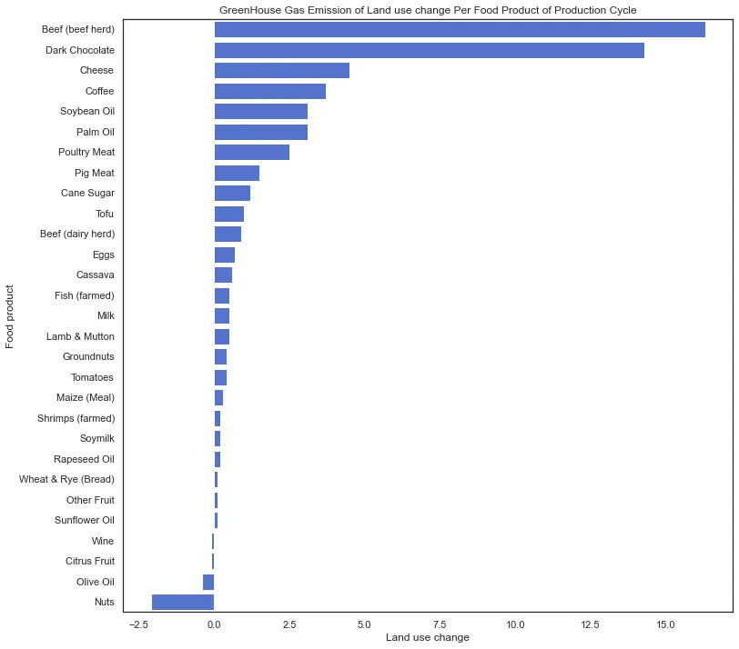

**Animal Feed Greenhouse Gas Emission of Food Products**

Animal feed refers to on-farm crop production and its processing into feed for livestock. It can be noticed that the emissions are from animal-based products with 3 kg or less CO2 equivalents per kilogram produced.

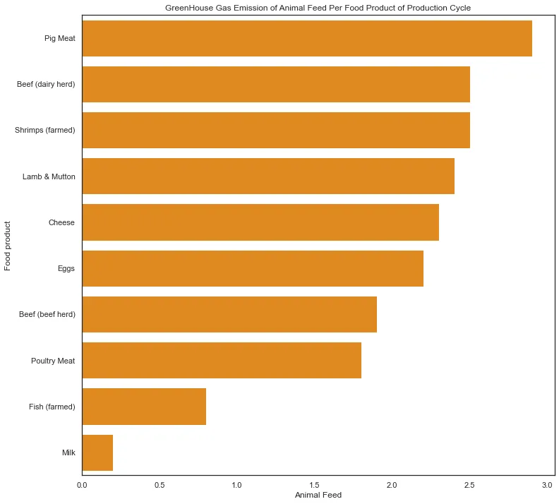

**Farm Greenhouse Gas Emission of Food Products**

Farm emissions include all farm activities that contribute to greenhouse gases. Processes such as an increase in fertilizer, both organic and synthetic, use for crops dramatically increase emissions. The production of methane in the stomachs of ruminants is also a major contributor to the GHG emissions of the farm. From the graph, beef herd, lamb & mutton and dairy beef recorded 15 kg of CO2 equivalents of GHG per kilogram produced. Most of the food products have less than 5 kg of CO2 equivalents of GHG emissions.

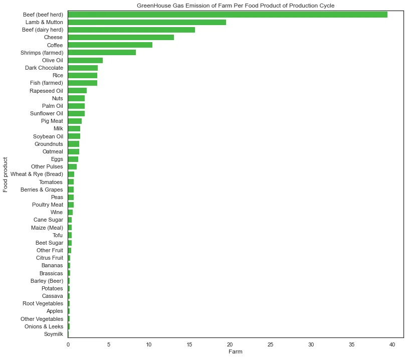

##### Processing Greenhouse Gas Emission of Food Products
Emission from energy used in the process of converting raw agricultural products into finished goods. From the graph Herd beef and Palm oil are the top emitters of GHG of 1.3kg of CO2 equivalents.

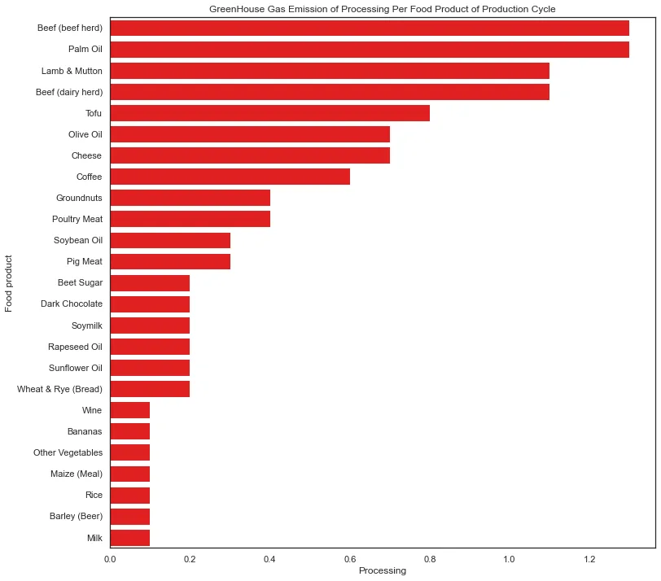

**Transport Greenhouse Gas Emission of Food Products**

Emissions from energy use in the transportation of processed farm products around the world. This includes fuel burnt by delivery trucks carrying finished agricultural products. From the graph, Cane Sugar, Beet Sugar, and Olive Oil are the top 3 emitters. Transport emissions are very small. It ranges between 1.3 to 0.1

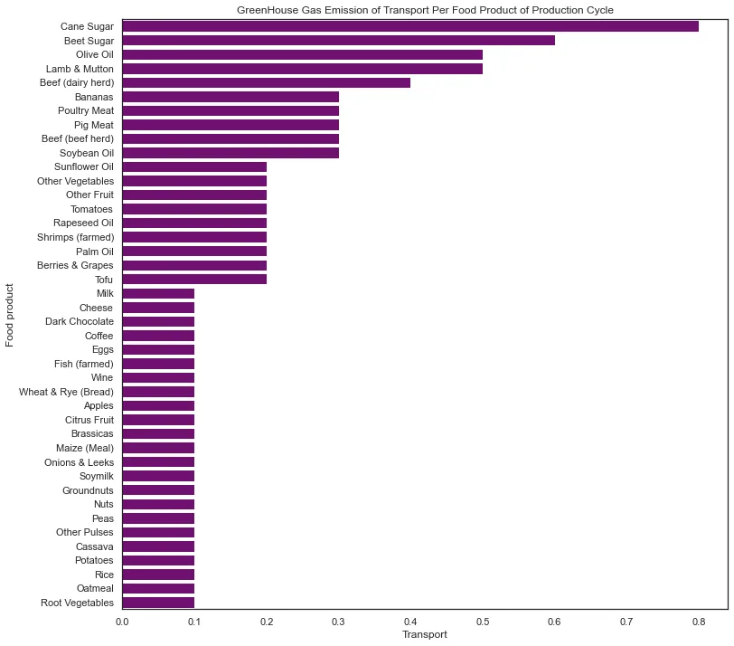

##### Packaging **Greenhouse Gas Emission of Food Products**

Emissions from the production of packaging materials used for packaging agricultural products. Coffee has the highest emissions. Most of the emissions are from the packaging of plant-based production. (The top 10 emitters are all plant-based products)

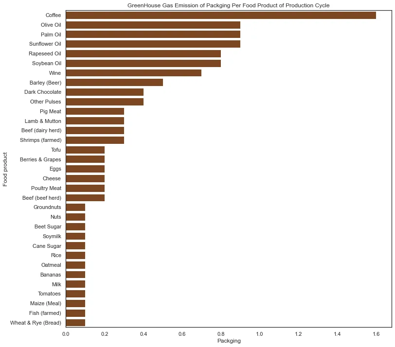

**Retail Greenhouse Gas Emission of Food Products**

Emission from energy used in storing finished agricultural products in retail shops. Activities like refrigeration on a large scale of finished products lead to the release of GHG. Emission from ranges from 0.1 to 0.3.

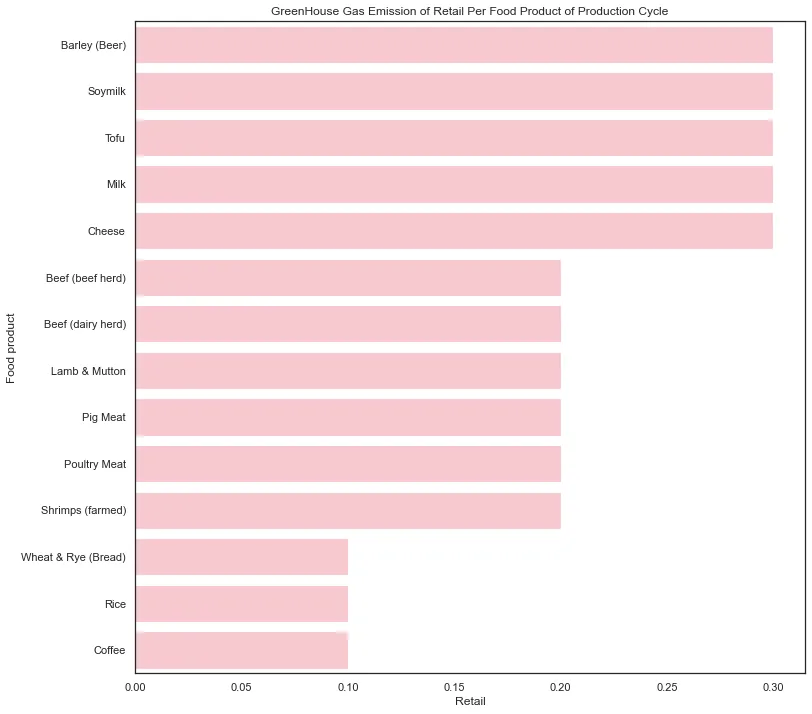

**GREENHOUSE GAS EMISSION PER NUTRITIONAL VALUE.**

GHG emissions comparison of food products per their nutritional values produced. This nutritional value is measured in protein and energy produced. Below, we take a broader look at the emissions of food products high in nutritional values.

A function was created in order to repeatedly produce bar graphs for all the nutritional values. In order to label our bar char the data in the graph, a code from [**statology**](https://www.statology.org/seaborn-barplot-show-values/)was sourced.

```python
def gas_emission(column):
    """This function requires a column name of greenhouse gases footprint bar graph, filter outs
    food products with zero emissions, calculates the total percentage of different stages in the lifecycle of food production
    in relation to total emission and plots the emission per food product.
    Args:
        column name as a string
    Returns:
        A bar graph of food product per emission and first five rows of emission a new dataframe with product name,

    """
    emission= food[~(food[column] == 0)][['Food product',column]].sort_values(column,ascending=False)
    emission = emission[['Food product',column]]

    plt.figure(figsize=(20,20))
    p=sns.barplot(y='Food product',x=column,data=emission)
    plt.title(f'{column}')
    show_values(p,'h',space=0.2) #sourced function
    plt.show()
    return emission
```

**Greenhouse Gas Emissions per 1000 Kilocalories Produced.**

From the graph below, Coffee produces the most kgCO₂eq per 1000kcal of 51, followed by beef(beef herd) at 36 and lamb & mutton at 13. Foods that recorded less than 1 kgCO₂eq per 1000kcal are all plant-based food products which include oatmeal, nuts, palm oil, etc.

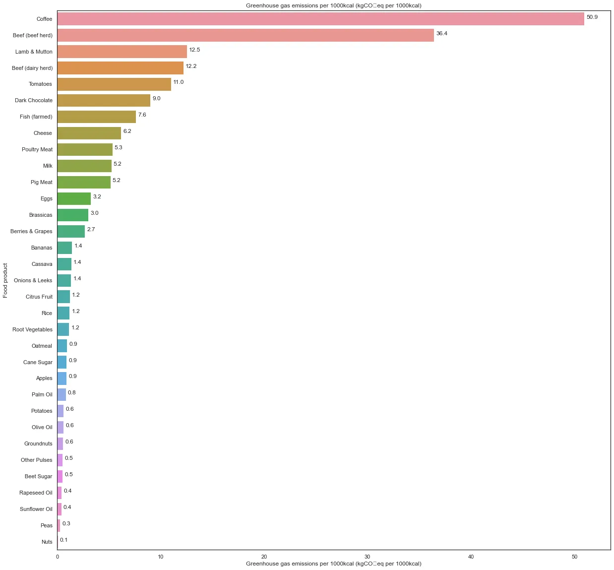

**Greenhouse Gas Emissions per 100g Protein Produced**

Dark chocolate, beef(beef herd), and coffee recorded more than 35 kgCO₂eq per 100g protein. Nuts, peas, other pulses, groundnuts, and oatmeal recorded less than 2 kgCO₂eq per 100g protein.

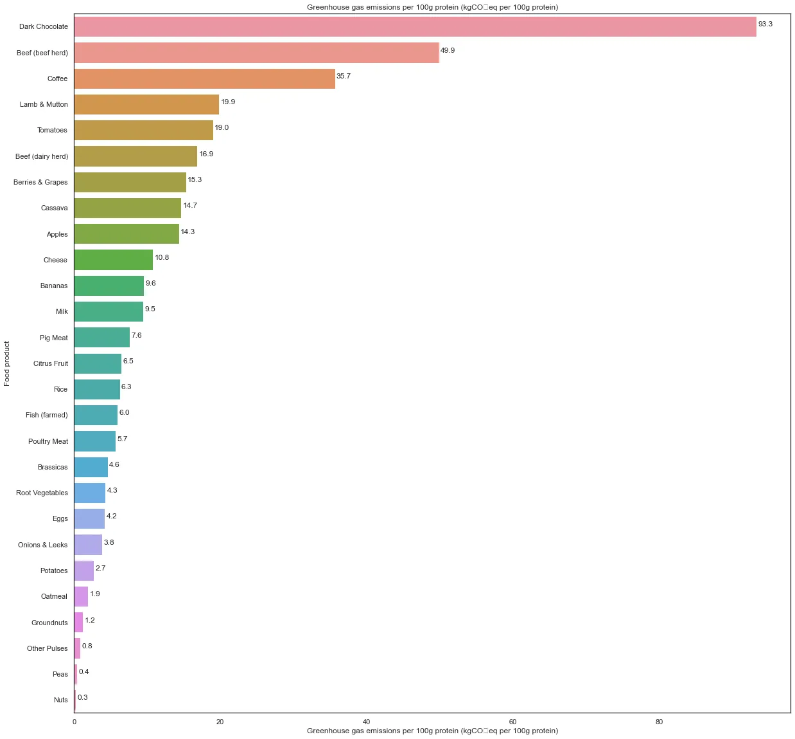

**LAND USE**

Land Use refers to the food products that used the most or least land in their production. How does the land use of food products compare? As always, the comparison is based on the mass: land use per kilogram of food product and the nutritional units: the land used in supplying protein and energy. Here we measure land use based on

1. Land use measured in meters squared (m2) per kilogram of food products

2. Land use measured in meters squared (m2) per 100 grams of protein

3. Land use measured in meters squared (m2) per 1000 kilocalories

**Land Use Measured In Meters squared Per Kilogram of Food Products**

This shows the land used per kilogram of the food product. The two food products used more than 326 meters square of land to produce one kilogram of food. They are Lamb & Mutton and Beef(herd beef). They are animal-based foods. All the foods that used less than 1 meter square per kilogram of food produced are plant-based. These include soymilk, apples, root vegetables, etc.


**Land Use Measured In Meters squared Per 100g of Protein**

The Land used to produce 100 grams of protein per food product. From the graph, Lamb & Mutton uses 184.8-meter squares, followed by beef (beef herd) with 163.6 m² and dark chocolate with 137.9m². The following food products used less than 5m² lands, rice, fish(farmed), groundnuts, peas, root vegetables, and onions & leeks.

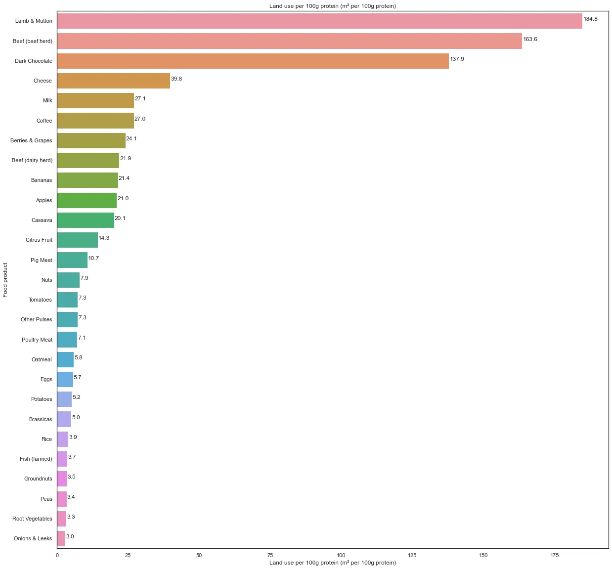

**Land Use Measured In Meters squared Per 1000 Kilo Calories**

This shows land used in the production of foods produced per 1000 kilocalories. From the graph, beef(herd beef) and lamb & mutton use more than 116 meters squared of land per 1000 kilocalories in their production. These are the top two most animal-based food products. The least 5 lands used fall below 1 meter squared that is, root vegetables, rice, cane sugar, beet sugar, and palm oil. These are plant-based foods.

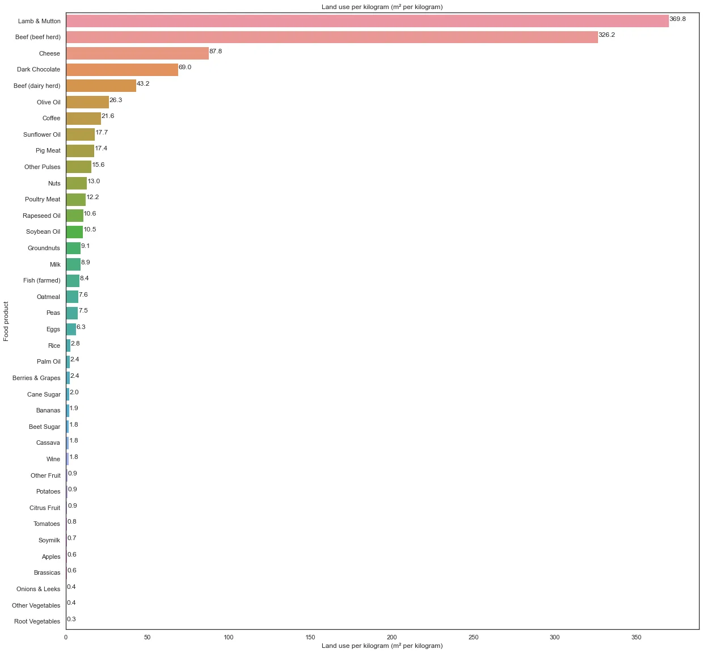

**How Does Land Use Contribute to Greenhouse Gas Emissions?**

To determine how land use relates to GHG emissions, a correlation matrix was created to determine the correlation between the two columns. The code below was instantiated to subset the food dataframe to include only the impacts on the environments per kilogram of food products. Then food products were categorized into animal-based and plant-based.

```python
# Create a new dataframe of all environmental impacts per kilogram of food produced.
per_kilo = food[['Total_emissions','Eutrophying emissions per kilogram (gPO₄eq per kilogram)',
                 'Freshwater withdrawals per kilogram (liters per kilogram)','Land use per kilogram (m² per kilogram)',
                 'Scarcity-weighted water use per kilogram (liters per kilogram)']]
per_kilo.rename(columns={'Total_emissions': 'Greenhouse_Emissions','Eutrophying emissions per kilogram (gPO₄eq per kilogram)':
                        'Eutrophying_Emissions','Freshwater withdrawals per kilogram (liters per kilogram)':
                         'Freshwater_withdrawals','Land use per kilogram (m² per kilogram)': 'Land_use',
                         'Scarcity-weighted water use per kilogram (liters per kilogram)':'Scarcity_weghted_water_use'},
                    inplace =True)
```

For the correlation matrix;

```python
sns.heatmap(per_kilo.corr(),annot=True)
plt.title('Correlation of Adverse Impacts On The Environment per Kilogram of Fod Produced')
plt.show()
```

The output:

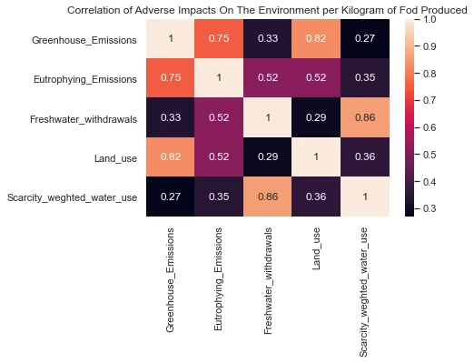

```python
#create a new function that categorizes food based on whether its plant or animal based.
def food_cat(dataframe):
    """this function takes the food dataframe and categorizes the food products whether it is plant or animal based.
    Args:
        a food dataframe
    Returns:
        categorizes food product column based on whether its plant or animal based.
    """

    a = dataframe[['Food product']]
    a.loc[:33] = 'plant based' # first 33 rows in the data frame are plant based
    a.loc[33:] = 'animal based'# the remaining 10 are animal based
    return a
```

```python
# new category based on food products
per_kilo['food category'] = food_cat(food)
per_kilo.tail()
```

Output:

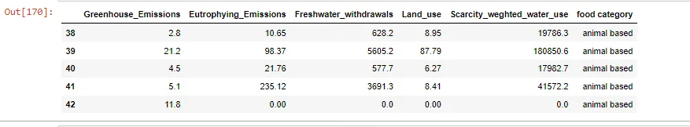

Correlation between the Greenhouse emission and land use is 0.82. This is the second strongest correlation among the other emission. This means a unit increase in land use is associated with a 0.82 increase in greenhouse emissions. Plant and animal-based food products are represented as blue and orange respectively from the graph.

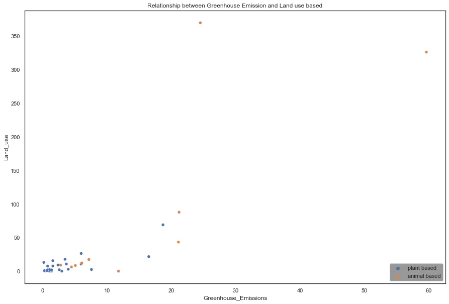

**CONCLUSION**

The trend throughout the exploration of this is that plant-based food products relatively contribute less GHG emissions to the environment compared to animal-based products. A case can be made that consuming plant-based food will greatly improve the health of the environment because they offer similar nutritional value ( protein and calories) compare to animal-based food products.

However, anecdotally human tastes and preferences greatly influence what type of food that is produced and consumed. Even though plant-based products may be better for the environment, I do not see a way of slowing down the production of animal-based products anytime. The world population just hit 9 billion. I cannot prove whether the production of only plant-based products can satisfy the 9 billion hungry population nor do I think it can be sustained. A balanced mixture of the production of the two product types is what is ideal to save the environment and also satisfy the hunger needs of the population.

**LIMITATION**

The other columns were not explored in this blog. The analysis of those columns can be accessed on my [GitHub repository](https://github.com/Storerun/eda_food_production/blob/main/food_productionEDA.ipynb).

Further studies on the world population and the demand for food will be highly desirable.

**REFERENCES**

<https://www.canr.msu.edu/news/greenhouse_gases_their_impact_on_climate_change>

<https://www.statology.org/seaborn-barplot-show-values/>

[Environmental Impacts of Food Production - Our World in Data](https://ourworldindata.org/environmental-impacts-of-food#you-want-to-reduce-the-carbon-footprint-of-your-food-focus-on-what-you-eat-not-whether-your-food-is-local)

As always this is a Datainsight capstone project on exploratory data analysis. Learn more about [Datainsight](https://www.datainsightonline.com/).

Follow me on[**LinkedIn Benjamin Owusu**](https://www.linkedin.com/in/benjaminowusu/)

Add me on [GitHub](https://github.com/Storerun)

Photo by [Annie Spratt](https://unsplash.com/@anniespratt?utm_source=unsplash&utm_medium=referral&utm_content=creditCopyText) on [Unsplash](https://unsplash.com/s/photos/farm?utm_source=unsplash&utm_medium=referral&utm_content=creditCopyText)
