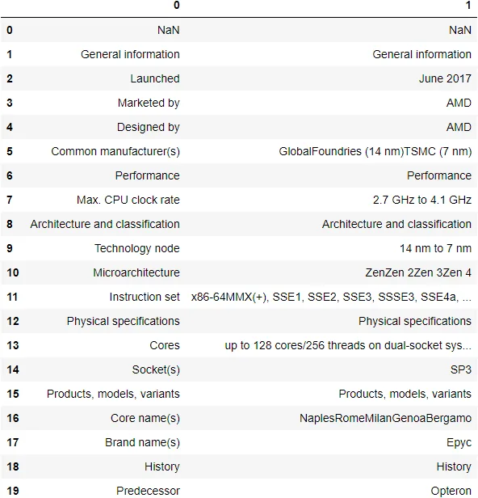

Before You work with Your data you should import it

There are many ways to import data in python such as csv files ,Excel files ,web,api....etc

it depends on the size of the data you want to use so excel files don't be a good way if you use big data

## 1: Reading Data From csv files
Comma Separated Value or csv is the most way you will import your data in in data science and as its name suggests it separated by comma Pandas introduce function which you can use it to read data from csv files read_csv() function tacks many parameter as

#### parameter:file name which could be downloaded in your pc or url

#### sep : default ,
#### delimiter str: default None

```python
import pandas as pd
df = pd.read_csv('titanic.csv')
df
```

You also can extract tables from html data and if exist many tables you can use index

```python
data = pd.read_html('https://en.wikipedia.org/wiki/Epyc')
data[0]
```



Their exist a lot of ways and technique Which You can use such as:

read_sas(): Reads files from the SAS statistics software package.read_spss(): Reads files from the SPSS statistics software package.read_pickle(): Reads files from the Python Pickle format.read_sql(): Reads files in a variety of SQL dialects via SQLAlchemy.
