**1. Crosstabs**

Cross tabulation is a technique that allows you to summarize the data in categorical variables and examine it to determine if there are any associations present. When implemented in Pandas python library, it by default computes a frequency table of the factors unless an array of values and an aggregation function are passed.

The syntax:

```python
pandas.crosstab(parameters)
```

Out of the many parameters the function supports, the following are used to demonstrate how to use it.

**columns :** array-like, Series, or list of arrays/Series

Values to group by in the columns.

**values :** array-like, optional

Array of values to aggregate according to the factors. Requires aggfunc be specified.

**aggfunc :** function, optional

If specified, requires values be specified as well.

**margins :** bool, default False

Add row/column margins (subtotals).

**margins_name :** str, default ‘All’

Name of the row/column that will contain the totals when margins is True.

**Returns :** DataFrame

Cross tabulation of the data.

Let's first see the basic usage of panda's crosstab function. We begin by importing the dataset and wrangle it a bit to modify the headers and filter only records that come from the subset of car models we select. The following snippet does all that.

```python
import pandas as pd

# Define the headers since the data does not have any
headers = ["symboling", "normalized_losses", "make", "fuel_type", "aspiration",
           "num_doors", "body_style", "drive_wheels", "engine_location",
           "wheel_base", "length", "width", "height", "curb_weight",
           "engine_type", "num_cylinders", "engine_size", "fuel_system",
           "bore", "stroke", "compression_ratio", "horsepower", "peak_rpm",
           "city_mpg", "highway_mpg", "price"]

# Read in the CSV file and convert "?" to NaN
df_raw = pd.read_csv("datasets/imports-85.data", header=None, names=headers, na_values="?" )

# Define a list of models that we want to review
models = ["toyota","nissan","mazda", "honda", "mitsubishi", "subaru", "volkswagen", "volvo"]

# Create a copy of the data with only the top 8 manufacturers
df = df_raw[df_raw.make.isin(models)].copy()
```

Once we have the data imported, wrangled and filtered, its lets see how we can achieve a simple crosstab.

```python
pd.crosstab(df.make, df.fuel_type)
```

The output of the above snippet is this:

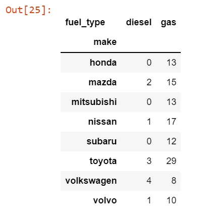

The interpretation of the above code is the values reflect the count of all records with each car make having diesel/gas fuel type.

Let's enhance the result a bit to include an additional calculated field named 'Total' that aggregates the values per row and append it to the crosstab table. That's achievable by specifying the margins and margins_name params.

```python
pd.crosstab(df.make, df.fuel_type, margins=True, margins_name="Total")
```

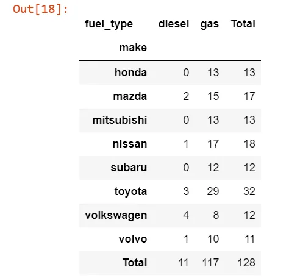

We can chance the aggregation function and the values aggregated if we wish using the values and aggfunc params.

```python
pd.crosstab(df.make, df.body_style, values=df.curb_weight, aggfunc='mean').round(0)
```

To make the analysis even more interesting, we can group the columns as needed so that the result reflects aggregates based on the grouping we specify.

```python
pd.crosstab(df.make, [df.body_style, df.drive_wheels])
```

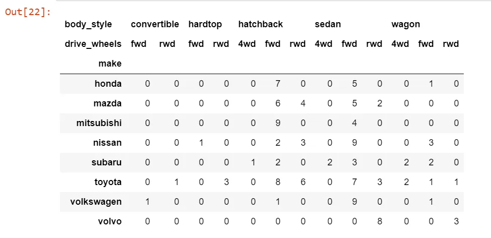

**2. Imputing missing values**

Real world datasets are not perfect obviously and that means there are missing values here and there. Dealing with missing values is one of the foremost data preparation tasks required before we consider the dataset for analysis.

There are many different approaches that can be taken to fill in missing values with pandas and lets see them one by one.

Lets consider the following dataset which has missing values.

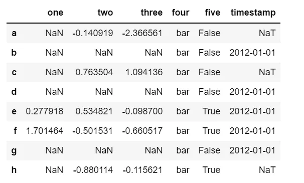

2.1) Filling with custom value with DataFrame.fillna() method

```python
df.fillna(0)
```

Output:

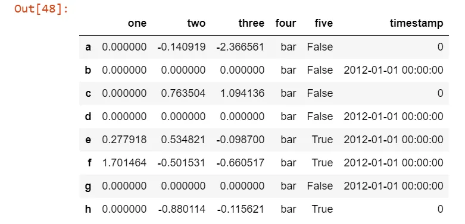

2.2) Fill gaps forward or backward

The following code illustrates filling missing values from the leading rows.

```python
df.fillna(method="bfill")
```

Output:

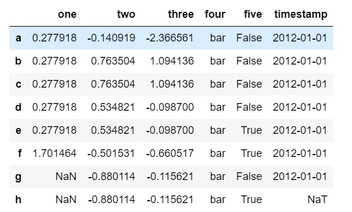

2.3) Filling with computed values

It is also possible to compute the missing values from the known observations as follow.

```python
df.fillna(df.mean()["two":"three"])
```

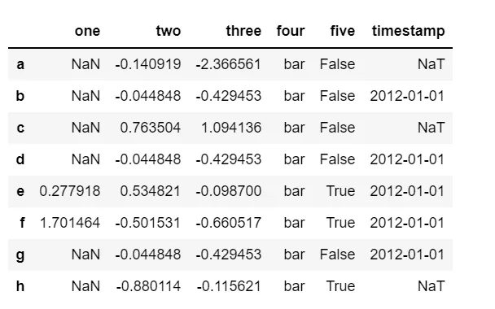

2.4) Drop dataset labels that have missing values

```python
df.dropna(axis=1)
```

Output:

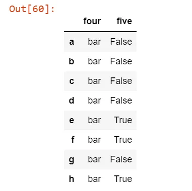

2.5) Interpolation

Both Series and DataFrame objects have [interpolate()](https://pandas.pydata.org/pandas-docs/stable/reference/api/pandas.DataFrame.interpolate.html#pandas.DataFrame.interpolate) that, by default, performs linear interpolation at missing data points.

```python
df[["one", "two"]].interpolate()
```

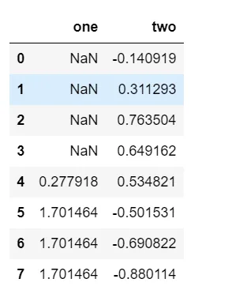

**3. 10 very useful summary (aggregation) functions**

1. **mean()**: Compute mean of groups
2. **sum()**: Compute sum of group values
3. **size()**: Compute group sizes
4. **count()**: Compute count of group
5. **describe()**: Generates descriptive statistics
6. **first()**: Compute first of group values
7. **last()**: Compute last of group values
8. **nth()** : Take nth value, or a subset if n is a list
9. **min()**: Compute min of group values
10. **max()**: Compute max of group values

**4. Groupwise analysis**

It is a common practice to perform different data analytics operations on a group of data instead of at individual row level. Pandas offer the groupby() and many other methods to accomplish such tasks.

The following example illustrates how we can count how many of each car make is in the dataset used above.

```python
df.groupby('make').make.count()
```

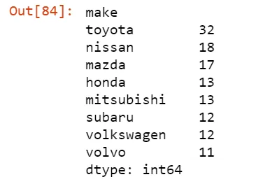

The same result could also simply be achieved with one method value_counts().

```python
df.value_counts('make')
```

Furthermore, we can use aggregate functions like min(),max(), sum() etc on the grouped data as follow.

```python
df.groupby('make').width.min()
```

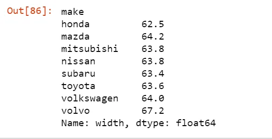

**5. Selecting a subset of data from a dataset**

Index based selection with iloc[]

To select the first five rows of the dataset, we can use the following function.

```python
df.iloc[1:6]
```

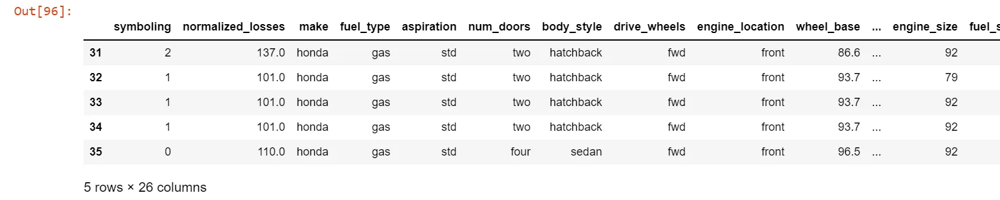

To target the first two columns in the result, another range can be specified like this.

```python
df.iloc[1:6, 1:3]
```

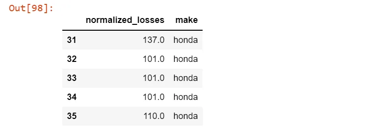

Label based selection with loc.

We can on the other hand use the loc[] selector along with a condition to apply as a criteria for selecting the subset we need.

```python
df.iloc[df.price > 10000]
```

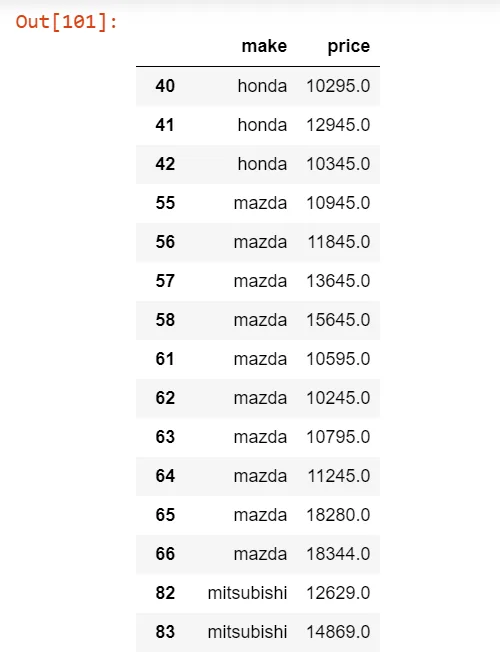
