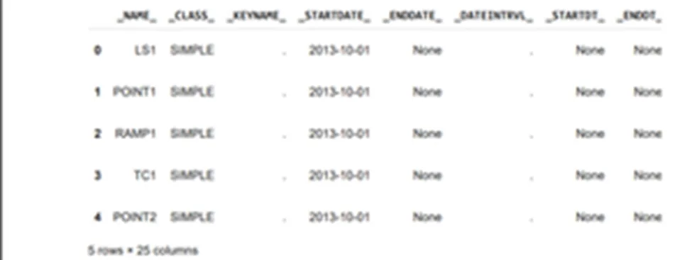
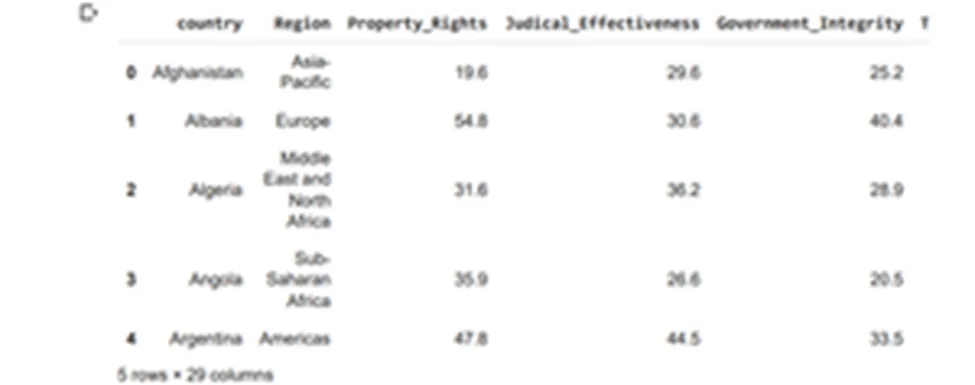
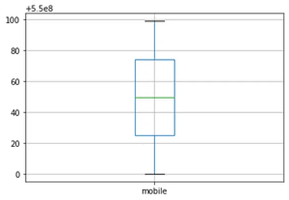

## Importing Data In Python
We need datasets for data analysis. Python has various modules which help us in importing the external data in various file formats to a python program. There are various file types for data which are text files, SAS files, Stata File, Excel Spreadsheets, relational databases, pickled files, Matlab files, HDF5 files, and others. We will be going through how to import some of these various data file types for analysis.

##### Importing Text Files In Python
A text file is a kind of computer file that is structured as a sequence of lines of electronic text. A text file exists stored as data within a computer file system. Below is a code to show how it works using google collaboratory:

```python
#Uploading file from local computer to google collab
from google.colab import files
uploaded = files.upload()

#Opening file to read first 3 lines
with open('Pitch.txt', 'r') as file:
  print(file.readline())
  print(file.readline())
  print(file.readline())
```

***Output:***

```python
In your pitch;
1.We want you to clearly define your problem
2.We want you to clearly define your solution
```

##### Importing SAS Files In Python
A file with the SAS file extension is a **Statistical Analysis Software (SAS) file**. The SAS file is an ASCII (text) file that contains a series of SAS functions that may be run against a data set, or a SAS file may contain the actual data set.

```python
#Uploading file from local to google collab
from google.colab import files
sas_file = files.upload()

#Downloading the sas7bdat library
!pip install sas7bdat

from sas7bdat import SAS7BDAT
with SAS7BDAT('eventrepository.sas7bdat') as file:
  df_sas = file.to_data_frame()

df_sas.head()
```

***Output:***



##### Importing Excel Spreadsheets In Python
A spreadsheet is a file that exists of cells in rows and columns and can help arrange, calculate and sort data. Data in a spreadsheet can be numeric values, as well as text, formulas, references, and functions.

```python
#Uploading file from local computer to google collab
from google.colab import files
xlsx = files.upload()

#importing pandas
import pandas as pd

#reading the excel worksheet
excel_file = pd.read_excel('indicadores3.xlsx')
excel_file.head()
```

***Output:***



##### Importing CSV Files In Python
A comma-separated values file is a delimited text file that uses a comma to separate values. Each line of the file is a data record. Each record consists of one or more fields, separated by commas. The use of the comma as a field separator is the source of the name for this file format.

```python
#Uploading file from local computer to google collab
from google.colab import files
csv_file = files.upload()

#Importing the pandas library
import pandas as pd

#Reading the csv file user.csv
csv_data = pd.read_csv('user.csv')
csv_data.head()
```

***Output:***


## Cleaning Data In Python
Data cleaning or cleansing is the process of detecting and correcting (or removing) corrupt or inaccurate records from a recordset, table, or database and refers to identifying incomplete, incorrect, inaccurate, or irrelevant parts of the data and then replacing, modifying, or deleting the dirty or coarse data. The issues with data usually include missing data and irregular data (outliers).

##### Missing Data
Dealing with missing data/values is one of the most tricky but common parts of data cleaning. While many models can live with other problems with the data, most models don’t accept missing data.

One technique for checking for missing data is using the ***isnull*** function.

```python
#Uploading file from local computer to google collab
from google.colab import files
csv_file = files.upload()

#Importing the pandas library
import pandas as pd

#Reading the csv file user.csv
csv_data = pd.read_csv('user.csv')
csv_data.head()

#Checking for null values or missing values using the isnull function
csv_data.isnull().sum()
```

***Output:***

```python
u_id            0
name            0
mobile          0
wallet_id       0
when_created    0
dtype: int64
```

One other technique for checking for missing data is using the ***heatmap***

```python
import seaborn as sns
cols = csv_data.columns[:6] # first 30 columns
colours = ['#000099', '#ffff00'] # specify the colours - yellow is missing. blue is not missing.
sns.heatmap(csv_data[cols].isnull(),cmap=sns.color_palette(colours))
```

***Output:***


Our data is free from missing values. All observations are captured with values.

Regardless, the problem of missing data can be solved by dropping the observations, dropping the features, or imputing missing values.

Dropping the observations is as follows:

```python
#Dropping missing values from the dataset
csv_data_no_missing_row_values = csv_data.dropna()
#Displaying info after dropping missing values.
csv_data_no_missing_row_values.info()
```

***Output:***

```python
<class 'pandas.core.frame.DataFrame'>
Int64Index: 100 entries, 0 to 99
Data columns (total 5 columns):
#   Column        Non-Null Count  Dtype
---  ------        --------------  -----
0   u_id          100 non-null    int64
1   name          100 non-null    object
2   mobile        100 non-null    int64
3   wallet_id     100 non-null    int64
4   when_created  100 non-null    object
dtypes: int64(3), object(2)
memory usage: 4.7+ KB
```

Dropping the features is as follows:

```python
# Assuming mobile column has a lot of missing.
# If we want to drop.
cols_to_drop = ['mobile']
csv_data_without_mobile_column = csv_data.drop(cols_to_drop, axis=1)
csv_data_without_mobile_column.head()
```

***Output:***


Imputing missing values:

```python
#Calculating the median value
med = csv_data['mobile'].median()

#Printing the median value to console
print(med)

#Filling all missing values with the median value.
csv_data['mobile'] = csv_data['mobile'].fillna(med)
```

***Output:***

```python
550000049.5
```

##### Irregular data (Outliers)
Outliers are data that is *distinctively* different from other observations. They could be real outliers or mistakes. Techniques for finding outliers are: histogram/boxplot or descriptive statistics.

The ***histogram*** technique is used when the feature is numeric. The technique is as follows:

```python
#Uploading file from local computer to google collab
from google.colab import files
csv_file = files.upload()

#Importing the pandas library
import pandas as pd

#Reading the csv file user.csv
csv_data = pd.read_csv('user.csv')
csv_data.head()

# histogram of mobile.
csv_data['mobile'].hist(bins=100)
```

***Output:***


The ***boxplot*** technique is used when the feature is numeric. The technique is as follows:

```python
#Uploading file from local computer to google collab
from google.colab import files
csv_file = files.upload()

#Importing the pandas library
import pandas as pd

#Reading the csv file user.csv
csv_data = pd.read_csv('user.csv')
csv_data.head()

# box plot.
csv_data.boxplot(column=['mobile'])
```

***Output:***



The ***descriptive statistic*** technique is also used for numeric features. The technique is as follows:

```python
#Uploading file from local computer to google collab
from google.colab import files
csv_file = files.upload()

#Importing the pandas library
import pandas as pd

#Reading the csv file user.csv
csv_data = pd.read_csv('user.csv')
csv_data.head()

# box plot.
csv_data.boxplot(column=['mobile'])
```

***Output:***

```python
count    1.000000e+02
mean     5.500000e+08
std      2.901149e+01
min      5.500000e+08
25%      5.500000e+08
50%      5.500000e+08
75%      5.500001e+08
max      5.500001e+08
Name: mobile, dtype: float64
```

The above methods show that the data being analyzed is free from irregular data/outliers.

Regardless, while outliers are not hard to detect, we have to determine the right solutions to handle them. It highly depends on the dataset and the goal of the project. The methods of handling outliers are somewhat similar to missing data. We either drop or adjust or keep them.

***LINK TO GITHUB REPO:*** <https://github.com/Jegge2003/importing_and_cleaning_data>
