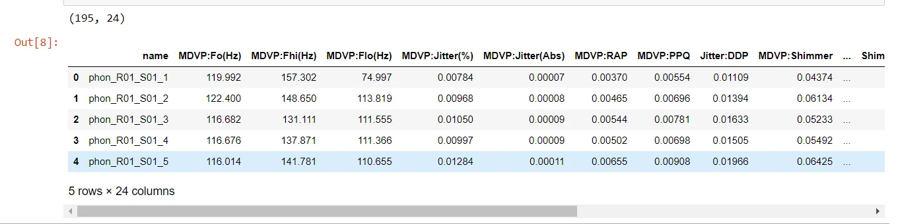
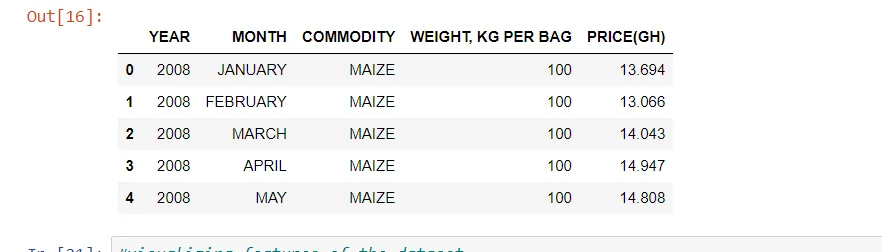
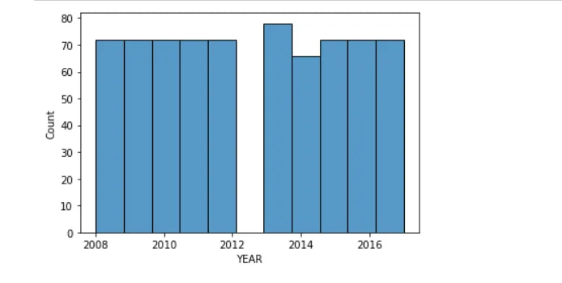
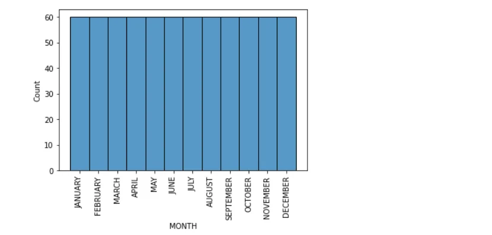
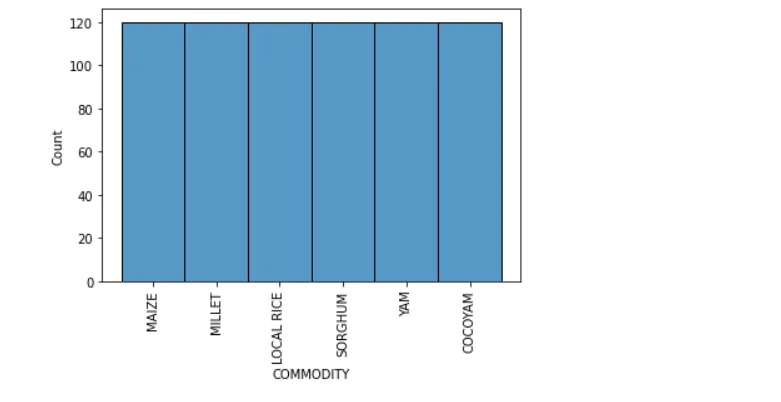
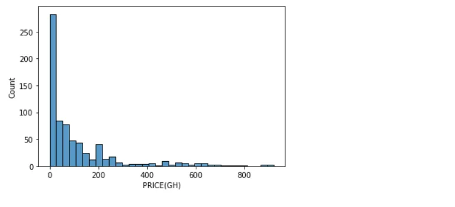

**IMPORTING DATA IN PYTHON**

Data Scientists are expected to build high-performance machine learning models, but the starting point is getting the data into the python environment. Only after importing can the data scientist clean, wrangle, visualize and build predictive models on it.

In this blog post, you'll learn simple techniques on how to import data in python, and you'll understand further how to clean the data to make it useful for machine learning models and other analysis.

we'll start with flat files including .csv and .txt which are simple formats for data storage

**CSV Files**

One of the most data storage type is the *csv* format, which is an acronym for *comma-separated values.*

```python
import pandas as pd
file_path = 'parkinson_data.csv'
data = pd.read_csv(file_path)
print(data.shape)
data.head(5)
```

The first line of code above imports the pandas package with the alias 'pd', the file is then stored in the variable file_path, the fourth line outputs the shape of the data thus, the number of rows and columns, and the last line outputs the first five(5) rows of the data.



**Text Files**

The other common flat file type is text files, which also contain textual data, but not necessarily in a tabular format. For our example, we'll be working with the **moby_dick.txt** file.

```python
data1 = pd.read_table('moby_dick.txt')
print(data1)
```


**Excel**

Using the *pandas.read_excel* function, we can also read excel files into pandas dataframe for cleaning and or analysis

```python
df = pd.read_excel('file.xlsx', sheet_name='sheet1')
```

**VISUALIZE DATA IN PYTHON**

Data visualization is the discipline of trying to understand data by placing it in a visual context so that patterns, trends and correlations that might not otherwise be detected can be exposed.

In this post, you'll learn how to do visualization on a simple dataset, we will consider visualizing only the columns which is sometimes called features in data science.

```python
#importing the necessary libraries
import pandas as pd
import matplotlib.pyplot as plt
import seaborn as sns

df = pd.read_csv('wholeSale.csv')
df.head(5)
```



The code above imported all the libraries we need to perform the visualizations.

The dataset is about a price of commodities and it's weight recorded throughout the year.

Let's start visualizing...

In this post, we will want to understand more about distribution plots,

```python
sns.histplot(df['YEAR'], kde=False)
plt.show()
```



The plot, gives us some good information about the 'year' feature.

from the year 2008 through to 2012 have the same count, likewise 2015,16 and 2017.

The highest count can be seen to be 2013.

Let's visualize the 'month' column.

```python
sns.histplot(df['MONTH'],kde=False)
plt.xticks(rotation=90)
plt.show()
```



Clearly, the months have the same counts.

Let's visualize the commodities feature

```python
sns.histplot(df['COMMODITY'],kde=False)
plt.xticks(rotation=90)
plt.show()
```



It also turns out that, equal number of commodities were produced throughout the year.

The last thing will be the price feature

```python
sns.histplot(df['PRICE(GH)'], kde=False)
plt.show()
```



The price column seem to vary, the plot above shows that the distribution is right skewed.

Visualizing a single column, also known as univariate analysis, gives you knowledge about the data, which is very helpful.

so go on, try your hands on some univariate analysis :)
