In this tutorial, we’ll use Python’s [Pandas](https://realpython.com/pandas-python-explore-dataset/) and NumPy libraries to clean data.

**In first part i will explain cleaning data in python :**

- Dropping unnecessary columns in a DataFrame
- Changing the index of a DataFrame
- Using .str methods to clean columns
- Using the DataFrame.apply() function to clean the column,
- Cleaning entire dataset using dataset.applymap (),
- Renaming columns to a more recognizable set of labels and Skipping unnecessary rows in a CSV file

**In secont part i will explain how visualizing data in python**

Let’s start with the first part and import the required modules .

***1. Importing and cleaning data***

in this part we will use three data set

- BL-Flickr-Images-Book.csv – a data set that contain information about books
- university_towns.txt – A data set that contain some names of college
- olympics.csv – a data set summarizing the participation of all countries in summer

**Dropping unnecessary columns in a DataSet**

We start by importing the libraries (pandas and numpy)

```python
# Import Libraries
import numpy as np
import pandas as pd
```

First, let’s create a dataframe (name book) out of the CSV file ‘BL-Flickr-Images-Book.csv’.

and show the head of our dataset.

```python
book = pd.read_csv('BL-Flickr-Images-Book.csv')
book.head()
```

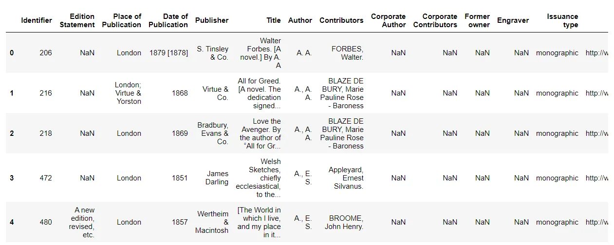

When we examine the first five entries using the head() method,

we can see that some of columns provide information that would be useful to the library but are not descriptive of the books themselves.

Then We can drop these columns with drop() function:

```python
#Dropping Columns in a DataFrame
to_drop = ['Edition Statement',
            'Corporate Author',
            'Corporate Contributors',
            'Former owner',
            'Engraver',
            'Contributors',
            'Issuance type',
            'Shelfmarks']
book.drop(to_drop, inplace=True, axis=1)

book.head()
```

Now when we inspect the DataSet again, we can see that the undesirable columns have been removed:

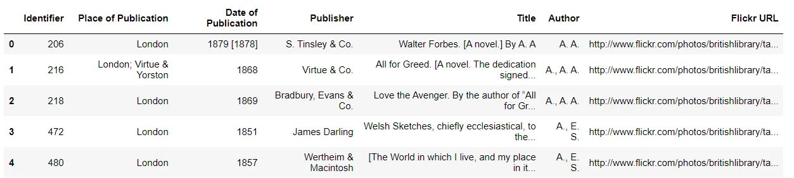

**Changing the Index of a DataSet**

In the dataset used in our example, we can expect that when a librarian searches for a record, he/she will be able to enter the unique identifier (values in the Identifier column) for a book:

```python
book['Identifier'].is_unique
```

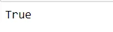

Let's replace the existing index with this column using set_index :

```python
book = book.set_index('Identifier')
book.head()
```

the result:

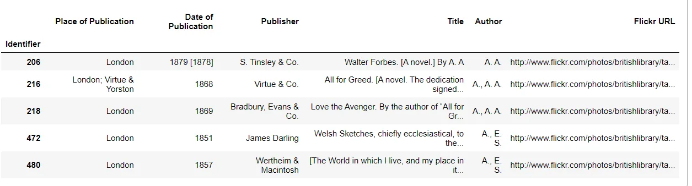

We can access each record in a simple way with loc[]. Although loc[] may not have such an obvious of a name, it allows us to perform label-based indexing, i.e. labeling a row or record regardless of its position:

```python
book.loc[206]
```

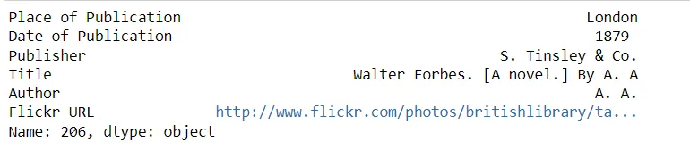

**Using .str methods to clean columns**

To clean up the Publication Location field, we can combine Pandas' str methods with NumPy's np.where function.

We'll use these two functions to clean up the publication location because this column contains string objects.

Here are the contents of the column:

```python
book['Place of Publication'].head(10)
```

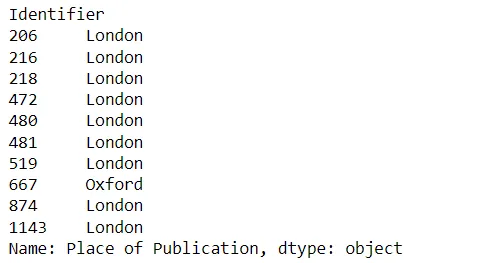

We see that for some lines, the place of publication is contains unnecessary information.

If we were to look at more values, we would see that this is only the case for some lines where the place of publication is "London" or "Oxford".

```python
book.loc[4157862]
```

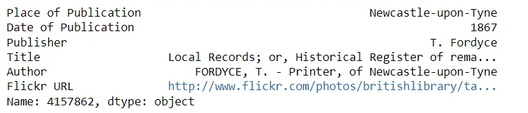

```python
book.loc[4159587]
```

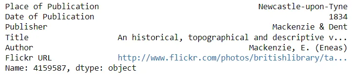

These two books were published in the same place, but one has hyphens in the place name while the other does not.

To clean up this column in a single scan, we can use str.contains() to get a boolean mask.

then we combine them with np.where :

```python
pub = book['Place of Publication']
book['Place of Publication'] = np.where(pub.str.contains('London'), 'London',
    np.where(pub.str.contains('Oxford'), 'Oxford',
        np.where(pub.eq('Newcastle upon Tyne'),
            'Newcastle-upon-Tyne', book['Place of Publication'])))

book.head()
```

Now let's take a look at the first five entries

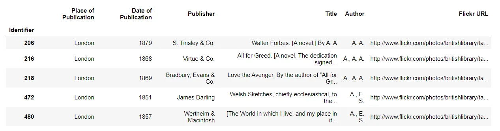

## Using DataSet.apply() for clean the column
```python
unwanted_characters = ['[', ',', '-']

def clean_dates(item):
    dop= str(item.loc['Date of Publication'])

    if dop == 'nan' or dop[0] == '[':
        return np.NaN

    for character in unwanted_characters:
        if character in dop:
            character_index = dop.find(character)
            dop = dop[:character_index]

    return dop

book['Date of Publication'] = book.apply(clean_dates, axis = 1)
book.head()
```

**Cleaning entire dataset using dataset.applymap ()**

In some cases, it would be useful to apply a custom function to each cell or element of a DataFrame bu using .applymap() method.

We will create a DataSet from the file "university_towns.txt":

```python
university_towns = []

with open('university_towns.txt', 'r') as file:
    items = file.readlines()
    states = list(filter(lambda x: '[edit]' in x, items))

    for index, state in enumerate(states):
        start = items.index(state) + 1
        if index == 49: #since 50 states
            end = len(items)
        else:
            end = items.index(states[index + 1])

        pairs = map(lambda x: [state, x], items[start:end])
        university_towns.extend(pairs)

towns_df = pd.DataFrame(university_towns, columns = ['State', 'RegionName'])
towns_df.head()
```

the applymap() function is called on our object. Now the DataFrame is much cleaner

this method took each element of the DataFrame, passed it to the function and the original value was replaced with the returned value.

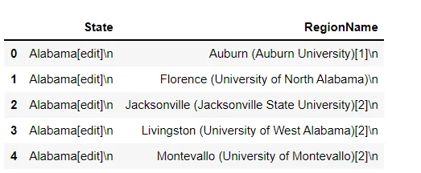

**Renaming columns and skipping rows**

Often, the datasets we will be working with will either have column names that are not easy to understand, or unimportant information in the first and/or last rows, such as definitions of dataset terms or footnotes.

In this case, we would like to rename the columns and skip some rows so that we can access the necessary information with correct and meaningful labels.

To show how to do this, let's first look at the first five rows of the "olympics.csv" data set:

```python
olympics_df = pd.read_csv('olympics.csv')
olympics_df.head()
```

The columns are the string form of integers indexed at 0. The row that should have been our header (i.e. the one to use to define the column names) is at olympics_df.iloc[0]. This happened because our CSV file starts with 0, 1, 2, ..., 15.

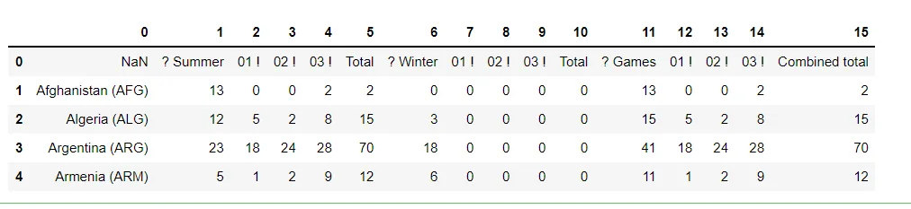

Therefore, we need to do two things:

1. Ignore a row and set the header as the first row (0 indexed)
2. Rename the columns

We can skip rows and set the header when reading the CSV file by passing some parameters to the read_csv() function.

This function takes a lot of optional parameters, but in this case we only need one (header) to delete the 0th row:

```python
olympics_df = pd.read_csv('olympics.csv', skiprows = 1, header = 0)
olympics_df.head()
```

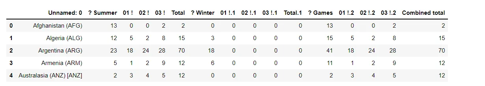

We now have the correct row set as the header and all unnecessary rows removed. Take note of how Pandas changed the name of the column containing the country names from NaN to No name: 0.

To rename the columns, we will use the rename() method of a DataFrame, which allows you to rename an axis based on a mapping (in this case, a dict).

Let's start by defining a dictionary that maps the current column names (as keys) to the more usable ones (the dictionary values) :

We call the rename() function on our object and Defining inplace to True specifies that our changes should be made directly to the object

```python
new_names =  {'Unnamed: 0': 'Country',
              '? Summer': 'Summer Olympics',
              '01 !': 'Gold',
              '02 !': 'Silver',
              '03 !': 'Bronze',
              '? Winter': 'Winter Olympics',
              '01 !.1': 'Gold.1',
              '02 !.1': 'Silver.1',
              '03 !.1': 'Bronze.1',
              '? Games': '# Games',
              '01 !.2': 'Gold.2',
              '02 !.2': 'Silver.2',
              '03 !.2': 'Bronze.2'}

olympics_df.rename(columns = new_names, inplace = True)
olympics_df.head()
```

Let’s see if this checks out:

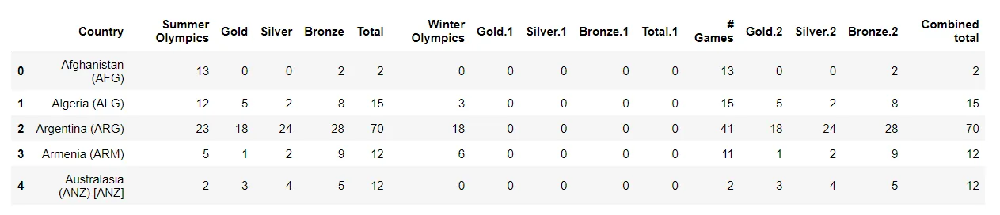

Passing to the second part of this tutorial

***2. Importing and visualizing data in python***

In this part we will use iris.csv dataset

let's start with importing libraries and data

```python
import pandas as pd
import seaborn as sns
import matplotlib.pyplot as plt
sns.set(style="white", color_codes=True)
iris = pd.read_csv("Iris.csv")
iris.head()
```

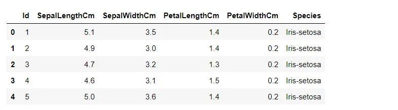

```python
# Let's see how many examples we have of each
```

```python
speciesiris["Species"].value_counts()
```

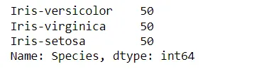

The first way to plot things is to use the .plot extension of Pandas data frames

We'll use it to create a scatterplot of the Iris features.

```python
iris.plot(kind="scatter", x="SepalLengthCm", y="SepalWidthCm")
```

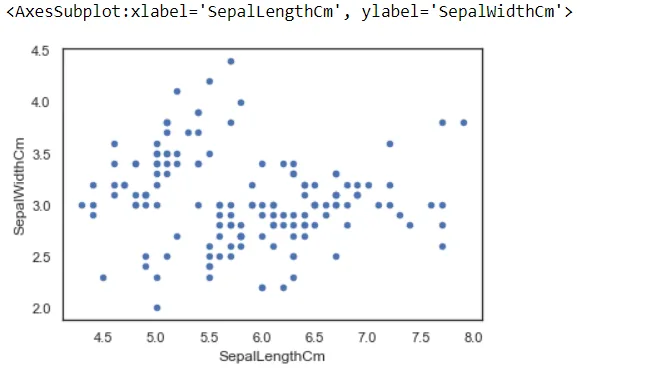

We can also use the Seaborn library to make a similar plot

*A seaborn* jointplot shows bivariate scatterplots and univariate histograms on the same figure

```python
sns.jointplot(x="SepalLengthCm", y="SepalWidthCm", data=iris, size=5)
```

One piece of information missing from the above graphs is the species of each plant.

Here we will use Seaborn's FacetGrid to color the scatterplot by species

```python
sns.FacetGrid(iris, hue="Species", size=5) \
   .map(plt.scatter, "SepalLengthCm", "SepalWidthCm") \
   .add_legend()
```

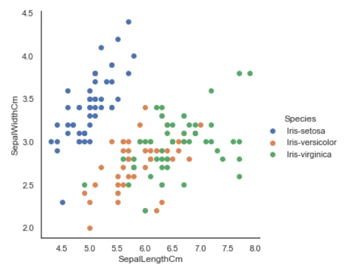

We can examine an individual feature in Seaborn through a boxplot

```python
sns.boxplot(x="Species", y="PetalLengthCm", data=iris)
```

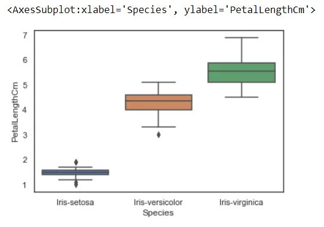

Finally ,

I hope you like this tutorialyou can find the complete code with the dataset in [github](https://github.com/rabebbenothmen/Data-Insight2021/tree/main/Assignments/6-%20Importing%20cleaning%20and%20visualizing%20data%20in%20python)
