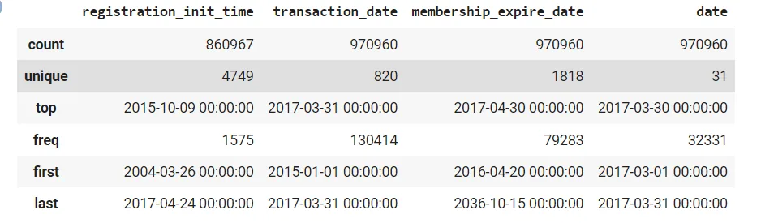
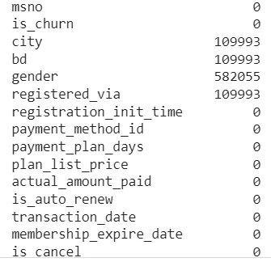
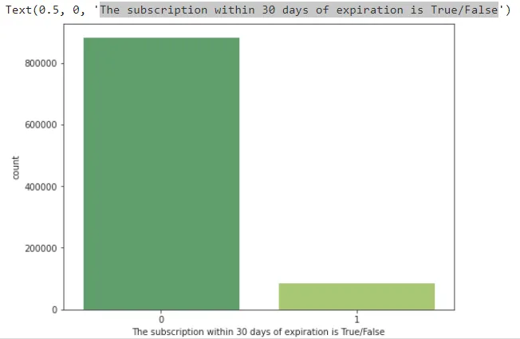
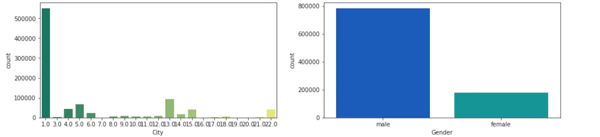
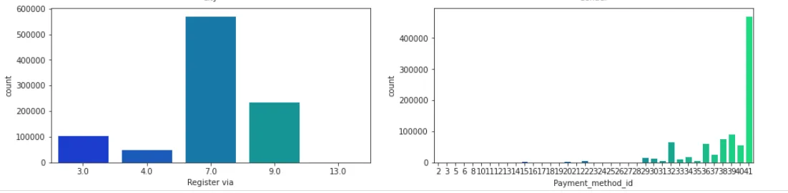

## Introduction :

**Today we are going to talk about the importance of importing ,cleaning and visualize data using a great example from Kaggle this example called customer churn prediction the aim goal of this project to predict if the customer will leave or not and try to get some action if you know that the customer will leave.**

## Importing Data :

**Today we will learn how to import data from Kaggle using API and download data on Google Colab notebook and the steps to do it.**

**1- Create Kaggle account.**

**2- Login and go to your account.**

**3- Press to Create API token to get your own credential.**

**4- This file is Kaggle.json**

**5- Upload this file using this following code in Google colab.**

from google.colab import files
uploaded = files.upload()
for fn in uploaded.keys():
 print('User uploaded file "{name}" with length {length} bytes'.format(
 name=fn, length=len(uploaded[fn])))
# Then move kaggle.json into the folder where the API expects to find it.
!mkdir -p ~/.kaggle/ && mv kaggle.json ~/.kaggle/ && chmod 600 ~/.kaggle/kaggle.json

**6- Once you upload Kaggle.json now you can use Kaggle API to download data for our data we will use the following API.**

! kaggle competitions download -c kkbox-churn-prediction-challenge

**7- After Download our data we will unzipped it.**

!7z e members_v3.csv.7z
!7z e sample_submission_v2.csv.7z
!7z e train_v2.csv.7z
!7z e transactions_v2.csv.7z
!7z e user_logs_v2.csv.7z

**8- Importing the essential libraries.**

import pandas as pd
import numpy as np
import seaborn as sns
import matplotlib.pyplot as plt

**9- Read our data .**

train = pd.read_csv('train_v2.csv',dtype={'is_churn':np.int8})
test = pd.read_csv('sample_submission_v2.csv',dtype={'is_churn':np.int8})
members = pd.read_csv('members_v3.csv',parse_dates=['registration_init_time'],dtype={'city':np.int8,'bd':np.int8,
 'registered_via':np.int8})
transactions = pd.read_csv('transactions_v2.csv',parse_dates=['transaction_date','membership_expire_date'],
 dtype={'payment_method_id':np.int8,'payment_plan_days':np.int8,'plan_list_price':np.int8,
 'actual_amount_paid':np.int8,'is_auto_renew':np.int8,'is_cancel':np.int8})

user_log = pd.read_csv('user_logs_v2.csv',parse_dates=['date'],dtype={'num_25':np.int16,'num_50':np.int16,
 'num_75':np.int16,'num_985':np.int16,'num_100':np.int16,'num_unq':np.int16})

## EDA and Clean Data :

**Now we have multiple tables and we need to merge them together**

train = pd.merge(train,members,on='msno',how='left')
test = pd.merge(test,members,on='msno',how='left')
train = pd.merge(train,transactions,how='left',on='msno',left_index=True, right_index=True)
test = pd.merge(test,transactions,how='left',on='msno',left_index=True, right_index=True,)
train = pd.merge(train,user_log,how='left',on='msno',left_index=True, right_index=True)
test = pd.merge(test,user_log,how='left',on='msno',left_index=True, right_index=True)

del members,transactions,user_log
print('Number of rows & columns',train.shape)
print('Number of rows & columns',test.shape)

**Get some summary statistics**

train[['registration_init_time' ,'transaction_date','membership_expire_date','date']].describe()

**Now it`s time to check if there is a missing values**

train.isnull().sum()

**Once we know that we have missing values it`s time to handle it we create a function to handle missing values**

col = [ 'city', 'bd', 'gender', 'registered_via']
def missing(df,columns):
 col = columns
 for i in col:
 df[i].fillna(df[i].mode()[0],inplace=True)
missing(train,col)
missing(test,col)

**Once we clean our data it`s time to visual our data to share our findings**

## Visualizing Data :

**We want to answer this question** **The subscription within 30 days of expiration is True/False using a perfect graph**

plt.figure(figsize=(8,6))
sns.set_style('ticks')
sns.countplot(train['is_churn'],palette='summer')
plt.xlabel('The subscription within 30 days of expiration is True/False')

**As we see in the graph above the number of the subscription is true is small but we need to have save these customers**

**Now we will have some univariate analysis to see the count of gender and city,...etc**

print(train['city'].unique())
fig,ax = plt.subplots(2,2,figsize=(16,8))
ax1,ax2,ax3,ax4 = ax.flatten()

sns.set(style="ticks")
sns.countplot(train['city'],palette='summer',ax=ax1)
[#ax1](https://www.datainsightonline.com/blog/hashtags/ax1).set_yscale('log')

ax1.set_xlabel('City')
[#ax1](https://www.datainsightonline.com/blog/hashtags/ax1).set_xticks(rotation=45)

sns.countplot(x='gender',data = train,palette='winter',ax=ax2)
[#ax2](https://www.datainsightonline.com/blog/hashtags/ax2).set_yscale('log')
ax2.set_xlabel('Gender')

sns.countplot(x='registered_via',data=train,palette='winter',ax=ax3)
[#ax3](https://www.datainsightonline.com/blog/hashtags/ax3).set_yscale('')
ax3.set_xlabel('Register via')

sns.countplot(x='payment_method_id',data= train,palette='winter',ax=ax4)
ax4.set_xlabel('Payment_method_id')

## Conclusion :

**Importing Data, EDA, cleaning data and visualize data one of the most skills that used to answering most of the questions that we asked about our data also we use visualization to interpret with non technical persons with our results and findings.**
