In your journey of working with data, you will come across data of different formats that need to be cleaned, wrangled among other things in order to draw insights. Visualizations exposes the underlying patterns in the data and also help to communicate interpretations drawn from the data to other data analysts and consumers of the data. This blog post seeks to address the following concepts:

- Importing Data in Python
- Cleaning Data in Python
- Visualizing Data in Python

## Importing Data in Python
The first step in making meaning out of any data is to get it set up in your Python environment. This is done by importing the data into Python using the Pandas library. Data comes in various file formats such as .txt, .csv, .json, Excel, MATLAB files and many more.

### Reading CSV files
CSV, acronym for Comma Separated Values is a plain text file that contains a list of data separated by commas. This file type is one of the commonest sources of raw data for Data Scientists. Pandas has a .read_csv() method which reads the data in the CSV file. The method takes the file path as arguments.

```python
employees = pd.read_csv('employees.csv')
employees.head()
```

This outputs:

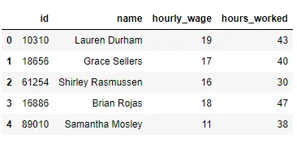

### Reading JSON files
JSON, abbreviation for JavaScript object notation, is mainly used for transmitting data between a web application and a server. JSON files store simple data structures and objects and are lightweight, text-based, human-readable and can be edited using a text editor. Pandas reads JSON files with a .read_json() method which takes the file path as arguments.

```python
users = pd.read_json('yelp_user.json', lines = True)
users.head()
```

The lines parameter assists in reading the JSON file per line. Previewing with the .head() method returns the below.

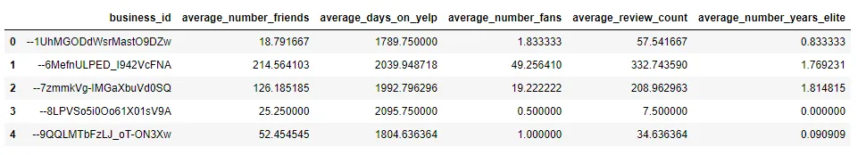

### Reading Excel files
Pandas has a variety of methods for reading Excel files. One common way is to use the .read_excel() method which takes the file path as arguments.

```python
trade_journal = pd.read_excel('Best Compound Growth Chart.xlsx')
trade_journal.head()
```

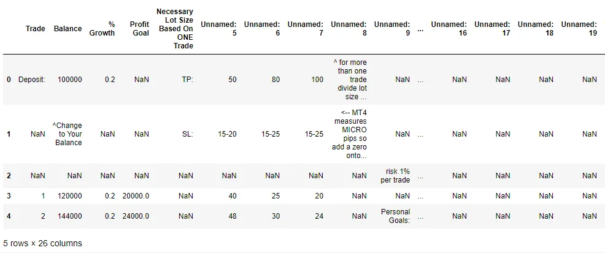

Another method is to assign the .ExcelFile() to a variable. This method allows you to get the sheet names of the Excel file using the attribute .sheet_names. We can then access each sheet by its name or by its index through the .parse() method.

```python
trade_journal = pd.ExcelFile('Best Compound Growth Chart.xlsx')
trade_journal.sheet_names
```

This returns:

```python
['Sheet1']
```

We then apply the method parse to the object data with a single argument, which is either the name as a string or the index as a float of the sheet that we wish to load.

```python
df = trade.parse(0)
df.head()
```


## Cleaning Data in Python
It's generally said that Data Scientists spend a whooping 80% of their time cleaning and manipulating data with only 20% of their time actually analyzing it to make meaning. The resources channeled into getting data into a tidy and clean state is extremely critical since analyzing messy data can lead to inaccurate conclusions. More often than not, we cross paths with unstructured and messy datawhen we work with data. There is the need to clean, transform and sometimes manipulate the data structure to gain any relevant insights. The data cleaning process produces data that can be easily used for modeling purposes or for visualization purposes.

### Exploratory Data Analysis
We import the data into DataFrames and begin the data cleaning process by inspecting the data. Data inspection is an essential first step of any analysis. This step helps to illuminate potential avenues for further investigation. This can be done with the .head() method which prints the first five rows of the DataFrame.

```python
df_lst = []
files = glob.glob('states*')
for filename in files:
    df = pd.read_csv(filename)
    df_lst.append(df)
us_census = pd.concat(df_lst).reset_index(drop = True)
us_census.head()
```

This outputs:

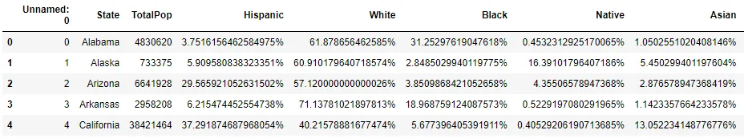

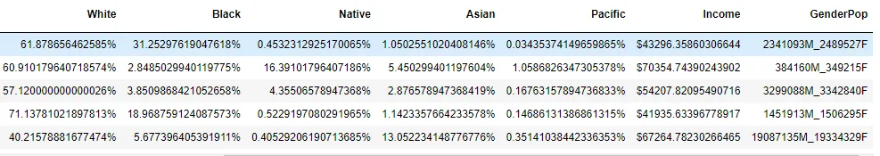

Based on this output, we notice that some columns are supposed to be quantitative while others are categorical. We then use the .info() method to check the data types of the columns.

```python
us_census.info()
```

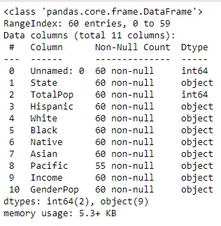

We get to realize there are 60 rows and 11 columns in the DataFrame. From our initial inspection using the .head() method, the TotalPop, Income and race columns namely Hispanic, White, Black, Native Asian and Pacific all contain numerical values but are encoded as categorical. We also notice that the Pacific column contains some null values. The Unnamed: 0 column is irrelevant and can be dropped. We also use the .descrivbe() method to get the statistical summary of the quantitative columns.

```python
us_census.describe()
```

This returns:

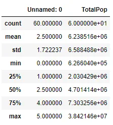

This affirms our earlier observation of the encoding of the numerical columns as categorical.

#### Dropping Irrelevant Columns
Some features are not useful and do not contribute in any way to analyzing the dataset and therefore needs to be dropped. The Unnamed: 0 column meets such conditions. We, therefore use the .drop() method to get rid of the said column.

```python
us_census.drop('Unnamed: 0', axis = 1, inplace = True)
```

#### Converting the Supposedly Numerical Columns to Numeric dtype
Per the initial investigation, we noticed entries in some columns were numeric but those columns are encoded as categorical. We can use regex to replace the special characters in those columns with empty strings then cast the column to numeric dtype.

```python
columns = us_census.columns[2:9]
for col in columns:
    us_census[col] = us_census[col].replace('\%|\$', '', regex = True)
    us_census[col] = pd.to_numeric(us_census[col])

us_census.info()
```

We then cross check the results using .info() method

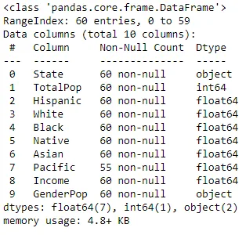

#### Separate GenerPop into Two Columns; Men and Women Both of Numeric dtype
Looking at the GenderPop column, we can separate this into two columns. This can be done by spliting the column using str.split and separating out those results. We then convert both of the columns into numerical datatypes.

```python
split_pop = us_census.GenderPop.str.split('_')
us_census['Men'] = split_pop.str.get(0)
us_census['Women'] = split_pop.str.get(1)
us_census.Men = us_census.Men.str[:-1]
us_census.Men = pd.to_numeric(us_census.Men)
us_census.Women = us_census.Women.str[:-1]
us_census.Women = pd.to_numeric(us_census.Women)
us_census.drop('GenderPop', axis = 1, inplace = True)
us_census.head()
```

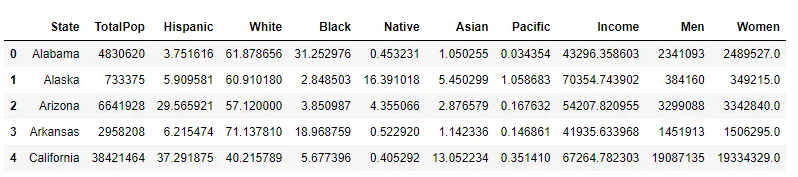

```python
us_census.info()
```

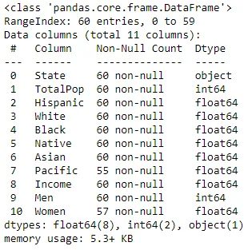

#### Dealing with Missing Values
```python
us_census.isna().any()
```

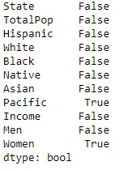

There are null values in the Pacific and Women columns. Let's further investigate the nature of the null values in those columns.

```python
us_census.Women.isnull().sum()
>> 3
```

```python
us_census.Pacific.isnull().sum()
>> 5
```

The missing values can be filled by using pandas’ .fillna() function. As an estimate for the missing values in the Women column, the TotalPop of that state minus the Men for that state can be computed and used.

```python
us_census.Women = us_census.Women.fillna(value = us_census.TotalPop - us_census.Men)
```

We now cross check for null values in the Women column to validate if the .fillna() method worked.

```python
us_census.Women.isnull().sum()
>> 0
```

We follow the earlier approach to fill the null values in the Pacific column. As an estimate for the missing values in the Pacific column, 100 minus the sum of the percentages of the other values in the race column for that state can be computed and used.

```python
us_census.Pacific = us_census.Pacific.fillna(value = 100 - (us_census.Asian + us_census.Native + us_census.Black + us_census.White + us_census.Hispanic))
```

We now cross check for null values in the Pacific column to validate if the .fillna() method worked.

```python
us_census.Pacific.isna().sum()
>> 0
```

#### Dealing with Duplicates
We can check for duplicates using .duplicated() and drop them if any.

```python
us_census.duplicated().any()
>> True
```

```python
us_census = us_census.drop_duplicates()
```

We now cross check if there are still any duplicates.

```python
us_census.duplicated().any()
>> False
```

## Visualizing the Data in Python
After tidying up our data, we are ready to draw some insights. Visualization is key in analyzing data to uncover the hidden patterns and effectively communicate these findings to your audience. There are tons of libraries in Python to do the heavy lifting in our journey of Data Visualization. Matplolib and Seaborn are the common ones used by most Data Scientists. Matplotlib provides the building blocks to create rich visualizations of many different kinds of datasets. Seaborn, built on Matplotlib is a powerful Python library that makes it easy to create informative and attractive visualizations. There are a variety of plots ranging from scatterplot, lineplots, histograms, bar charts among others.

We begin by visualizing the Total Population per State using bar chart. Seaborn's barplot() method was called into action.

```python
fig = plt.figure(figsize = (6, 9))
sns.barplot(data = us_census, y = 'State', x = 'TotalPop')
plt.show()
```

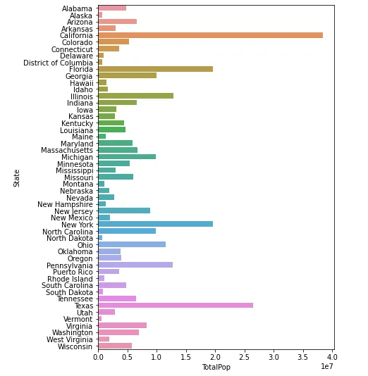

*Total Population in each State*

From the visualization, it can be inferred that the most populous state is California with Texas and Florida following behind. There are quite a number of less populated states notably amongst that category are Alaska, Delaware, District of Columbia, North Dakota, Rhode Island, South Dakota and Vermont.

The next plot shows the percentage of each race in each of the states.

```python
race_columns = us_census.columns[2:8]
for race in race_columns:
    fig = plt.figure(figsize = (6, 9))
    sns.barplot(data = us_census, x = race, y = 'State')
    plt.show()
```

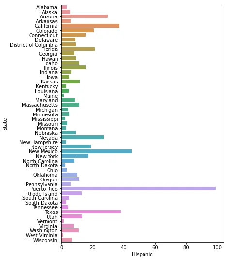

Hispanics are prevalent in Puerto Rico, New Mexico, Texas and California.

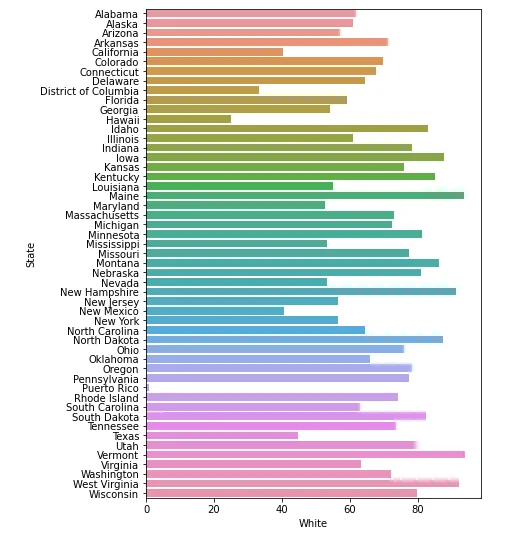

The White race looks to be fairly distributed among the states with the exception of Puerto Rico which have a negligible percent of its inhabitants being Whites.

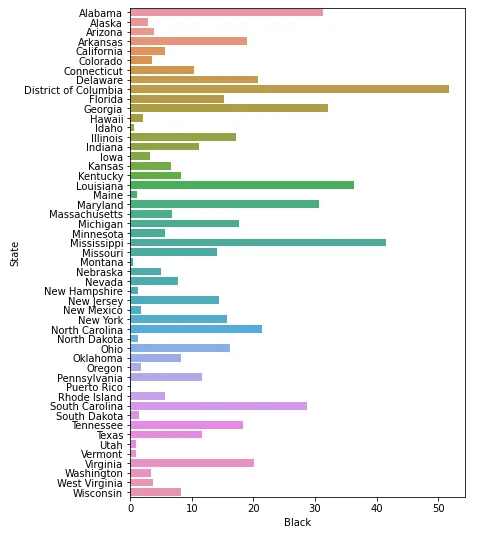

Blacks seem to be represented among majority of the states notably are District of Columbia, Mississippi, Louisiana, Alabama, South Carolina, Maryland and Georgia. Their representation in Puerto Rico, Idaho and Montana, however is minimal.

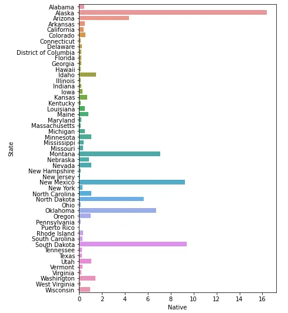

Native Americans are predominant in Alaska, Montana, New Mexico, Oklahoma and South Dakota. Their presence is minimal in the other states.

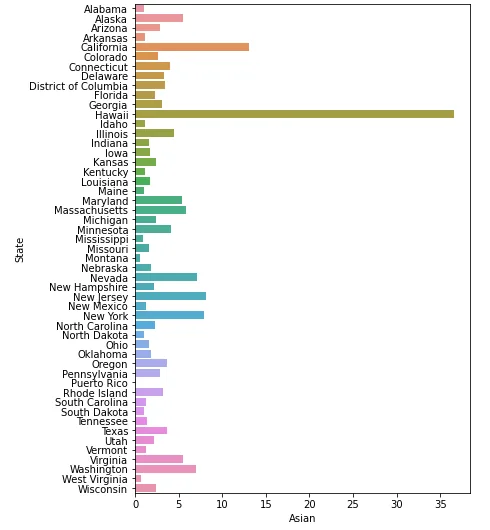

Asians are mostly found in Hawaii and almost not in Puerto Rico. Their presence is minimal in other states.

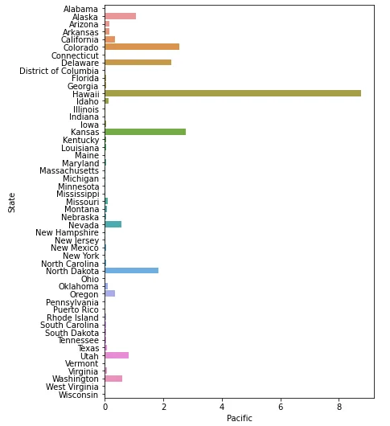

Pacifics are mainly found in Hawaii as compared to other states.

We now turn our attention to the Income column. Let's investigate how income across the various states vary.

```python
fig = plt.figure(figsize = (6, 9))
sns.barplot(data = us_census, x = 'Income', y = 'State')
plt.show()
```

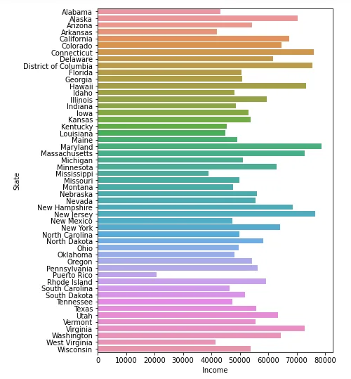

Income is high in Alaska, Connecticut, District of Columbia, Hawaii, Maryland, Massachusetts, New Hampshire, New Jersey and Washington whiles low in Puerto Rico.

There are other key insights which can be drawn from further investigations.

## Conclusions
Cleaning data and visualizations provides an avenue to uncover key findings in data.

All datasets used in this tutorial are obtained from [Kaggle](http://www.kaggle.com). This is a [link](https://github.com/catiemokeseku/Importing-Cleaning-and-Visualizing-Data-in-Python.git) to the repo.
