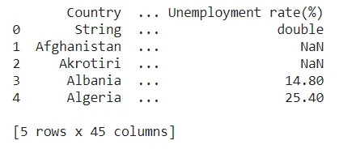

Web data mining is the process of extracting data from a given web site in order to extract useful information for decision making. The data collection is done with Python scripts and can be saved in several different file formats.The formats can be flat , non flat , htm file etc.

In the following lines, we will guide you step by step with examples to familiarize you with importing data from a web site and allow you to practice your own. Let's go !

Before starting anything else, it is necessary to load a number of essential packages and to understand what they are used fo

- Urlib : used to import data from the web with the URL,

Urllib .request allows to open and read the URL,

Urlretrieve : useful for saving locally

-Pandas : create DataFrames

## 1) Importing flat files from the web
Flat files are data files containing one record per line, and whose fields can be delimited (separated) from each other by a special character. These file types are in binary, text (.txt) or csv form. After installing the necessary packages, the following code allows to import a flat file:

```python
#Load package
from urlib.request import urlretrieve
# Assign the url of file
url = "specify the url"
# save file locally by using urlretreive
urlretrieve (url, "give a name to the .csc file")
# read it with the Pandas script which is written as follows:
df = pd.read_csv('filename' ,sep = ';')
# display some line of the file with the head() function
Print(df.head())
```

For a clearer understanding, we will make a concrete example with the country data. A dataset of 160 countries with about 40 characteristics such as debt, electricity consumption, internet users, etc. the data source is the web site named Project datasets.

```python
# import packages
import pandas as pd
from urllib.request import urlretrieve

# provide the url
url = 'https://perso.telecom-paristech.fr/eagan/class/igr204/data/factbook.csv'

# load and save the file locally
urlretrieve(url,'cars.csv')

# read the file with pandas and store it as df
df = pd.read_csv('cars.csv', sep = ';')
# print the first five rows of our DataFrame
print(df.head(n = 5))
```

Here is the overview of the imported data.

Output :



## 2) Importing non-flat files from the web
Collecting data, can be done also with the help of non flat files. These can be in the form of Excel, Matlab, SASfile etc. The first lines of code are almost the same except for the DataFrame reading. We will focus on excel files in this case. The recovery and reading of Excel sheets on a website is done with the above script:

```python
#read it with the Pandas script which is written as follows:
File_excel = pd .read_csv(url ,sheet_name = None)
```

Sheet_name = None : allows us to read all the excel sheets in the database.

In our exercise, we have an excel file that on the File Examples site. We are interested in these data. To do this, the lines of code below show us how we had to import these data types. The packqges have already been loaded.

```python
# assign url of file : url
url_excel = "https://file-examples-com.github.io/uploads/2017/02/file_example_XLS_100.xls"

#read the excel file in all sheets and store it as xls
xls = pd.read_excel(url_excel, sheet_name= None)

# print the sheetnames
print(xls.keys())
```

Output :

dict_keys(['Sheet1'])

We notice that our excel file contains only one sheet named Sheet_1.

### Conclusion :
It's out for the import of both file formats. I hope this will be useful to you and don't forget to practice.

You can access the scripts through my github link :

<https://github.com/Dorlote/Data_insight_programme_2021/blob/main/Importing_data_in_python_from_web_.ipynb>
