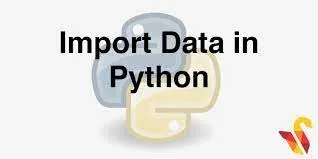

As a data scientist, you will need to clean data, wrangle and munge it, visualize it, build predictive models and interpret these models. Before you can do so, however, you will need to know how to get data into Python. so in this article we will talk about how to import your data into python let's start .

## 1- Importing data from flat file
Data can be stored in flat file as .txt or .csv files. to import this file we will use NumPy and Pandas Libraries.

### .txt file

Reading txt file

You can use Python’s basic open function to open a connection to the file. To do so, you assign the filename to a variable as a string, pass the filename to the function open and also pass it the argument mode equals 'r', which makes sure that we can only read it (we wouldn't want to accidentally write to it!), assign the text from the file to a variable text by applying the method read to the connection to the file. After you do this, make sure that you close the connection to the file using the command file .close.

```python
# Open a file: file
file = open('moby_dick.txt', 'r')

# Print it
print(file.read())

# Check whether file is closed
print(file.closed)

# Close file
file.close()

# Check whether file is closed

print(file.closed)
```

you can also used numpy library to read txt file as :

```python
# Import numpy
import numpy as np

# Assign the filename: file
file = 'digits_header.txt'

# Load the data: data
data = np.loadtxt(file, delimiter="\t", skiprows=1, usecols=[0,2])

# Print data
print(data)
```

Writing txt file

if you wanted to open a file in order to write to it, you would pass it the argument mode equals 'w.

### CSV file

You can import CSV file easily by using Pandas library in python by using .read_csv( )

```python
df=pd.read_csv('titanic.csv')
```

### Pickled file

The concept of pickling a file is motivated by the following: while it may be easy to save a numpy array or a pandas dataframe to a flat file, there are many other datatypes, such as dictionaries and lists, for which it isn't obvious how to store them. 'Pickle' to the rescue! If you want your files to be human readable.

```python
# Import pickle package
import pickle

# Open pickle file and load data: d
with open('data.pkl', 'rb') as file:
    d = pickle.load(file)

# Print d
print(d)

# Print datatype of d
print(type(d))
```

### Excel spreadsheets

An Excel file generally consists of a number of sheets. There are many ways to import Excel files and you'll use pandas to do so because it produces dataframes natively, which is great for your practice as a Data Scientist.

```python
# Import pandas
import pandas as pd

# Assign spreadsheet filename: file
file = 'battledeath.xlsx'

# Load spreadsheet: xls
xls = pd.ExcelFile(file)

# Print sheet names
print(xls.sheet_names)
```

### SAS files

SAS files are important because SAS is a software suite that performs advanced analytics, multivariate analyses, business intelligence, data management, predictive analytics and is a standard for statisticians to do computational analysis.

```python
# Import sas7bdat package
from sas7bdat import SAS7BDAT

# Save file to a DataFrame: df_sas
with SAS7BDAT('sales.sas7bdat') as file:
    df_sas = file.to_data_frame()

# Print head of DataFrame
print(df_sas.head())
```

### Stata files

Stata files have extension .dta and we can import them using pandas.

```python
# Import pandas
import pandas as pd

# Load Stata file into a pandas DataFrame: df
df=pd.read_stata('disarea.dta')

# Print the head of the DataFrame df
print(df.head())
```

### HDF5 files

In the Python world, consensus is rapidly converging on Hierarchical Data Format version 5, or 'HDF5,' as the standard mechanism for storing large quantities of numerical data. It’s now relatively common to deal with datasets hundreds of gigabytes or even terabytes in size; HDF5 itself can scale up to exabytes.

```python
# Import packages
import numpy as np
import h5py

# Assign filename: file
file='LIGO_data.hdf5'

# Load file: data
data = h5py.File(file, 'r')

# Print the datatype of the loaded file
print(type(data))
```

### MAT files

MAT-files are binary MATLAB® files that store workspace variables.

This workspace can contain strings, floats, vectors and arrays, among many other objects. .mat file is simply a collection of such objects.

```python
# Import package
import scipy.io

# Load MATLAB file: mat
mat=scipy.io.loadmat('albeck_gene_expression.mat')

# Print the datatype type of mat
print(type(mat))
```

## 2****- Importing data from Relational database
What is a relational database?

It's a type of database that is based upon the Relational model of data

At the first we need to create a data base engine in python to be able to call the data.

```python
# Import necessary module
from sqlalchemy import create_engine

# Create engine: engine
engine = create_engine('sqlite:///Chinook.sqlite')
```

Then we need to connect to the engine and query the database to be able to write SQL query to explore our data in python.

```python
# Import packages
from sqlalchemy import create_engine
import pandas as pd

# Create engine: engine
engine = create_engine('sqlite:///Chinook.sqlite')

# Open engine connection: con
con =engine.connect()

# Perform query: rs
rs = con.execute("select * from Album")

# Save results of the query to DataFrame: df
df = pd.DataFrame(rs.fetchall())

# Close connection

con.close()
# Print head of DataFrame df
print(df.head())
```

That's all about importing data in python as a beginner data scientist there are more kind of data you will need to import it that we will discuss soon .

At the end, I hope that you enjoyed reading this article and that it helped you in your field, even a little

Recourses:

Data camp

This article is based on what was studied in Introduction to Importing Data in Python course .

you will find the data & the code at Github:

https://github.com/alaa-mohamed98/importing-data-in-python
