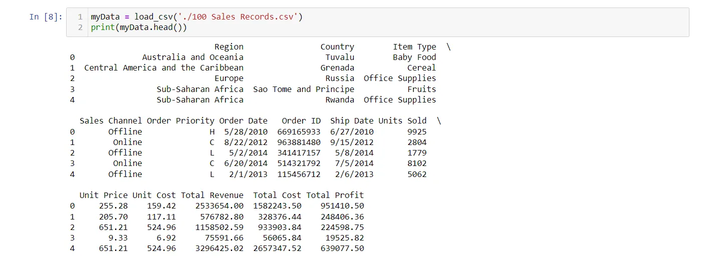
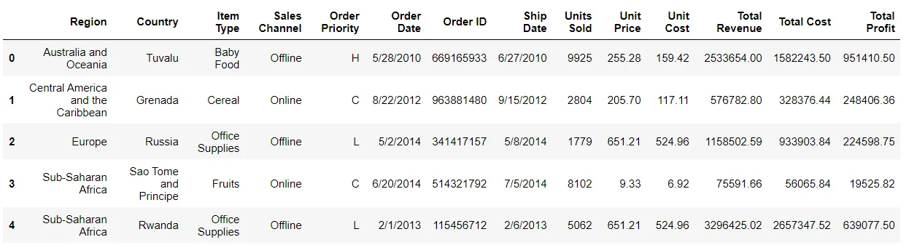
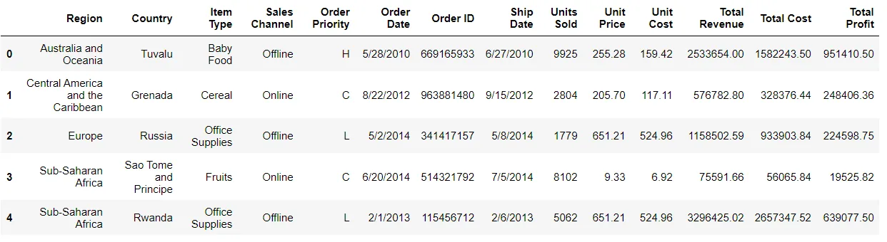

As a beginner, you might only know a single way to load data (normally in CSV) which is to read it using *pandas.read_csv* function. It is one of the most mature and strong functions, but other ways are a lot helpful and will definitely come in handy sometimes.

The ways that I am going to discuss are:

- **Manual** function
- **read_csv** function
- **Pickle**

The dataset that we are going to use to load data can be found [**here**](http://eforexcel.com/wp/downloads-18-sample-csv-files-data-sets-for-testing-sales/). It is named as 100-Sales-Records.

**Imports**

We will use Numpy, Pandas, and Pickle packages so import them.

```python
import numpy as np
import pandas as pd
import pickle
```

### 1. Manual Function

This is the most difficult, as you have to design a custom function, which can load data for you. You have to deal with Python’s normal filing concepts and using that you have to read a *.csv* file.

Let’s do that on 100 Sales Records file.

```python
def load_csv(filepath):
    data =  []
    col = []
    checkcol = False
    with open(filepath) as f:
        for val in f.readlines():
            val = val.replace("\n","")
            val = val.split(',')
            if checkcol is False:
                col = val
                checkcol = True
            else:
                data.append(val)
    df = pd.DataFrame(data=data, columns=col)
    return df
```

Hmmm, What is this??? Seems a bit complex code!! Let’s break it step by step so you know what is happening and you can apply similar logic to read a *.csv* file of your own.

Here, I have created a *load_csv* a function that takes in as an argument the path of the file you want to read.

I have a list named as *data* which is going to have my data of CSV file, and another list *col* which is going to have my column names. Now after inspecting the csv manually, I know that my column names are in the first row, so in my first iteration, I have to store the data of the first row in *col* and rest rows in *data*.

To check the first iteration, I have used a Boolean Variable named as *checkcol* which is False, and when it is false in the first iteration, it stores the data of first-line in *col* and then it sets *checkcol* to True, so we will deal with *data* list and store rest of values in *data* list.

***Logic***

The main logic here is that I have iterated in the file, using *readlines()* a function in Python. This function returns a list that contains all the lines inside a file.

When reading through headlines, it detects a new line as *\n* character, which is line terminating character, so in order to remove it, I have used *str.replace* function.

As it is a *.csv* file, so I have to separate things based on *commas* so I will split the string on a *,* using *string.split(',')*. For the first iteration, I will store the first row, which contains the column names in a list known as *col*. And then I will append all my data in my list known as *data*.

To read the data more beautifully, I have returned it as a dataframe format because it is easier to read a dataframe as compared to a numpy array or python’s list.

```python
myData = load_csv('./100 Sales Records.csv')
print(myData.head())
```



**Pros and Cons**

The important benefit is that you have all the flexibility and control over the file structure and you can read in whatever format and way you want and store it.

You can also read the files which do not have a standard structure using your own logic.

Important drawbacks of it are that it is complex to write especially for standard types of files because they can easily be read. You have to hard code the logic which requires trial and error.

You should only use it when the file is not in a standard format or you want flexibility and reading the file in a way that is not available through libraries.

### 2. Pandas.read_csv()

Pandas is a very popular data manipulation library, and it is very commonly used. One of it’s very important and **mature** functions is *read_csv()* which can read any **.csv** file very easily and help us manipulate it. Let’s do it on our 100-Sales-Record dataset.

This function is very popular due to its ease of use. You can compare it with our previous codes, and you can check it.

```python
pdDf = pd.read_csv('./100 Sales Records.csv')
pdDf.head()
```



And guess what? We are done. This was actually so simple and easy to use. Pandas.read_csv definitely offers a lot of other parameters to tune in our data set, for example in our convertcsv.csv file, we had no column names so we can read it as.

### 3. Pickle

When your data is not in a good, human-readable format, you can use pickle to save it in a binary format. Then you can easily reload it using the pickle library.

We will take our 100-Sales-Record CSV file and first save it in a pickle format so we can read it.

```python
with open('test.pkl','wb') as f:
    pickle.dump(pdDf, f)
```

This will create a new file *test.pkl* which has inside it our *pdDf* from **Pandas** heading.

Now to open it using pickle, we just have to use *pickle.load* function.

```python
with open("test.pkl", "rb") as f:
    d4 = pickle.load(f)
d4.head()
```



And here we have successfully loaded data from a pickle file in *pandas.DataFrame* format.

### Learning Outcomes

You are now aware of 3 different ways to load data files in Python, which can help you in different ways to load a data set when you are working in your day-to-day projects.
