There are different formats of data and several ways of importing them in python . In this tutorial we are dealing with some formats of data and their importing procedure.

## Importing csv file into python using pandas:
First of all ,we import the pandas library. Pandas is usually imported under the 'pd' alias.we use as keyword to create an alias.

```python
 import pandas as pd
```

##### Reading a csv file into dataframe:
CSV (Comma Separated Values) is a simple file format used to store tabular data, such as a spreadsheet or database.Here ,we use pandas **read_csv()** function to read a comma-separated values (csv) file into DataFrame.

```python
emp_df =pd.read_csv("C:\\Users\\DELL\\Desktop\\emp_data.csv")
```

```python
emp_df.head()
```

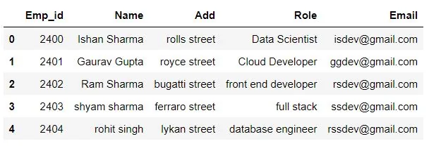

##### Reading only specific columns:
To read a CSV file with only specific columns call **pd.read_csv(file_name, usecols=column_list)** .

Here file name specifies the name of the csv file and we pass the list of columns name to the usecols parameter to read the csv file with the columns specified in the list.

```python
cols_list = ["Name", "Role"]
df = pd.read_csv("C:\\Users\\DELL\\Desktop\\emp_data.csv", usecols=cols_list)
```

```python
df.head()
```

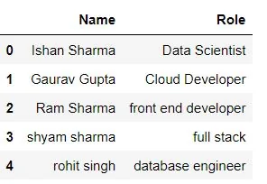

## Importing excel file:

An excel file has a ‘.xlsx’ format. For importing an Excel file into Python using Pandas we have to use **pandas.read_excel()** function.

```python
excel_df = pd.read_excel("C:\\Users\\DELL\\Desktop\\gamesbook.xlsx")
excel_df.head()
```

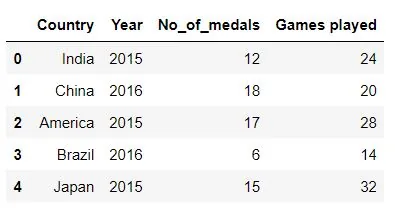

##### Reading particular columns:

For reading specific columns we pass a list of column index to the **usecols** parameter.Here index 0 specifies first column , 1 for second and so on.

```python
cols = [0, 2, 3]
df1 = pd.read_excel("C:\\Users\\DELL\\Desktop\\gamesbook.xlsx", usecols=cols)
df1.head()
```

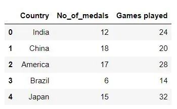

##### selecting particular column as an index column:

Here we can specify a specific column as the index column of the dataframe by passing the index no of the column to the **index_col** parameter while reading the excel file.

```python
df2 = pd.read_excel("C:\\Users\\DELL\\Desktop\\gamesbook.xlsx",
                   index_col = 0)
df2.head()
```

Here we specified the first column as the index column of the **df2** dataframe.

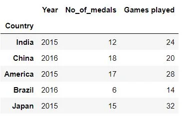

##### Skipping rows while reading a excel file to Dataframe:

If we assign N number to the skiprows parameter .Then the first N rows are skipped while reading the excel file.

```python
df3 = pd.read_excel("C:\\Users\\DELL\\Desktop\\gamesbook.xlsx", skiprows=2)
df3.head()
```

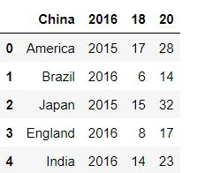

In this example we assigned skiprows = 2 and the first two rows of the gamesbook.xlsx file are skipped.

## Importing text file:
It is done using the open() function.

open(path_to_file, mode)

The open function has many parameter .here we are studying about the major two .The path_to_file specifies the file location and the mode specifies the mode in which we wish to open the file.

we append **'r'** to Open a text file for reading text .

**'w'** to Open a text file for writing text.

**'a'**  to Open a text file for appending text.

To open the file, use the built-in **open()** function.

The open() function returns a file object, which has a read() method for reading the content of the file:

To demontrate the example we have a text file **dt.txt** saved in our local computer.

```python
file1 = open("C:\\Users\\DELL\\Desktop\\dt.txt","r")
print(file1.read())
```

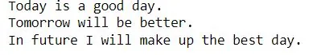

##### Reading from file:

1. read() – this method reads all text from a file into a string.
2. readline() – this method reads the text file line by line and return all the lines as strings.
3. readlines() – this method reads all the lines of the text file and return them as a list of strings.

```python
file2 = open("C:\\Users\\DELL\\Desktop\\dt.txt","r")
print(file2.read())
```

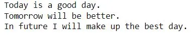

read() function reads the whole text.

```python
file3 = open("C:\\Users\\DELL\\Desktop\\dt.txt","r")
print(file3.readline())
```


readline() function reads the text linewise.

```python
file4 = open("C:\\Users\\DELL\\Desktop\\dt.txt","r")
print(file4.readlines())
```

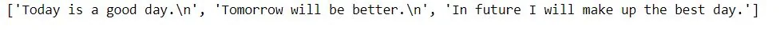

Here the output is the whole text resturned as list of strings.

##### closing the file:

The file that you open will remain open until you close it using the close() method.close()method closes the file and frees the memory space acquired by that file.

```python
file1.close()
print(file1.read())
```

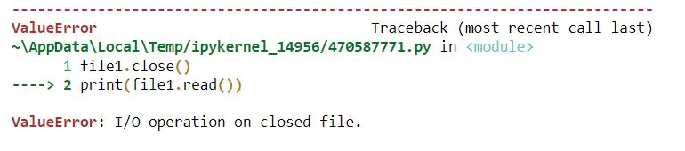

The following error is obtained which tells the file has been closed.

##### Using context manager 'with' to import the file:
To close the file automatically without calling the close() method, we make use of the context manager 'with'.

```python
with open("C:\\Users\\DELL\\Desktop\\dt.txt") as file:
    print(file.readline())
```


## Importing flat file from web:

Here we are importing file from the web.The file we are importing is **forestfires.csv.** The url for the file is <https://archive.ics.uci.edu/ml/machine-learning-databases/forest-fires/forestfires.csv>

Import the function urlretrieve from the urllib.request subpackage.

```python
from urllib.request import urlretrieve
```

Assigning the url of the file to a variable.

```python
url = 'https://archive.ics.uci.edu/ml/machine-learning-databases/forest-fires/forestfires.csv'
```

Using the function urlretrieve to save this file locally. Pass two arguments to the function - the url of the website (which has been assigned to the variable ‘url’) and the name you want the file to be saved as.

```python
urlretrieve(url, 'wildfire.csv')
fire_df= pd.read_csv('wildfire.csv')
fire_df.head()
```

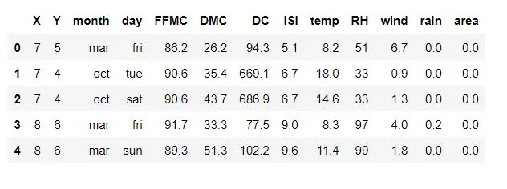

## Web Scrapping with python:

Web Scrapping is the technique of accessing the HTML of the webpage and extracting useful information/data from it.

For web scraping we are going to use the very popular Python library called **BeautifulSoup**.

Importing the required libraries.

```python
import requests
from bs4 import BeautifulSoup
```

Specifying the URL of the webpage you want to scrape.

```python
# specifying the url
url ='https://www.datainsightonline.com/'
```

Sending a HTTP request to the specified URL and save the response from server in a response object 'r'.

```python
# Send a HTTP request to the specified URL
r = requests.get(url)
```

Specifying the HTML parser we want to use (html5lib)

```python
# Parsing the HTML content
soup = BeautifulSoup(r.content, 'html5lib')
```

Now, **soup.prettify()** is printed,it gives the visual representation of the parse tree created from the raw HTML content.

```python
print(soup.prettify())
```

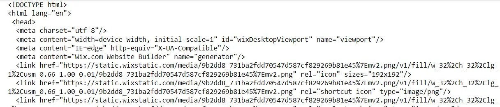

**soup.title** prints the title of the webpage in the HTML format.

```python
print(soup.title)
```

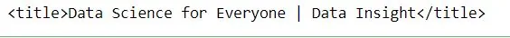

Here, **soup.title.prettify()** prints the title in perfect html format.

```python
print(soup.title.prettify())
```

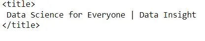

get_text() method returns only the text .

```python
print(soup.title.get_text())
```

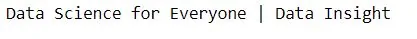

The link to the notebook in the github repository is [here.](https://github.com/Techy-Ishan/Importing-data-in-python/blob/master/Importing%20data%20in%20python.ipynb)
