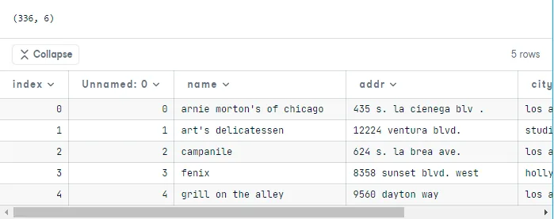
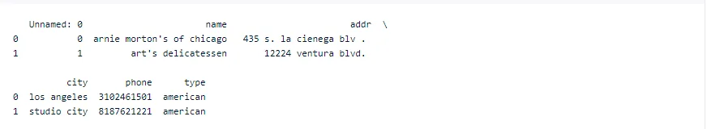
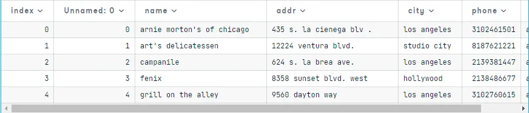
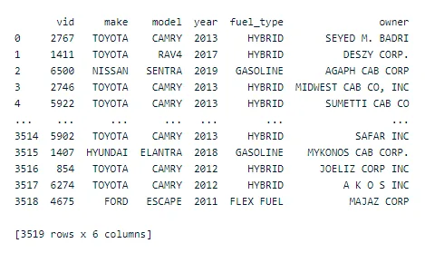
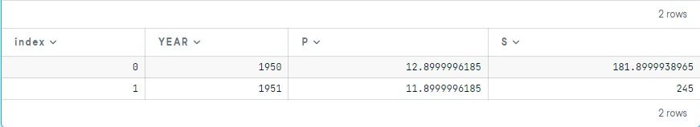
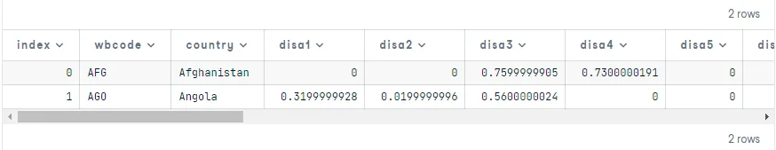
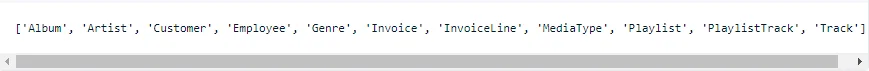
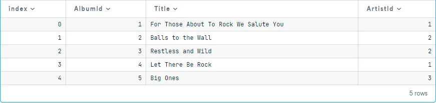
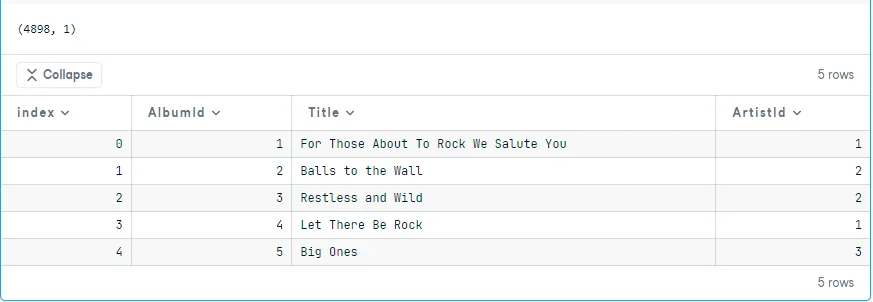

Importing data into the Python environment is the starting point to detect the insights that matter. after importing the data you can clean, and visualize it.

You'll learn the different types of files that you import and different ways to import data into Python.

First, you'll see the flat file data types.

**CSV Files**

One of the most common flat file types is the CSV format (comma-separated values).

I'll explain how to import CSV files using pandas. The first line of code below imports the pandas' package using the alias pd. The second line reads the .csv file and stores it as a pandas data frame using the pandas pd.read_csv() function. The third line prints the shape of the data, and the fourth line displays the first five rows.

```python
import pandas as pd
df = pd.read_csv('restaurants.csv')
print(df.shape)
df.head(5)
```

output:



**Text Files**

The other common flat file type is text files, which also contain textual data, but not necessarily in a tabular format.

The first line of code below reads the text file using also the pandas pd.read_csv() function, we also here use the sep parameter to specify the separator between columns(fields) in each row(record), then save the result into a data frame. The second line prints the first few lines of the file.

df_textfile = pd.read_csv('names.txt', sep='\t')

print(df_textfile)

output:


Now, you'll see other file types.

**Excel Data**

Excel data needs no introduction and is the most widely used data type in the business world.

The first line of code below imports and stores the dataset using the pandas pd.ExcelFile() function. The second line prints the sheet names in the file.

excel_data = pd.ExcelFile('restaurants.xlsx')

print(excel_data.sheet_names)

excel_data = pd.ExcelFile('restaurants.xlsx')

print(excel_data.sheet_names)

output:


The output shows that the Excel file has three sheets. If we didn't specify a sheet name, it would take the first sheet by default. Using the parse function as we see below to store the data as a pandas data frame.

df1 = excel_data.parse()

print(df1.head(2))

output:



If we want to load only a particular sheet from the Excel file for analysis, we can do that using the first line of code below. The second line prints the first five rows of the data. It is also possible to customize the imports, for example, skipping certain rows, importing only selected columns, or changing variable names.

df_excel = excel_data.parse('restaurants_2')

df_excel.head()



**Pickled files**

It's native to Python, used with many data types for which it isn't obvious how to store them, and it's serialized (converted to byte stream)

you should import the pickle package first, then use it to load the file.

import pickle

with open('taxi_vehicles.p', 'rb') as file:

data = pickle.load(file)

print(data)

output:



**SAS and Stata files**

They are data files used with business analytics and biostatistics and academic social science research.

We import SAS7BDAT from sas7bdat package, then use it to load data into the data frame

from sas7bdat import SAS7BDAT

with SAS7BDAT('sales.sas7bdat') as file:

df_sas = file.to_data_frame()

df_sas.head(2)

output:



For Stata, we don't need to import anything, just pandas which has a method for Stata (pd.read_stata)

df_stata = pd.read_stata('disarea.dta')

df_stata.head(2)

output:



**HDF5**

It's standard for storing large quantities of numerical data (hundreds of gigabytes or terabytes)

import h5py

data = h5py.File('test.hdf5', 'r')

print(type(data))

output:


**MATLAB**

It's the standard type in engineering and science.

To import a .mat file we import scipy.io, it fives us data in a dictionary datatype

import scipy.io

filename = 'ja_data2.mat'

mat = scipy.io.loadmat(filename)

print(type(mat))

output:


**SQL Database**

Relational databases are a prominent source of data storage for many organizations, and it is extremely important to know how to import data from such databases. Structured Query Language (or SQL) is the most widely used database, and we can import data from tables stored in SQL Server by building a connection.

The first step is to import the required packages and functions. The sqlalchemy package is used in the illustration below.

Then you need to query the database using these steps:

- create database engine

- connect to the engine

- query the database

- save the query result to a data frame

- close the connection

from sqlalchemy import create_engine

engine = create_engine('sqlite:///Chinook.sqlite')

table_names = engine.table_names()

print(table_names)

output:



con = engine.connect()

rs = con.execute("SELECT \* FROM Album")

df = pd.DataFrame(rs.fetchall())

df.columns = rs.keys()

con.close()

df.head()

output:



**Importing Data from URL**

Often data is available on a website and can be downloaded into a local system. We can load the data directly from a website URL (Universal Resource Locator) into the Python environment.

We will use the urllib library for performing this task, as this package provides the interface for fetching data across the web. The first two lines of code below import the required libraries. The third line assigns the URL of the file that we want to import into Python. The fourth line uses the urlretrieve function to save the file in the local environment. The last three lines of code below read the file into a data frame and print the shape and the first few observations of the dataset.

import urllib

from urllib.request import urlretrieve

url = "http://archive.ics.uci.edu/ml/machine-learning-databases/wine-quality/winequality-white.csv"

urlretrieve(url, 'ww.csv')

df_url = pd.read_csv('ww.csv')

print(df_url.shape)

df.head(5)


