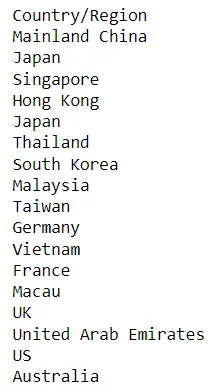
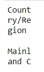
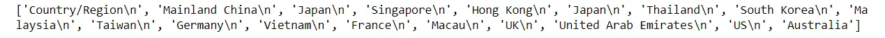
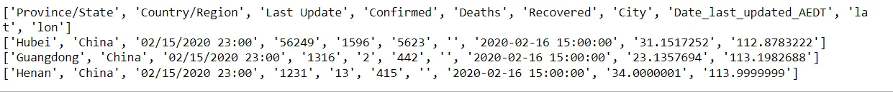
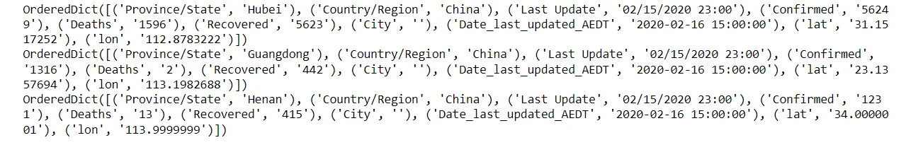
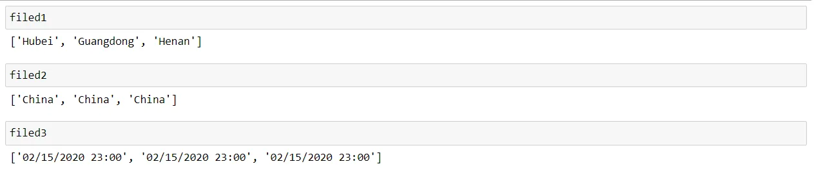
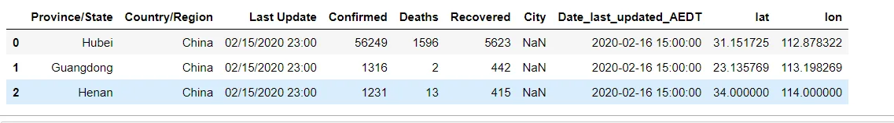
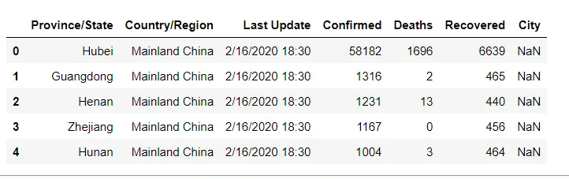
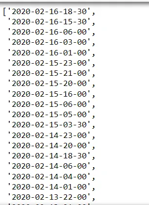
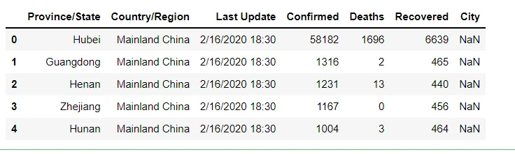

There are a lot of data formats depend on the types of data files (e.g. .csv, .txt, .tsv, .html, .json, Excel spreadsheets, relational databases etc.).

We will list some common methods for importing data in Python.

**1. Python build-in functions (read(), readline(), and readlines())**

In general, a text file (.txt) is the most common file we will deal with. Text files are structured as a sequence of lines, where each line includes a sequence of characters. Let’s assume we need to import in Python the following text file (sample.txt).

To import its content to Python, we need to first open it. This step is just like double-clicking a file to open it in our computer system. However, in Python, this is done by calling the open() built-in function. open() has a required argument that is the path to the file and an optional argument to indicate the mode (i.e. default argument ‘r’: open for reading; ‘w’: open for writing). With those set, open() then returns us a file object.

There are three methods to read content (i.e. read(), readline(), and readlines()) that can be called on this file object either by one or in combination.

- read(size=-1): this reads from the file based on the number of size bytes. If no argument is passed or None or -1 is passed, then the entire file is read.

```python
with open('sample.txt', 'r') as reader:
    # Read & print the entire file
    print(reader.read())
```

The output:



```python
with open('sample.txt', 'r') as reader:
    # Read & print the partial file
    print(reader.read(5))
```

The output:


- readline(size=-1): this reads the entire line if no arguments are passed or None or -1 is passed Or if passed with size, this reads the size number of characters from the line. Moreover, multiple readline() functions can be called sequentially, in which the next readline() function will continue from the end position of last readline() function. Note that output of the third readline() appends an extra newline character(\n, displayed as a new line). This can be avoided by using print(reader.readline(5), end=’’).

```python
with open('sample.txt', 'r') as reader:
    # Read & print the first 5 characters of the line 1 time
    print(reader.readline())
```

The output:


```python
with open('sample.txt', 'r') as reader:
    # Read & print the first 5 characters of the line 5 times
    print(reader.readline(5))
    print(reader.readline(5))
    print(reader.readline(5))
    print(reader.readline(5))
    print(reader.readline(5))
```

The output:



- readlines(): this reads all the lines or remaining lines from the file object and returns them as a list

```python
with open('sample.txt', 'r') as reader:
    print(reader.readlines())
```

The output:



2. **Python csv library**

The sample.txt we just processed had only one field per line, which make it handy to process using just build-in function (read(), readline(), and readlines()).

Here let’s learn two common functions from this module.

- csv.reader(): this reads all lines in the given file and returns a reader object. Then each line can be returned as a list of strings.

```python
import csv
with open('sample.csv','r') as myFile:
    lines=csv.reader(myFile, delimiter=',')
    for line in lines:
        print(line)
```

The output:



- csv.DictReader(): if the file has headers (normally the first row that identifies each filed of data), this function reads each line as a dict with the headers as keys

```python
with open('sample.csv','r') as myFile:
    lines=csv.DictReader(myFile, delimiter=',')
    for line in lines:
        print(line)
```

The output:



We then can access the data of each column by calling its field name

```python
filed1=[]
filed2=[]
filed3=[]
with open('sample.csv','r') as myFile:
    lines=csv.DictReader(myFile, delimiter=',')
    for line in lines:
        filed1.append(line['Province/State'])
        filed2.append(line['Country/Region'])
        filed3.append(line['Last Update'])
```

The output:



3. **Import data using Pandas**

Another very popular option in importing data in Python must go to Pandas, especially when the data size is big (like several hundred MBs).

Here we just show some of the power of pandas in reading csv and excel files.

- pd.read_csv(): this reads a csv file into DataFrame object. An important point here is that pandas is smart enough to automatically tell the header row and data type of each field, which make the downstream analyse more efficient.

```python
import pandas as pd
df = pd.read_csv('sample.csv')
df
```

The output:



- pd.read_excel(): this reads an excel file (.xls, .xlsx, .xlsm, .xlsb, and .odf file extensions) into a pandas DataFrame.

```python
df = pd.read_excel('sample.xlsx')
df.head()
```

The output:



```python
xlsx = pd.ExcelFile('sample.xlsx')
# Now you can list all sheets in the file
xlsx.sheet_names
```

The output:



```python
# to read just one sheet to dataframe:
df = pd.read_excel(xlsx, sheet_name="2020-02-16-18-30")
df.head()
```

The output:



You can find the complete code [here](https://github.com/MarehanRefaat/Data-Insights/tree/main/Importing%20Data%20in%20Python)
