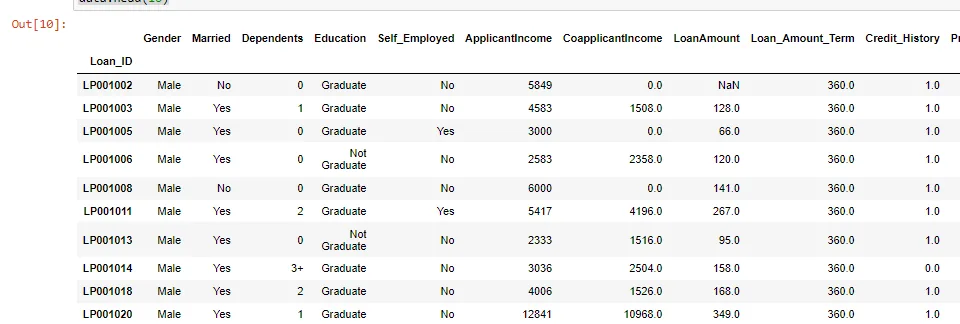

In this blog, I'm going to show a tutorial on how to import data in python for different types of data files. Python offers modules that help to import different data with various files formats.

First, I going to import data with CVS format as shown in the code below.

The CSV format enables us to read each row in the file using a comma as a delimiter.

In the beginning, I open the file in "**read-only**" mode, affect the delimiter, and then I used a for loop to read each row from the CSV file.

```python
import csv

with open("C:/Users/asus/Desktop/train.csv,'r') as custfile:
rows=csv.reader(custfile,delimiter=',')
for r in rows:
print(r)
```

Also, there is another method to import .csv files by using pandas as shown below:

```python
import pandas as pd
import numpy as np
data = pd.read_csv("C:/Users/asus/Desktop/train.csv", index_col="Loan_ID")
data.head(10)
```

First, I import **pandas and numpy**, second, load the data with **pd.read_csv** module, then show the first 10 rows and the result shown below:



The second file format I import with python is .txt format. as shown in the next code. First I import the NumPy library, load the file using **loadtxt** module.

```python
import numpy as np
filename = 'MNIST_header.txt'
data = np.loadtxt(filename, delimiter=',', skiprows=1, dtype=str)
print(data)
```

Pandas library can handle excel files using the **read_excel module**. As shown below the example that imports data from an excel file.

First, I import the pandas library, import the excel file by using the **pd.ExcelFile** module the use **df.parse** module with specifying **"loan_ID"**

and finally, I showed the first 10 lines.

```python
import pandas as pd

df = pd.ExcelFile("C:/Users/asus/Desktop/train.xlsx")
data=df.parse("Loan_ID")
print(data.head(10))
```

Also in python, we can connect to database servers **using a module called pyodbc.** This method offers to us the opportunity to import data from relational sources using a SQL query. As shown below:

```python
import pyodbc
sql_conn = pyodbc.connect("Driver={SQL Server};Server=serverName;UID=UserName;PWD=Password;Database=sqldb;")
data_sql = pd.read_sql_query(SQL QUERY’, sql_conn)
data_sql.head()
```
