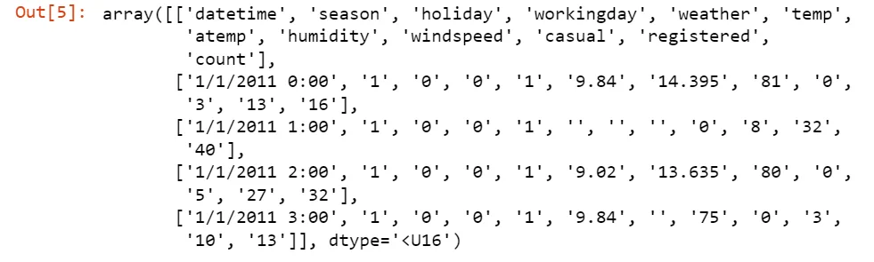
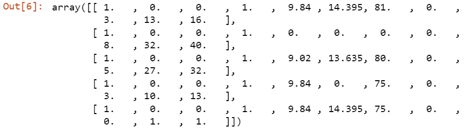
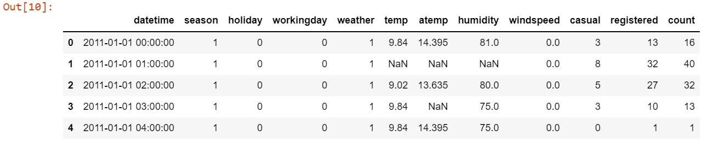
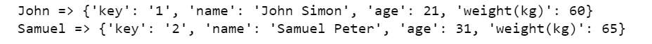
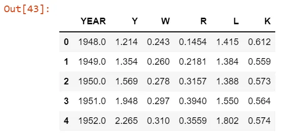
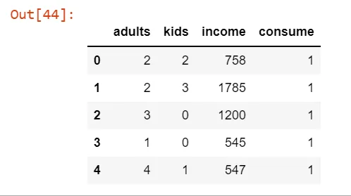
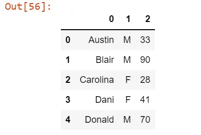
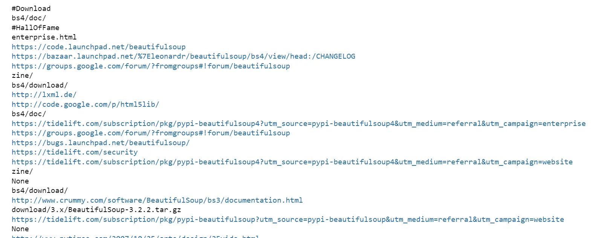

This article is focused on explaining the different ways you can bring data into python with examples. Python has libraries like numpy and pandas that provide a collection of helper functions to do that.

Data in real world comes from different sources and in various formats. Data sources can come from flat files, relational database, web scrapes, SAS, Stata, hdf etc.

Flat files, which are data tables stored in plain text format separated by delimiters like a comma or tab usually. Each record contains value of the different columns/attributes. Despite their popularity, flat files do not maintain relationship information between tables.

Two useful functions in numpy are numpy.loadtxt() and numpy.genfromtxt(), the later has more parameters to allow more control over the behavior of the function, like handling of missing lines. The default values used to represent a missing value with this function is as follow.


To demonstrate how to control the representation of missing values with numpy.genfromtxt(), consider the following example.

```python
import numpy as np

data = np.genfromtxt('datasets/bike_sharing.csv', delimiter=',', dtype='str')
data[:5]
```



In order to fill the missing values with a chosen value, we should use the missing_values and filling_values argument.

```python
kwargs = dict(delimiter=",",
                  dtype=float,
                  skip_header=1,
                  usecols=np.arange(1,12),
                  missing_values={np.nan},
                  filling_values=0
             )
data = np.genfromtxt('datasets/bike_sharing.csv', **kwargs)
data[:5]
```



Pandas has a very commonly used tool called read_csv() to import .csv files as a DataFrame, which is a 2-dimensional labeled data structure with columns of potentially different types.

One striking different difference with the numpy library used above is that you cannot deal with missing values in pandas while reading the data source, in one line of code.

```python
import pandas as pd

df = pd.read_csv('datasets/bike_sharing.csv', parse_dates=["datetime"])

df.head()
```



Pickle file is a native Python file type that helps to store Python object as a serialized byte stream for storage and retrieval. To illustrate this, the following snippet reads a .pkl file and parses its content and print it on the screen.

```python
pkl_file = open('pickle_example.pkl', 'rb')
data = pickle.load(pkl_file)
for keys in data:
    print(keys, '=>', data[keys])
pkl_file.close()
```



Another very common data file type is excel sheets. Pandas.ExcelFile() is used to read the excel workbook and a specific sheet can be selected and loaded as a dataframe like this:

```python
data = pd.ExcelFile('datasets/iris.xlsx')
#print(data.sheet_names)
df1 = data.parse(0)
print(df1.head())
```

SAS and Stata are also a widely used data types and are usually processed with the help of Software packages dedicated to them. SAS is a statistical software suite developed by SAS Institute for data management, advanced analytics, multivariate analysis, business intelligence, criminal investigation, and predictive analytics. Stata is a file type generated by a general-purpose statistical software. The following illustrations help understand importing those type of files.

```python
import pandas as pd
from sas7bdat import SAS7BDAT
with SAS7BDAT('datasets/airline.sas7bdat') as file:
    df_sas = file.to_data_frame()
df_sas.head()
```



```python
data = pd.read_stata('datasets/alcohol.dta')
data.head()
```



HDF - Heirarchical Data Format is a set of file formats (**HDF4**, **HDF5**) designed to store and organize large amounts of data. HDF5 can store scale up to exabytes of data.

```python
import h5py
filename = 'H-H1_LOSC_4_V1-815411200-4096.hdf5'
data = h5py.File(filename, 'r') # 'r' is to read
```

Connecting to relational databases from your python code is attainable with the help of different libraries depending on the database type. For example sql_alchemy is the most widely used. Illustration of using the library is below.

```python
from sqlalchemy import create_engine
import pandas as pd
engine = create_engine('sqlite:///datasets/simplefolks.sqlite')
con = engine.connect()
rs = con.execute("SELECT * FROM people")
df = pd.DataFrame(rs.fetchall())
con.close()

df.head()
```



Web Scraping is another technique used by people in the Data world to pull and organize data from the world wide web. BeautifulSoup is one of the top python libraries out there. It provides methods like find_all() on the objects to search through the html document for an html tag we are concerned with. The following code exemplifies searching for all links in a given website and print them.

```python
from bs4 import BeautifulSoup
import requests
url = 'https://www.crummy.com/software/BeautifulSoup/'
r = requests.get(url)
html_doc = r.text
soup = BeautifulSoup(html_doc)

for link in soup.find_all('a'):
    print(link.get('href'))
```


