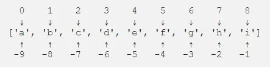

Indexing and slicing is the one of the most commonly used concept in Python. It helps retrieving elements from strings, lists and other [iterables](https://stackoverflow.com/questions/9884132/what-exactly-are-iterator-iterable-and-iteration).

## What is indexing?
Indexing means to refer to an element of an iterable through its position. For example, in the list

```python
new_list = ['a','b','c','d','e']
```

each element in the list can be called upon by its position. Like the alphabet 'a' can be called as new_list[0] while 'e' can be called by new_list[4].

*Notice how the index (position) of elements starts from 0 and not 1.*

Python also supports negative indexing, meaning the elements can be indexed from the last item. A negative number is used for negative indexing. In the list defined above the index -1 i.e. new_list[-1] gives the output 'e'. Similarly, new_list[-2] gives 'd'.

*Notice here in negative index begins from -1 and not 0.*

The image here shows both the indexing approaches.



## Slicing
As the name suggests, slicing is to get a slice of the whole. In Python, slicing means getting a portion from an iterable based on their indices.

The notation of slicing takes the form

```python
list[start:stop:step]
```

Taking the example of new_list from above:

```python
new_list = ['a','b','c','d','e']
```

Slicing results in the following

```python
new_list[1:3]

#output
['b','c']
```

As mentioned earlier, indexing starts from 0 so the position 1 refers to the element 'b' of the list.

Another thing to notice in the slice above is that the element 'd' of index 3 is not included. This is because, the 'stop' element is exclusive i.e. it is not included.

The 'step' in the syntax above refers to the skip step. This can be better understood from the example below:

```python
new_list[0:4:2]

#output
['a','c']
```

Here beginning from position 0, one character is skipped each time until the position 4 ( remember 4 is exclusive). So, the output results as

position 0 = 'a'

position 1 (skipped)

position 2 = 'c'

position 3 (skipped)

Remember the negative indexing - it can also be utilized in slicing. While negative indexing, the results are printed in reverse order as follows:

```python
new_list[-5:-1]

#output
['a', 'b', 'c', 'd']
```

*Remember, negative index starts from -1 and not 0, hence the element index of -5.*

Another thing to remember is, while slicing the elements to be included should be right of the start index and left of the stop index. This means, if you try to index new_list[-1:-5], you get an empty list since there is nothing right of -1.

However, one exception remains.

```python
new_list[-1:-5:-1]
```

In the above slicing, I've used -1 as start and -5 as stop index. Contrary to what I mentioned earlier, this does not result in an empty list. This is because of the negative step I've included in the end.

Can you guess what the resulting output of the above code will be?

The above code produces a reverse list.

```python
['e', 'd', 'c', 'b']
```

Notice how the stop index being exclusive also applies here.

Some other slicing includes.

```python
new_list[:3]
new_list[1:]
new_list[::2]
```

In the first code above, elements from the beginning until the 2nd element is given.

In the second code, elements starting from position 1 until the final element is given.

In the last code, all elements from the start till end is given skipping by two elements each time.

```python
#output

['a', 'b', 'c']
['b', 'c', 'd', 'e']
['a', 'c', 'e']
```

You can find the examples in my [GitHub](https://github.com/Clown-Face/DataInsight/blob/7615e8bf889843f21a9df2f0ab5c1ce98bde3cd7/Slicing%20and%20Indexing.ipynb) repo.
