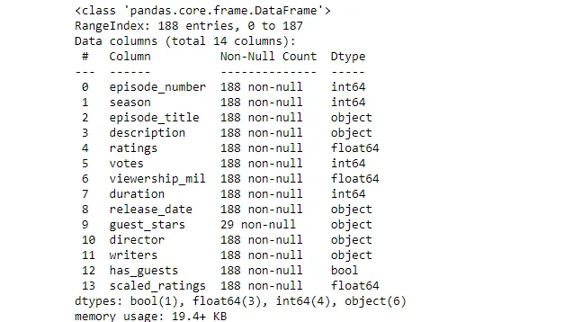
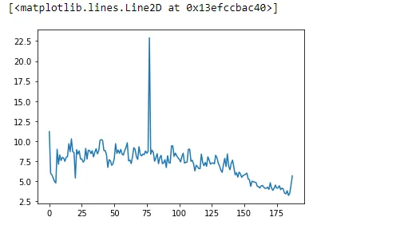
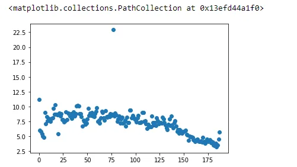
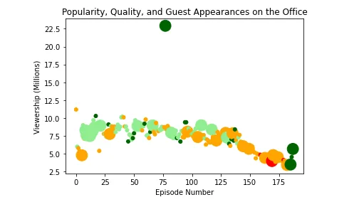

**introduction**

The office is an American TV series that started as a British mockumentary series about office culture in 2001, depicting the everyday lives of office employees in fictional Scranton office of Dunder Mifflin Paper Company.

The aim of this post is to acquire insight by investigating the popularity and quality of the office episodes over time.

To do so, datasets/office_projects.csv is the dataset used which was downloaded from kaggle.

The dataset contains information on a variety of characteristics of each episodes. In detail, these are;

1. **episode_number:** Canonical episode number
2. **season:** Season in which the episode appeared
3. **episode_title:** Title of the episode
4. **description:** Description of the episode
5. **ratings:** Average IMDB rating.
6. **votes:** Number of votes
7. **viewership_mil:** Number of US viewers in millions
8. **duration:** Duration in number of minutes
9. **release_date:** Airdate
10. **guest_stars:** Guest stars in episode (if any)
11. **director:** Director of the episode
12. **writers:** Writers of the episode.
13. **has_guests:** True/False column for whether the episode contained guest stars.
14. **scaled_ratings:** The ratings scaled from 0( worst-reviewed) to 1 (best-reviewed)

Let's peek into the dataset to know the various data type and other properties that will help us analyze the data.

To do so, we need to import certain libraries.

```python
import matplotlib.pyplot as plt
import pandas as pd
```

In the above code, since we will manipulate the dataset, pandas library

is imported and for visualizing the data, matplotlib is imported.

Moving on, we need to read the dataset,

```python
episodeDataset = pd.read_csv("datasets/office_projects.csv")
episodeDataset.info()
```

The code above read the dataset into the variable "episodeDataset".

The second line of code outputs the following;



This is helpful as it tells us what the dataset is about, the number of columns, the datatype of each column etc.

Now that we have seen the details of the dataset, let's visualize it using the matplotlib library.

```python
fig = plt.figure()
plt.plot(episodeDataset['episode_number'], episodeDataset['viewership_mil'])
```

This code plot the episode_number on x-axis and viewership_mil on the y-axis, these are the two columns we are much interested in.



The plot above gives us some visual representation of the dataset, but the kind of plotting used makes a bit difficult to wrap our head around the data.

We will make use of a scatter plot as it will give us much better understanding about the data set

```python
fig = plt.figure()
plt.scatter(episodeDataset['episode_number'], episodeDataset['viewership_mil'])
```



As it turns out, the scatter plot gives us much understanding about the dataset, notice that, one data point is really far from the other's,

what happened? why is that?

We will get to know more about that later.

Before we start making filters to make the plot clear, we first need to subset the columns we are interested in working with.

```python
# this subset the episode number
episodeNumber = episodeDataset['episode_number']

# this subset the number of views in millions
episodeViewership = episodeDataset['viewership_mil']

# this is the scaled ratings of the episodes
scaledRatings = episodeDataset['scaled_ratings']
```

After this, for us to get a clearer understanding of the dataset, we will set up filters and this will depend on the scaled ratings of the each episode

such that, if the

ratings < 0.25, the color will be red

ratings >= 0.25 and < 0.50, the color will be orange

ratings >= 0.50 and < 0.75, the color will be lightgreen

ratings >= 0.75, the color will be darkgreen.

```python
colors_str = list() # creates an empty list to append the #list of colors

# this loops through each scaled ratings
for Ratings in scaledRatings:
    if Ratings < 0.25:
        r_color = "red"# r_color is a variable
        colors_str.append(r_color)
    elif Ratings >= 0.25 and Ratings < 0.50:
        o_color = "orange"
        colors_str.append(o_color)
    elif Ratings >= 0.50 and Ratings < 0.75:
        l_color = "lightgreen"
        colors_str.append(l_color)
    elif Ratings >= 0.75:
        dg_color = "darkgreen"
        colors_str.append(dg_color)
```

Now that we are done setting up the filters, we will set up a marker size to know whether the dataset has a guest star or not and assign different markersize to it.

```python
size_s = list() # creates an empty list to append the sizes

#subsets the column of has_guests
guests = episodeDataset['has_guests']
for guest in guests:
    if guest == True:
        s = 250
        size_s.append(s)
    elif guest == False:
        s = 25
        size_s.append(s)
```

Those episodes with guest stars will have a wide marker size than those that do not have a guest star, this will help us understand the dataset much better

We now need to add these filters and plot to see how well we will understand the graph

```python
fig = plt.figure()

plt.scatter(episodeNumber, episodeViewership, s=size_s, c=colors_str) # the s and c accepts a list of string and numbers

#naming the x and y coordinates
plt.xlabel("Episode Number")
plt.ylabel("Viewership in (Millions)")
plt.title("Popularity, Quality, and Guest Appearances on the office")

plt.show()
```

Notice in the above code that we added some flavor to the plot,

we named the x and y axis and a title is included this time.

let's see how the plot will look .



Here, our plot is clear, easy to read and understand by anyone without any knowledge in data analysis. Our plot is telling us that, one of the episodes have views over 20+ million. How come it's so distinct from the others? Comment below what you think.

Since we've determined that one of the episodes had a greater views , we can as well determine one of the top star in that episode

Let's see how to go about this,

```python
stars = episodeDataset[episodeDataset['viewership_mil'] == max(episodeViewership)]['guest_stars']

listStars = list() # a variable to store the list of stars
for star in stars:
    listStars.append(star)

Stars = listStars[0]
top_star = Stars.split(",")[0]
print(top_star)

output:
Cloris Leachman
```

We see that, from the above code, Cloris Leachman is one of the top stars in the episode
